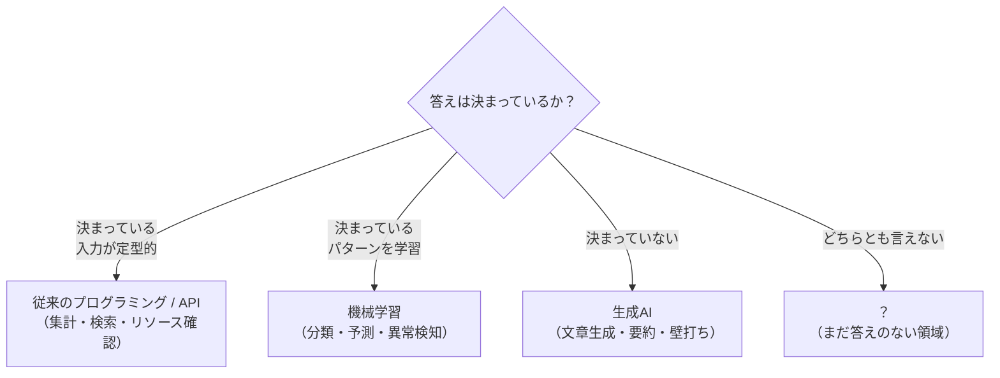

# SC運営×AI実装
## キックオフセミナー

SC業界特有の課題にAIを当てはめる思考を身につける

<div class="pt-12 text-sm opacity-70">
講師：早崎 知弥（宝来エンジニアリング）
</div>

---

# はじめに

- 自己紹介
- 本日のゴール
- なぜ今、SC業界にAIなのか（問題提起）

---

# 自己紹介

<div class="grid grid-cols-2 gap-8 items-center mt-4">

<div>


<div class="text-xs opacity-50 mt-2">前職：プラント・製造現場でのエンジニア経験</div>

</div>

<div>

**早崎 知弥**（はやさき ともや）
宝来エンジニアリング

- 現在：AWSを主軸としたクラウドインフラエンジニア（フリーランス）、TerraformなどIaCにも知見あり
- 前職：製造・プラント現場でのエンジニア
- SC経営士会 外部講師 / 年間サポートメンバー

</div>

</div>

<v-click>

**「現場」を知っているからこそ、机上の空論にならないAI活用を話したい**

</v-click>

---

# 本セミナーの全体像

<div class="grid grid-cols-2 gap-6 mt-4">
- 第一章：AIを知る
  - AIとはなにか？
  - AIの活用とは？
  - 段階別活用レベル
- 第二章：AIを上手く使う
  - アウトプットとの付き合い方
  - ループ設計
- 第三章：自分でもやってみよう

</div>

---

# アイディアソンの全体像

<div class="grid grid-cols-2 gap-6 mt-4">

<div>

**フェーズ1**
AI×SC業界の情報収集

<div class="text-sm opacity-70 mt-1">成果物：SC業界でのAI活用事例をまとめる（アプリ制作は不要）</div>

</div>

<div>

**フェーズ2**
自身のビジネスモデルへの組み込み

<div class="text-sm opacity-70 mt-1">成果物：AIをどう組み込むかの仮想的な設計アウトプット（実装は不要）</div>

</div>

</div>

<div class="text-xs opacity-50 mt-4">実施期間：2026年10月〜2027年3月末／成果発表会：2027年3月（予定）</div>

<!--
アイデアソンは約半年間のプログラム。
フェーズ1は情報収集・アウトプットが成果物（アプリ制作は不要）。
フェーズ2は自身のビジネスモデルへのAI組み込みを、仮想的な設計レベルでアウトプットする（実装は不要）。
今日のキックオフは、このプログラム全体の出発点であることを伝える。
-->

---

# 今日のゴール

<v-click>

**AIに関する質問が増えること**

</v-click>

<v-click>

<h1>→ 答えを持ち帰ることより、**問いを持ち帰ること**を重視する</h1>

</v-click>

<!--
今日は答えを覚えて持ち帰る場ではない。
「AIについてもっと知りたい」「自分の業務にどう当てはめられるか」という問いが増えた状態で
帰ってもらうことがゴール。その問いを、これから半年間のアイデアソン期間で深めていく。
-->

---

# 判断の軸を持つ

AIを活用したDXは、対象業務によって評価軸が異なる

| 対象 | 主な評価軸 |
|---|---|
| **既存業務のDX** | 工数削減率・コスト削減額・処理速度の向上 |
| **新規業務のDX** | 学習データの蓄積量・知見のドキュメント化・現場採用率 |

<v-click>

新規業務では即時のROIを求めない。**蓄積されること自体が成果**
ただし「蓄積されているが使われていない」は成功ではない

</v-click>

---
layout: section
---

# 第1章
## AIとは何か――定義と歴史

---
layout: default
class: bg-white
---

# 1-1. 「AI・ML・DL」という言葉の整理

<!-- AI ⊃ ML ⊃ DL の包含関係を図解（インラインSVG）。ラベルはリング帯の中央高さに十分な間隔で配置。注釈は見切れ防止のためSVG外に配置 -->

<div class="flex flex-col items-center">

<svg viewBox="0 0 760 620" xmlns="http://www.w3.org/2000/svg" role="img" class="h-95 w-auto">
<title>AIと生成AIの関係を示す入れ子図</title>
<desc>AIという大きな概念の中に機械学習があり、その中に深層学習、さらにその中に生成AIが位置づけられることを示す4層の同心円図</desc>

<circle cx="380" cy="340" r="300" fill="#E6F1FB" stroke="#185FA5" stroke-width="2"/>
<circle cx="380" cy="340" r="222" fill="#B5D4F4" stroke="#185FA5" stroke-width="2"/>
<circle cx="380" cy="340" r="148" fill="#85B7EB" stroke="#185FA5" stroke-width="2"/>
<circle cx="380" cy="340" r="72" fill="#D85A30" stroke="#993C1D" stroke-width="2"/>

<v-click>
<text x="380" y="90" text-anchor="middle" font-size="20" font-weight="700" fill="#042C53" font-family="'Hiragino Kaku Gothic ProN','Yu Gothic','Noto Sans JP',sans-serif">AI(人工知能)</text>
</v-click>

<v-click>
<text x="380" y="186" text-anchor="middle" font-size="17" font-weight="700" fill="#042C53" font-family="'Hiragino Kaku Gothic ProN','Yu Gothic','Noto Sans JP',sans-serif">ML(機械学習)</text>
</v-click>

<v-click>
<text x="380" y="272" text-anchor="middle" font-size="15" font-weight="700" fill="#0C447C" font-family="'Hiragino Kaku Gothic ProN','Yu Gothic','Noto Sans JP',sans-serif">DL(深層学習)</text>
</v-click>

<v-click>
<text x="380" y="370" text-anchor="middle" font-size="15" font-weight="700" fill="#FFFFFF" font-family="'Hiragino Kaku Gothic ProN','Yu Gothic','Noto Sans JP',sans-serif">生成AI</text>
</v-click>
</svg>

<v-click>
<div class="text-xs opacity-60 mt-2">※生成AIの調整（RLHF）にも強化学習を一部使うが、土台は深層学習</div>
</v-click>

</div>

<!--
発表者ノート:
- 生成AIはAIという大きな概念の中の、深層学習を土台にした一部分であることを伝える
- 「深層強化学習」という言葉は生成AIの主要な分類ではない点に注意（RLHFという調整技術の一部で強化学習の考え方を使っているだけ）
-->

---
layout: default
class: bg-white
---

# 従来の課題解決との違いは？

<!-- 従来のプログラミングと機械学習の違いを示すフロー図（インラインSVG）。角丸なし、注釈はSVG外に配置 -->

<div class="flex flex-col items-center w-full">

<svg viewBox="0 0 940 560" xmlns="http://www.w3.org/2000/svg" role="img" class="w-full" style="max-height: 400px;" font-family="'Hiragino Kaku Gothic ProN','Yu Gothic','Noto Sans JP',sans-serif">
<title>伝統的なプログラミングと機械学習の違いを示すフロー図</title>
<desc>従来のプログラミングはデータと規則から出力を得るのに対し、機械学習は学習フェーズでデータとアルゴリズムからモデルを作り、推論フェーズで新しいデータをモデルに通して出力を得ることを示す図</desc>

<defs>
<marker id="arrow" viewBox="0 0 10 10" refX="8" refY="5" markerWidth="8" markerHeight="8" orient="auto-start-reverse">
<path d="M0,0 L10,5 L0,10 z" fill="#5F5E5A"/>
</marker>
</defs>

<g v-click>
<text x="30" y="28" font-size="8" font-weight="700" fill="#2C2C2A">①従来のプログラミング</text>

<rect x="30" y="46" width="170" height="52" fill="#E6F1FB" stroke="#185FA5" stroke-width="1.5"/>
<text x="115" y="79" text-anchor="middle" font-size="6" fill="#0C447C">データ</text>

<rect x="30" y="112" width="170" height="52" fill="#E6F1FB" stroke="#185FA5" stroke-width="1.5"/>
<text x="115" y="145" text-anchor="middle" font-size="6" fill="#0C447C">規則（プログラム）</text>

<rect x="400" y="79" width="170" height="52" fill="#F1EFE8" stroke="#5F5E5A" stroke-width="1.5"/>
<text x="485" y="112" text-anchor="middle" font-size="6" fill="#2C2C2A">コンピュータ</text>

<rect x="760" y="79" width="150" height="52" fill="#F1EFE8" stroke="#5F5E5A" stroke-width="1.5"/>
<text x="835" y="112" text-anchor="middle" font-size="6" fill="#2C2C2A">出力</text>

<path d="M200,72 L400,95" fill="none" stroke="#5F5E5A" stroke-width="1.5" marker-end="url(#arrow)"/>
<path d="M200,138 L400,115" fill="none" stroke="#5F5E5A" stroke-width="1.5" marker-end="url(#arrow)"/>
<path d="M570,105 L760,105" fill="none" stroke="#5F5E5A" stroke-width="1.5" marker-end="url(#arrow)"/>
</g>

<line x1="30" y1="200" x2="910" y2="200" stroke="#D3D1C7" stroke-width="1"/>

<g v-click>
<text x="30" y="238" font-size="8" font-weight="700" fill="#2C2C2A">②機械学習（学習フェーズ）</text>

<rect x="30" y="256" width="170" height="52" fill="#E6F1FB" stroke="#185FA5" stroke-width="1.5"/>
<text x="115" y="289" text-anchor="middle" font-size="6" fill="#0C447C">データ</text>

<rect x="30" y="322" width="170" height="52" fill="#E6F1FB" stroke="#185FA5" stroke-width="1.5"/>
<text x="115" y="355" text-anchor="middle" font-size="6" fill="#0C447C">アルゴリズム</text>

<rect x="400" y="289" width="170" height="52" fill="#F1EFE8" stroke="#5F5E5A" stroke-width="1.5"/>
<text x="485" y="322" text-anchor="middle" font-size="6" fill="#2C2C2A">コンピュータ</text>

<rect x="760" y="289" width="150" height="52" fill="#F0997B" stroke="#993C1D" stroke-width="1.5"/>
<text x="835" y="322" text-anchor="middle" font-size="6" fill="#4A1B0C">モデル</text>

<path d="M200,282 L400,305" fill="none" stroke="#5F5E5A" stroke-width="1.5" marker-end="url(#arrow)"/>
<path d="M200,348 L400,325" fill="none" stroke="#5F5E5A" stroke-width="1.5" marker-end="url(#arrow)"/>
<path d="M570,315 L760,315" fill="none" stroke="#5F5E5A" stroke-width="1.5" marker-end="url(#arrow)"/>
</g>

<line x1="30" y1="410" x2="910" y2="410" stroke="#D3D1C7" stroke-width="1"/>

<g v-click>
<text x="30" y="448" font-size="8" font-weight="700" fill="#2C2C2A">③機械学習（推論フェーズ）</text>

<rect x="30" y="466" width="190" height="52" fill="#E6F1FB" stroke="#185FA5" stroke-width="1.5"/>
<text x="125" y="499" text-anchor="middle" font-size="6" fill="#0C447C">新しいデータ</text>

<rect x="400" y="466" width="190" height="52" fill="#F0997B" stroke="#993C1D" stroke-width="1.5"/>
<text x="495" y="499" text-anchor="middle" font-size="6" fill="#4A1B0C">学習済みモデル</text>

<rect x="760" y="466" width="150" height="52" fill="#F1EFE8" stroke="#5F5E5A" stroke-width="1.5"/>
<text x="835" y="499" text-anchor="middle" font-size="6" fill="#2C2C2A">出力</text>

<path d="M220,492 L400,492" fill="none" stroke="#5F5E5A" stroke-width="1.5" marker-end="url(#arrow)"/>
<path d="M590,492 L760,492" fill="none" stroke="#5F5E5A" stroke-width="1.5" marker-end="url(#arrow)"/>
</g>
</svg>

<div class="text-xs opacity-60 mt-2">規則を人が書く代わりに、データから規則（＝モデル）を学習させる</div>

</div>

<!--
発表者ノート:
- 「ルールを人間が書く」から「データからルール（モデル）を学ばせる」への発想転換がポイント
- SC業務に例えるなら、過去の対応履歴データから対応パターンをモデルに学ばせるイメージ
-->

---
layout: default
class: bg-white
---

# コードで見ると、違いは「1か所」だけ

<div class="text-sm opacity-70 mb-3">同じ「クレジットカード承認」を、2つのやり方で書いてみる（コードの中身は読めなくてOK）</div>

<div class="grid grid-cols-2 gap-6">

<div>

**従来のプログラミング**

```python {all}{lines:true}
def approve(income, score, debt):
    # 人がルールを書く
    if (income >= 5_000_000
        and score >= 650
        and debt < income * 0.3):
        return "承認"
    else:
        return "却下"
```

<div v-click="1" class="text-xs text-red-700 mt-2">↑ 判定ルールを<strong>人が丸ごと書く</strong></div>

</div>

<div>

**機械学習**

```python {all}{lines:true}
model = DecisionTreeClassifier()

# データから自動で学習する
model.fit(X_train, y_train)

def approve(income, score, debt):
    return model.predict(
        [[income, score, debt]])
```

<div v-click="2" class="text-xs text-red-700 mt-2">↑ ルールは書かない。<strong>fit() でデータから学ぶ</strong></div>

</div>

</div>

<div v-click="3" class="text-center mt-5 text-lg">
違うのは「<strong>ルールを人が書くか / データから学ぶか</strong>」——ただ一点
</div>

<!--
発表者ノート:
- コードの詳細は読ませない。左右で「if文の塊」と「fit()の1行」を対比させるのが狙い
- クリック①：従来はif文＝人がルールを書く。クリック②：機械学習はfit()＝データから学ぶ。クリック③：結論
- 判定基準（年収・スコア・借入）は両者で同じにしてあるので、違いはルールの作り方だけ、と言い切れる
-->

---
layout: default
class: bg-white
---

# 機械学習の定義とは

<!-- 機械学習の定義と3手法のVenn図（インラインSVG）。定義文・注釈はSVG外に配置 -->

<div class="flex flex-col items-center">

<div class="text-center mt-1 max-w-4xl">
機械学習とは、明示的な指示（ルール）を人が書く代わりに、<strong>データからパターンを学習</strong>し、新しいデータに対して予測・推論を行うAIの一分野
<div class="text-xs opacity-50 mt-1">出典: AWS「機械学習とは何ですか?」／ IBM「機械学習とは」</div>
</div>

<svg viewBox="0 0 720 560" xmlns="http://www.w3.org/2000/svg" role="img" class="w-auto mt-2" style="max-height: 330px;" font-family="'Hiragino Kaku Gothic ProN','Yu Gothic','Noto Sans JP',sans-serif">
<title>機械学習の3つの学習パラダイムを示すVenn図</title>
<desc>教師あり学習・教師なし学習・強化学習の3つが重なり合う関係を示す図</desc>

<circle cx="280" cy="250" r="150" fill="#B5D4F4" fill-opacity="0.7" stroke="#185FA5" stroke-width="2"/>
<circle cx="440" cy="250" r="150" fill="#85B7EB" fill-opacity="0.7" stroke="#185FA5" stroke-width="2"/>
<circle cx="360" cy="380" r="150" fill="#F0997B" fill-opacity="0.7" stroke="#993C1D" stroke-width="2"/>

<text x="160" y="230" text-anchor="middle" font-size="9" font-weight="700" fill="#042C53">教師なし学習</text>
<text x="560" y="230" text-anchor="middle" font-size="9" font-weight="700" fill="#042C53">教師あり学習</text>
<text x="360" y="500" text-anchor="middle" font-size="9" font-weight="700" fill="#4A1B0C">強化学習</text>
<text x="360" y="95" text-anchor="middle" font-size="7" font-weight="700" fill="#042C53">半教師あり学習</text>
</svg>

<div class="text-xs opacity-60 mt-1">※3つは独立した手法ではなく、学習の目的やデータに応じた分類の切り口（実際は組み合わせて使う）</div>

</div>

<!--
発表者ノート:
- 機械学習の中にもいくつかのアプローチがあることだけ伝われば十分。各手法の詳細説明は不要
- 教師あり学習が実務では最も触れる機会が多い（分類・予測タスク）
-->

---

# 1-2. 機械学習の成り立ちと発展（時系列）

<!-- AIの3つのブームと、2000年代以降に各分野へ分岐して発展した様子を示す簡易時系列図（オリジナル作図）。文科省/JST俯瞰図を参考に要素を絞って独自作成 -->

<div class="flex flex-col items-center w-full">

<svg viewBox="0 0 960 480" xmlns="http://www.w3.org/2000/svg" role="img" class="w-full" style="max-height: 380px;" font-family="'Hiragino Kaku Gothic ProN','Yu Gothic','Noto Sans JP',sans-serif">
<title>AIの3つのブームと各分野への発展を示す時系列図</title>
<desc>1950年代のダートマス会議から始まり、第1次・第2次・第3次のブームを経て、2000年代以降に理論・応用・社会の各方面へ分岐して発展したことを示す図</desc>

<defs>
<marker id="tarrow" viewBox="0 0 10 10" refX="8" refY="5" markerWidth="7" markerHeight="7" orient="auto-start-reverse">
<path d="M0,0 L10,5 L0,10 z" fill="#185FA5"/>
</marker>
</defs>

<line x1="60" y1="460" x2="900" y2="460" stroke="#5F5E5A" stroke-width="1.5"/>
<text x="95" y="450" text-anchor="middle" font-size="9" fill="#5F5E5A">1956</text>
<text x="330" y="450" text-anchor="middle" font-size="9" fill="#5F5E5A">1980年代</text>
<text x="600" y="450" text-anchor="middle" font-size="9" fill="#5F5E5A">2010年代</text>
<text x="870" y="450" text-anchor="middle" font-size="9" fill="#5F5E5A">現在</text>

<circle cx="95" cy="380" r="6" fill="#B5D4F4" stroke="#185FA5" stroke-width="1.5"/>
<text x="95" y="360" text-anchor="middle" font-size="11" font-weight="700" fill="#042C53">第1次</text>
<text x="95" y="306" text-anchor="middle" font-size="6" fill="#0C447C">ダートマス会議</text>

<circle cx="330" cy="315" r="6" fill="#85B7EB" stroke="#185FA5" stroke-width="1.5"/>
<text x="330" y="295" text-anchor="middle" font-size="11" font-weight="700" fill="#042C53">第2次</text>
<text x="330" y="231" text-anchor="middle" font-size="6" fill="#0C447C">エキスパートシステム</text>

<circle cx="580" cy="230" r="8" fill="#D85A30" stroke="#993C1D" stroke-width="1.5"/>
<text x="580" y="168" text-anchor="middle" font-size="13" font-weight="700" fill="#4A1B0C">第3次ブーム</text>
<text x="580" y="102" text-anchor="middle" font-size="6" fill="#712B13">深層学習の登場</text>

<path d="M101,374 Q210,360 324,320" fill="none" stroke="#185FA5" stroke-width="1.5"/>
<path d="M336,310 Q450,275 572,235" fill="none" stroke="#185FA5" stroke-width="1.5"/>

<g v-click>
<path d="M588,225 Q720,160 860,110" fill="none" stroke="#185FA5" stroke-width="1.5" marker-end="url(#tarrow)"/>
<text x="900" y="108" text-anchor="end" font-size="11" font-weight="700" fill="#042C53">理論の革新</text>
</g>

<g v-click>
<path d="M589,231 Q720,225 860,220" fill="none" stroke="#185FA5" stroke-width="1.5" marker-end="url(#tarrow)"/>
<text x="900" y="218" text-anchor="end" font-size="11" font-weight="700" fill="#042C53">応用の拡大</text>
</g>

<g v-click>
<path d="M587,238 Q720,290 860,330" fill="none" stroke="#185FA5" stroke-width="1.5" marker-end="url(#tarrow)"/>
<text x="900" y="338" text-anchor="end" font-size="11" font-weight="700" fill="#042C53">社会との関係</text>
</g>
</svg>

<div class="text-xs opacity-60 mt-2">AIは1950年代から研究されてきた<br>第3次ブーム以降、理論・応用・社会の各方面へ広がっている（文科省「科学技術白書」/ JST研究開発戦略センターの俯瞰図を参考に作図）</div>

</div>

---

# 1-3. 機械学習は、こんなに広い領域で成果を出している

<div class="grid grid-cols-2 gap-8 mt-2">

<div>

**成功しているタスクの例**

<div class="text-sm">

- 迷惑メール（スパム）の判定
- ターゲティング広告の顧客セグメント化
- 天気予報・長期的な気候変動の予測
- クレジットカードの不正取引の検知
- 自然災害の被害額予測（保険数理）
- 自動運転・ドローンの制御
- エネルギー利用の最適化
- 遺伝子配列の解析（疫病）
- 防犯カメラの物体検出

</div>

</div>

<div>

**ビジネスへの応用（目的別）**

<div class="text-sm">

- **売上向上**：配車予測、来客分析、需要予測（小売・農業）
- **コスト削減**：コールセンター自動化、点検の自動化
- **信頼性担保**：がん診断支援、原油備蓄量の分析
- **監視・管理**：電力需給予測、ドライバーの安全管理
- **人員不足解消**：配達ルート最適化、レジの商品自動識別

</div>

</div>

</div>

<div class="text-xs opacity-60 mt-3">前ページの「各方面への発展」が、実際のビジネス領域ではこれだけの用途になっている</div>

---
layout: default
class: bg-white
---

# ここまでのまとめ

<div class="text-lg leading-relaxed mt-6">

<div v-click>

<h3>1. AIという大きな概念の中に機械学習があり、その中に深層学習、さらに生成AIが位置づけられる。</h3>

</div>

<div v-click class="mt-6">

<h3>2. 機械学習は、人がルールを書く従来のプログラミングと違い、<strong>データからルール（モデル）を学習</strong>し、分類・予測・分析を行う。</h3>

</div>

<div v-click class="mt-6">

<h3>3. AIの研究は約70年前に始まり、ブームと冬の時代を繰り返しながら、いまや各方面へ発展している。</h3>

</div>

</div>

<!--
発表者ノート:
- 1行目は同心円図（1-1）の入れ子構造を回収。「並列」ではなく「入れ子」であることを口頭でも補足
- 2行目はコード比較（if vs fit）とフロー図を回収
- 3行目は俯瞰図（1-2）を回収。この直後のパンチラインへつなぐ
-->

---
layout: center
class: text-center
---

<!-- 話の転換点・パンチライン（タイトルなし／ワンメッセージ）。機械学習の説明の締め -->

# **生成AIと機械学習、従来のプログラミング<br>なにを使えばいいの？**

---
layout: default
class: bg-white
---

# 正直、僕もまだ答えを持っていない

<div class="mt-4">

いま、ほとんどの案件で生成AIを使って業務をしている。

</div>

<div v-click class="mt-6">

でも——クラウドのリソース確認のように、<strong>答えが決まっている作業</strong>にまで生成AIを使うのは、正直ちょっと違うと思っている。

</div>

<div v-click class="mt-6">

確実な答えがあるものを、わざわざ「それっぽく答える道具」に置き換える必要はない。

</div>

<div v-click class="mt-8 text-center text-xl">

問うべきは「生成AIか、従来か」ではなく<br>
<strong>「その作業の答えは、決まっているか？」</strong>

</div>

<!--
発表者ノート:
- ここは断言せず「まだ答えは出ていない」という正直なスタンスで話す
- 答えが決まっている作業（リソース確認・集計・検索・ルール判定）→ API/スクリプト/従来手法で十分
- 答えが決まっていない作業（文章生成・要約・方針の壁打ち・あいまいな入力の解釈）→ 生成AIの出番
- 構造化データの数値予測・分類・異常検知 → 従来の機械学習が速くて安い
- このセミナーのゴール（問いを持ち帰る）に合わせ、聴衆に問いを渡す形で締める
-->

---
layout: default
class: bg-white
---

# 使い分けの目安：まず「答えは決まっているか？」

<div class="flex justify-center mt-2">



</div>

<div class="text-xs opacity-60 mt-2 text-center">「生成AIか従来か」ではなく、作業の性質から選ぶ。判断に迷う「？」の領域こそ、後半で考えていく</div>

<!--
発表者ノート:
- パンチラインの問い「答えは決まっているか？」を、そのまま判断の入口に置いた
- 「？（まだ答えのない領域）」が後半「生成AIをどう使いこなすか」への入り口になる
- 断定ではなく、判断の目安として提示する
-->

---
layout: section
---

# 第2章

## 生成AIとは何か

---

# 2-1. 生成AIの仕組み

<!-- bbycroft可視化 https://bbycroft.net/llm を画面共有 / iframeで見せる。WOWモーメント。見せるが教えない -->

<iframe src="https://tiktokenizer.vercel.app/?model=cl100k_base" class="w-full h-100 border-0" />


---

<iframe src="https://bbycroft.net/llm" class="w-full h-100 border-0" />

---
layout: default
class: bg-white
---

# 生成AIは、ざっくり2ステップで動く

<div class="grid grid-cols-[1fr_auto_1fr_auto_1fr] gap-3 items-center mt-10 text-center">

<div class="border-2 border-[#0b2f64] p-5">

**プロンプト**<br>
人間が入力する文章

</div>

<div class="text-3xl text-[#0b2f64]">▶</div>

<div class="border-2 border-[#0b2f64] p-5">

**トークンに変換**<br>
文章を細かい単位に分解

</div>

<div class="text-3xl text-[#0b2f64]">▶</div>

<div class="border-2 border-[#0b2f64] p-5">

**膨大パラメータで確率計算**<br>
次に来やすい単語を予測

</div>

</div>

<div v-click class="text-center mt-10 text-xl">

<h2>つまり、生成AIは<strong>「次の単語」を確率で選び続けている</strong>だけ</h2>

</div>

<!--
発表者ノート:
- 前のtiktokenizerデモが「トークンに変換」、次のbbycroftデモが「膨大なパラメータで確率計算」に対応
- 難しい仕組みは見せるが教えない。この2ステップだけ持ち帰ってもらう
-->

---
layout: default
class: bg-white
---

# 生成AIも、実は機械学習と同じ仕組み

<!-- 第1章の「機械学習」の図と同じ箱・矢印を踏襲し、学習/推論フェーズが共通であることを示す。角丸なし、注釈はSVG外 -->
<br>
<div class="flex flex-col items-center w-full">

<svg viewBox="0 0 900 470" xmlns="http://www.w3.org/2000/svg" role="img" class="w-full" style="max-height: 380px;" font-family="'Hiragino Kaku Gothic ProN','Yu Gothic','Noto Sans JP',sans-serif">
<title>機械学習と生成AIが同じ学習・推論構造を持つことを示す図</title>
<desc>機械学習の学習フェーズ・推論フェーズと、生成AIの同じ構造（テキストデータ・Transformer・LLMによる学習、プロンプト・LLM・出力による推論）を比較する図</desc>

<defs>
<marker id="arrow2" viewBox="0 0 10 10" refX="8" refY="5" markerWidth="7" markerHeight="7" orient="auto-start-reverse">
<path d="M0,0 L10,5 L0,10 z" fill="#5F5E5A"/>
</marker>
</defs>

<text x="40" y="28" font-size="7.5" font-weight="700" fill="#2C2C2A">機械学習（一般化した構造）</text>

<rect x="40" y="42" width="180" height="46" fill="#E6F1FB" stroke="#185FA5" stroke-width="1.5"/>
<text x="130" y="70" text-anchor="middle" font-size="5" fill="#0C447C">訓練データ</text>
<rect x="290" y="42" width="180" height="46" fill="#E6F1FB" stroke="#185FA5" stroke-width="1.5"/>
<text x="380" y="70" text-anchor="middle" font-size="5" fill="#0C447C">アルゴリズム</text>
<rect x="540" y="42" width="200" height="46" fill="#F0997B" stroke="#993C1D" stroke-width="1.5"/>
<text x="640" y="70" text-anchor="middle" font-size="5" fill="#4A1B0C">モデル（学習済み）</text>
<path d="M220,65 L290,65" fill="none" stroke="#5F5E5A" stroke-width="1.5" marker-end="url(#arrow2)"/>
<path d="M470,65 L540,65" fill="none" stroke="#5F5E5A" stroke-width="1.5" marker-end="url(#arrow2)"/>

<rect x="40" y="106" width="180" height="46" fill="#E6F1FB" stroke="#185FA5" stroke-width="1.5"/>
<text x="130" y="134" text-anchor="middle" font-size="5" fill="#0C447C">新しい入力</text>
<rect x="290" y="106" width="180" height="46" fill="#F0997B" stroke="#993C1D" stroke-width="1.5"/>
<text x="380" y="134" text-anchor="middle" font-size="5" fill="#4A1B0C">モデル</text>
<rect x="540" y="106" width="200" height="46" fill="#F1EFE8" stroke="#5F5E5A" stroke-width="1.5"/>
<text x="640" y="134" text-anchor="middle" font-size="5" fill="#2C2C2A">出力</text>
<path d="M220,129 L290,129" fill="none" stroke="#5F5E5A" stroke-width="1.5" marker-end="url(#arrow2)"/>
<path d="M470,129 L540,129" fill="none" stroke="#5F5E5A" stroke-width="1.5" marker-end="url(#arrow2)"/>

<line x1="40" y1="182" x2="740" y2="182" stroke="#D3D1C7" stroke-width="1"/>

<text x="40" y="212" font-size="7.5" font-weight="700" fill="#2C2C2A">生成AI（同じ構造に当てはめると）</text>
<rect x="40" y="226" width="180" height="46" fill="#E6F1FB" stroke="#185FA5" stroke-width="1.5"/>
<text x="130" y="260" text-anchor="middle" font-size="5" fill="#0C447C">テキストデータ</text>
<rect x="290" y="226" width="180" height="46" fill="#E6F1FB" stroke="#185FA5" stroke-width="1.5"/>
<text x="380" y="254" text-anchor="middle" font-size="5" fill="#0C447C">Transformer</text>
<rect x="540" y="226" width="200" height="46" fill="#F0997B" stroke="#993C1D" stroke-width="1.5"/>
<text x="643" y="255" text-anchor="middle" font-size="4.5" fill="#4A1B0C">LLM（事前学習済み）</text>
<path d="M220,249 L290,249" fill="none" stroke="#5F5E5A" stroke-width="1.5" marker-end="url(#arrow2)"/>
<path d="M470,249 L540,249" fill="none" stroke="#5F5E5A" stroke-width="1.5" marker-end="url(#arrow2)"/>

<rect x="40" y="290" width="180" height="46" fill="#E6F1FB" stroke="#185FA5" stroke-width="1.5"/>
<text x="130" y="318" text-anchor="middle" font-size="5" fill="#0C447C">プロンプト</text>
<rect x="290" y="290" width="180" height="46" fill="#F0997B" stroke="#993C1D" stroke-width="1.5"/>
<text x="380" y="318" text-anchor="middle" font-size="5" fill="#4A1B0C">LLM</text>
<rect x="540" y="290" width="200" height="46" fill="#F1EFE8" stroke="#5F5E5A" stroke-width="1.5"/>
<text x="640" y="318" text-anchor="middle" font-size="5" fill="#2C2C2A">出力テキスト</text>
<path d="M220,313 L290,313" fill="none" stroke="#5F5E5A" stroke-width="1.5" marker-end="url(#arrow2)"/>
<path d="M470,313 L540,313" fill="none" stroke="#5F5E5A" stroke-width="1.5" marker-end="url(#arrow2)"/>

<text x="390" y="380" text-anchor="middle" font-size="7.5" font-weight="700" fill="#042C53">学習フェーズ・推論フェーズという骨格は共通</text>
</svg>

<div class="text-sm text-center mt-2">生成AIは「言葉」を大量に学習した<strong>機械学習モデルの一種</strong></div>

</div>

<!--
発表者ノート:
- 第1章の「従来のプログラミング vs 機械学習」の図と同じ箱・矢印を意図的に踏襲
- 「前に見た型に、もう1つ当てはまった」で理解の負荷を下げる
- ベクターストア/RAGは注釈で軽く触れる程度。「生成AIは常に検索している」という誤解を避ける
-->

---

# 2-2. なぜ「次の単語」を高精度で予測できるのか

---

# 2-3. 主要サービスの位置づけ

- ChatGPT
- Claude
- Gemini

---

# 2-4. LLMとGPTって？

- **LLM（Large Language Model）**：大量のテキストで学習した、大規模な言語モデルの総称
- **GPT（Generative Pre-trained Transformer）**：LLMを作るための代表的な技術方式のひとつ

<div class="text-xs opacity-50 mt-6">LLMという大きな括りの中に、GPTという方式がある、という関係</div>

---
layout: section
---

# 第3章
## AI活用の5段階レベル

---

# 3-1. テクニカルレベル（L1〜L5）の全体地図

---

# 3-2〜3-3. ビジネスサービス／SC業務への当てはめ

| Level | テクニカル定義 | ビジネスサービス例 | SC業務での用途イメージ |
|---|---|---|---|
| L1 | チャット・プロンプト | ChatGPT, Claude, Gemini, Copilot | 議事録・文案・報告書の下書き |
| L2 | プロンプトエンジニアリング | Claude Projects, Custom GPTs, Notion AI | SC特化FAQ、定型分析レポート自動生成 |
| L3 | エージェント構築 | Claude Code, Devin, Make.com, Zapier AI | 売上データ取得→分析→レポート送信を自動実行 |
| L4 | マルチエージェント連携 | AWS Bedrock Agents, LangGraph, CrewAI | 営業・施設管理・販促の横断自動化 |
| L5 | Harness / Loop Engineering | カスタム開発のみ | SC全体のAI基盤・自律改善システム |

---

# 3-4. システム構築の基礎（一枚絵）

<!-- 詳細なSDLC用語はスライドに出さず、口頭で説明する。目的は「AIエージェントは現時点では開発フェーズに最も貢献する」というメッセージを伝えること -->

<div class="text-center text-xl mt-8">

企画 → 設計 → 開発 → テスト → リリース → 運用

</div>

<v-click>

**AIエージェントは、現時点では「開発」フェーズに最も貢献する**

</v-click>

---

# 3-5. 【深掘り】使い方の進化：Prompt → Context → Harness → Loop

| 用語 | 定義 | 補足 |
|---|---|---|
| プロンプト | 人間がAIに渡すテキストを作成する | |
| コンテキスト | 人間がAIに見せる情報を選択する | |
| ハーネス | AIが安全に動くための環境・足場（ツール・メモリ・権限・検証の仕組み）を人間が用意する | 「制約を課す」だけでなく「能力を与える」側面もある |
| ループ | investigate→implement→verify→repeatの反復サイクルを設計し、人間の関与ポイントを決める | |

<div class="text-xs opacity-50 mt-6">出典: Addy Osmani "Own the Outer Loop"（2026/7）</div>

---

# 3-6. 人間の役割の変化：HITLからHOTLへ

| 用語 | 定義 |
|---|---|
| HITL（Human in the Loop） | 一連の作業の中に人間が介在し、実行前に承認が必要 |
| HOTL（Human on the Loop） | 人間は外から監視し、方針・制約を管理する。実行自体は自律 |

<v-click>

> "Engineers own the outer loop." —— Addy Osmani

人間はinner loop（実行そのもの）にいる必要はない。**constraints / sampling / audit / ownership** という4つの外側のループに関与する。

</v-click>

<div class="text-xs opacity-50 mt-6">
出典: Addy Osmani "Own the Outer Loop"（"HOTL"という語自体は原文では未使用。解釈的まとめ）<br>
補足: Anthropic「2026 Agentic Coding Trends Report」では、AI委任タスクの80〜100%で能動的な監視が継続。関与の「量」ではなく「位置」が変化している
</div>

---

# 3-7. ループの3層構造

| 層 | 名称 | サイクル | 内容 |
|---|---|---|---|
| 第一層 | エージェント型コーディングループ | 分〜1時間 | AIが実装〜自己テストを反復。人間は基本不在 |
| 第二層 | 開発者フィードバックループ | 時間単位 | 人間が成果物を見て方向づけ。人間の判断が最も効く層 |
| 第三層 | 外部フィードバックループ | 日〜週単位 | ユーザー・アルファテスター等の外部評価が仕様に反映される |

<div class="text-xs opacity-50 mt-6">出典: Andrew Ng "3 Loops for 0-to-1 AI Products"（Osmaniとは別出典）</div>

---

# 3-8. ループの設計とは

- 全てAIに任せるのではない
- 全て人間がやるのでもない
- 3層構造のうち、**どこに人間のインプットを置くのか**を決める

<v-click>

これが「ループ設計」＝L5（Harness / Loop Engineering）の本質

</v-click>

<v-click>

**段階的にシステムを構築する。その先にループがある。**

</v-click>

---

# 3-9. 実例：ビジネスアイデアをAIと一緒に構造化する

早崎さん自身が新規事業を検討した際、Claudeと対話しながら思考を進めた実例

<v-click>

ポイントは「AIに答えを出させた」のではなく、
**「思考を構造化し、論点を可視化しながら、最終判断は自分で行った」**こと

</v-click>

---

# 3-10. 検討の変遷

1. 最初のアイデアを思いつく
2. AIが前提を事実確認する（すでに世の中にある技術と重複していないか）
3. AIが価値提案の弱点を率直に指摘する → 方向を修正
4. AIが検討を進めるための考え方の型（フレームワーク）を提示する
5. 自分の現場知識・専門性を投入した瞬間、話の質が変わる → 方針転換

---

# 3-11. 対話の中の役割分担

| 役割 | 内容 |
|---|---|
| **AIが担ったこと** | 前提の事実確認／価値提案の弱点の指摘／考え方の型（フレームワーク）の提示／論点の整理 |
| **自分が担ったこと** | 現場知見の投入／最終判断／方向転換の意思決定 |

<v-click>

これがまさに第4章で見てきた「ループ設計」＝**どこに人間を置くか**の実例

</v-click>

---

# 3-12. ここから見える「実装への一歩」

このプロセスを実際に動くしくみにするなら、次のように設計を進める

| 項目 | 考え方 |
|---|---|
| ①業務のどの部分か | 型が決まっている定型作業（現場の判断が必要な部分は残す） |
| ②AIエージェントの役割 | 条件をもとにたたき台（下書き・データ）を作る |
| ③人間の役割 | 最終的に「これは使えるか」を判断する |
| ④実装するなら何を使うか | 条件を入力するフォーム＋生成AIの組み合わせ（L2〜L3） |

<div class="text-xs opacity-50 mt-4">この4項目が、第7章で使う「ループ設計ワークシート」の型になる</div>

---

# 3-13. 「あなたは今どこにいるか」自己診断

---

# 3-14. アイデアソン参加者の到達目標レベル

<v-click>

**L2到達を最低ライン、L3を「理解している」状態でアイデアソンに臨む**

</v-click>

---
layout: center
---

# 【参考：簡易版パターン】

ここまでの内容（3-1〜3-14）が重すぎる場合の代替案。協会レビューを踏まえて採否を判断

---

# B-1. 一般的な機械学習と生成AIの違い

<!-- 簡易版：詳細版（4-1〜4-8）の代わりに使う場合のスライド -->

---

# B-2. GPTとは何ですか？

<!-- 簡易版：詳細版（3-4, 4-1〜4-8）の代わりに使う場合のスライド -->

---
layout: section
---

# 第5章
## SC業界×AI――課題と可能性

---

# 【協会レビュー待ち】具体的な課題・事例は追記予定

<!-- 早崎さん自身のリサーチでは、一般的な小売業の課題（在庫管理・発注自動化等）止まりで、SC特有の核心的な課題に踏み込めなかった。一度協会運営にレビューしてもらい、フィードバックを踏まえて具体例を追記する方針 -->

- 5-1. SC運営の課題マップ（施設管理・営業・販促・バックオフィス）
- 5-2. AIが解決できること・できないこと
- 5-3. 国内外のSC×AI活用事例

<div class="text-xs opacity-50 mt-6">協会運営レビュー後に反映</div>

---
layout: section
---

# 第6章
## AIと向き合う心構えと実装の注意点

---

# 6-1. ワークスロップへの対応

AIが生成した、体裁は整っているが中身の薄い成果物のことを「ワークスロップ（workslop）」と呼ぶ

<v-click>

- 一見もっともらしいが、実質的な価値を欠く
- 受け取った側が、内容の確認・修正という余計な負担を強いられる
- 結果として、チームの信頼関係まで損なう

</v-click>

<div class="text-xs opacity-50 mt-6">出典: BetterUp Labs / Harvard Business Review（2025）</div>

---

# 6-2. AIの出力をどう評価するか

- 生成AIは「それらしい答え」を出す。正しいとは限らない
- 出力を検証できるのは、**自分自身のドメイン知識だけ**
- SC経営士としての現場知見こそが、AIを武器にする唯一の土台

---

# 6-3. 専門性が議論の質を変えた瞬間

第4章で紹介した実例でも、同じことが起きていた

<v-click>

自分の専門知識（現場知見）を対話に投入した瞬間、AIの提案の質が変わり、
事業の方向性そのものが変わった

</v-click>

<v-click>

**AIは論点を整理できる。しかし「これが正しい」と判断できるのは、自分の現場知識だけ**

</v-click>

---

# 6-4. AIに頼る前に揃えるべきもの

- 定量的なデータの蓄積（来館者数・売上・稼働率など）
- 業務プロセスの言語化・標準化
- AIは「データと言語」がなければ動かない

---

# 6-5. PoC実装のバッドプラクティス

- **作って終わり**：使う人を想定せずに作ったシステムは使われない
- **ユーザー視点の欠如**：技術が優れていても現場に馴染まなければ意味がない
- **発注丸投げ**：発注側がドメイン知識を持たないと要件がズレる
- **過剰な期待**：AIは万能ではない
- **逆も然り**：過小評価してAIを使わないままでいることも、同じくらい機会損失になる

<v-click>

> 「AIを使えるエンジニア」が増えるほど、ユーザー視点を持たないシステムも増える。
> そのシステムが使われなければ、エンジニアの存在意義も失われる

</v-click>

---
layout: section
---

# 第7章
## アイデアソンへ向けて

---

# 7-1. ループ設計ワークシート

自分のビジネスにAIを組み込むなら、という視点で4つを埋めていく

| 項目 | 問い |
|---|---|
| ①業務のどの部分か | どの業務を対象にするか |
| ②AIエージェントの役割 | AIに何を任せるか |
| ③人間の役割 | 最終的に誰が・何を判断するか |
| ④実装するなら何を使うか | 第4章のL1〜L5でいうとどのレベルか |

<div class="text-xs opacity-50 mt-4">第4章で紹介した実例と同じ枠組み</div>

---

# 7-2. グループワーク説明

---

# 7-3. ディスカッション

<!-- パンチライン2パターン。当日どちらを採用するか判断する -->

<!-- パターンA：問いそのものを投げる形 -->
<v-click>

**あなたが思い描けるループとは、どんなものですか？**

</v-click>

<div class="text-xs opacity-60 mt-4">答えではなく、問いを持ち帰ってほしい</div>

<!--
パターンB：冒頭「AIに関する質問が増えること」への回収として
<v-click>

**今日、AIへの問いはいくつ増えましたか？**

</v-click>

<div class="text-xs opacity-60 mt-4">増えた問いの数だけ、次の一歩がある</div>
-->

---
layout: center
class: text-center
---

# ご清聴ありがとうございました
