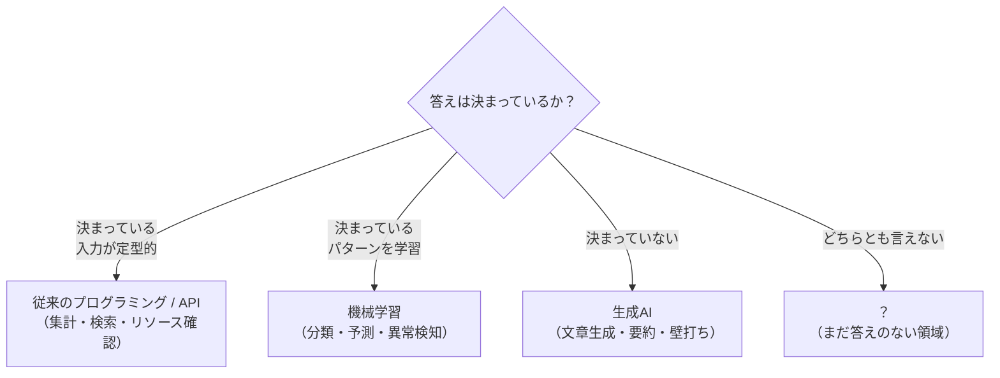

# SC運営×AI実装
## キックオフセミナー

SC業界特有の課題にAIを当てはめる思考を身につける

<div class="pt-12 text-sm opacity-70">
講師：早崎 知弥（宝来エンジニアリング）
</div>

---

# 自己紹介

<div class="grid grid-cols-2 gap-8 items-center mt-4">

<div>


<div class="text-xs opacity-50 mt-2">前職：プラント・製造現場でのエンジニア経験</div>

</div>

<div>

**早崎 知弥**（はやさき ともや）
宝来エンジニアリング

- 現在：AWSを主軸としたクラウドインフラエンジニア（フリーランス）、TerraformなどIaCにも知見あり
- 前職：製造・プラント現場でのエンジニア
- SC経営士会 外部講師 / 年間サポートメンバー

</div>

</div>

<v-click>

**「現場」を知っているからこそ、机上の空論にならないAI活用を話したい**

</v-click>

---

# 本セミナーの全体像

<div class="text-base leading-relaxed mt-4">

- **第1章** AIとは何か ── 定義と歴史
- **第2章** 生成AIとは何か ── 仕組みを知る
- **第3章** AI活用の5段階レベル ── 使い方の地図
- **第4章** Loop / Harness Engineering ── より深く理解する
- **第5章** AIと向き合う心構えと注意点
- **第6章** アイデアソンへ向けて ── 自分でやってみる

</div>

<div class="text-xs opacity-60 mt-4">前半で「知り」、後半で「使う・考える」。最後に自分の業務で試すところまで。</div>

---

# アイディアソンの全体像

<div class="grid grid-cols-2 gap-6 mt-4">

<div>

**フェーズ1**
AI×SC業界の情報収集

<div class="text-sm opacity-70 mt-1">成果物：SC業界でのAI活用事例をまとめる（アプリ制作は不要）</div>

</div>

<div>

**フェーズ2**
自身のビジネスモデルへの組み込み

<div class="text-sm opacity-70 mt-1">成果物：AIをどう組み込むかの仮想的な設計アウトプット（実装は不要）</div>

</div>

</div>

<div class="text-xs opacity-50 mt-4">実施期間：2026年10月〜2027年3月末／成果発表会：2027年3月（予定）</div>

<!--
アイデアソンは約半年間のプログラム。
フェーズ1は情報収集・アウトプットが成果物（アプリ制作は不要）。
フェーズ2は自身のビジネスモデルへのAI組み込みを、仮想的な設計レベルでアウトプットする（実装は不要）。
今日のキックオフは、このプログラム全体の出発点であることを伝える。
-->

---

# 今日のゴール

<v-click>

**AIに関する質問が増えること**

</v-click>

<v-click>

<h1>→ 答えを持ち帰ることより、**問いを持ち帰ること**を重視する</h1>

</v-click>

<!--
今日は答えを覚えて持ち帰る場ではない。
「AIについてもっと知りたい」「自分の業務にどう当てはめられるか」という問いが増えた状態で
帰ってもらうことがゴール。その問いを、これから半年間のアイデアソン期間で深めていく。
-->

---

---
layout: section
---

# 第1章
## AIとは何か――定義と歴史

---
layout: default
class: bg-white
---

# 1-1. 「AI・ML・DL」という言葉の整理

<!-- AI ⊃ ML ⊃ DL の包含関係を図解（インラインSVG）。ラベルはリング帯の中央高さに十分な間隔で配置。注釈は見切れ防止のためSVG外に配置 -->

<div class="flex flex-col items-center">

<svg viewBox="0 0 760 620" xmlns="http://www.w3.org/2000/svg" role="img" class="h-95 w-auto">
<title>AIと生成AIの関係を示す入れ子図</title>
<desc>AIという大きな概念の中に機械学習があり、その中に深層学習、さらにその中に生成AIが位置づけられることを示す4層の同心円図</desc>

<circle cx="380" cy="340" r="300" fill="#E6F1FB" stroke="#185FA5" stroke-width="2"/>
<circle cx="380" cy="340" r="222" fill="#B5D4F4" stroke="#185FA5" stroke-width="2"/>
<circle cx="380" cy="340" r="148" fill="#85B7EB" stroke="#185FA5" stroke-width="2"/>
<circle cx="380" cy="340" r="72" fill="#D85A30" stroke="#993C1D" stroke-width="2"/>

<v-click>
<text x="380" y="90" text-anchor="middle" font-size="20" font-weight="700" fill="#042C53" font-family="'Hiragino Kaku Gothic ProN','Yu Gothic','Noto Sans JP',sans-serif">AI(人工知能)</text>
</v-click>

<v-click>
<text x="380" y="186" text-anchor="middle" font-size="17" font-weight="700" fill="#042C53" font-family="'Hiragino Kaku Gothic ProN','Yu Gothic','Noto Sans JP',sans-serif">ML(機械学習)</text>
</v-click>

<v-click>
<text x="380" y="272" text-anchor="middle" font-size="15" font-weight="700" fill="#0C447C" font-family="'Hiragino Kaku Gothic ProN','Yu Gothic','Noto Sans JP',sans-serif">DL(深層学習)</text>
</v-click>

<v-click>
<text x="380" y="370" text-anchor="middle" font-size="15" font-weight="700" fill="#FFFFFF" font-family="'Hiragino Kaku Gothic ProN','Yu Gothic','Noto Sans JP',sans-serif">生成AI</text>
</v-click>
</svg>

<v-click>
<div class="text-xs opacity-60 mt-2">※生成AIの調整（RLHF）にも強化学習を一部使うが、土台は深層学習</div>
</v-click>

</div>

<!--
発表者ノート:
- 生成AIはAIという大きな概念の中の、深層学習を土台にした一部分であることを伝える
- 「深層強化学習」という言葉は生成AIの主要な分類ではない点に注意（RLHFという調整技術の一部で強化学習の考え方を使っているだけ）
-->

---
layout: default
class: bg-white
---

# 従来の課題解決との違いは？

<!-- 従来のプログラミングと機械学習の違いを示すフロー図（インラインSVG）。角丸なし、注釈はSVG外に配置 -->

<div class="flex flex-col items-center w-full">

<svg viewBox="0 0 940 560" xmlns="http://www.w3.org/2000/svg" role="img" class="w-full" style="max-height: 400px;" font-family="'Hiragino Kaku Gothic ProN','Yu Gothic','Noto Sans JP',sans-serif">
<title>伝統的なプログラミングと機械学習の違いを示すフロー図</title>
<desc>従来のプログラミングはデータと規則から出力を得るのに対し、機械学習は学習フェーズでデータとアルゴリズムからモデルを作り、推論フェーズで新しいデータをモデルに通して出力を得ることを示す図</desc>

<defs>
<marker id="arrow" viewBox="0 0 10 10" refX="8" refY="5" markerWidth="8" markerHeight="8" orient="auto-start-reverse">
<path d="M0,0 L10,5 L0,10 z" fill="#5F5E5A"/>
</marker>
</defs>

<g v-click>
<text x="30" y="28" font-size="8" font-weight="700" fill="#2C2C2A">①従来のプログラミング</text>

<rect x="30" y="46" width="170" height="52" fill="#E6F1FB" stroke="#185FA5" stroke-width="1.5"/>
<text x="115" y="79" text-anchor="middle" font-size="6" fill="#0C447C">データ</text>

<rect x="30" y="112" width="170" height="52" fill="#E6F1FB" stroke="#185FA5" stroke-width="1.5"/>
<text x="115" y="145" text-anchor="middle" font-size="6" fill="#0C447C">規則（プログラム）</text>

<rect x="400" y="79" width="170" height="52" fill="#F1EFE8" stroke="#5F5E5A" stroke-width="1.5"/>
<text x="485" y="112" text-anchor="middle" font-size="6" fill="#2C2C2A">コンピュータ</text>

<rect x="760" y="79" width="150" height="52" fill="#F1EFE8" stroke="#5F5E5A" stroke-width="1.5"/>
<text x="835" y="112" text-anchor="middle" font-size="6" fill="#2C2C2A">出力</text>

<path d="M200,72 L400,95" fill="none" stroke="#5F5E5A" stroke-width="1.5" marker-end="url(#arrow)"/>
<path d="M200,138 L400,115" fill="none" stroke="#5F5E5A" stroke-width="1.5" marker-end="url(#arrow)"/>
<path d="M570,105 L760,105" fill="none" stroke="#5F5E5A" stroke-width="1.5" marker-end="url(#arrow)"/>
</g>

<line x1="30" y1="200" x2="910" y2="200" stroke="#D3D1C7" stroke-width="1"/>

<g v-click>
<text x="30" y="238" font-size="8" font-weight="700" fill="#2C2C2A">②機械学習（学習フェーズ）</text>

<rect x="30" y="256" width="170" height="52" fill="#E6F1FB" stroke="#185FA5" stroke-width="1.5"/>
<text x="115" y="289" text-anchor="middle" font-size="6" fill="#0C447C">データ</text>

<rect x="30" y="322" width="170" height="52" fill="#E6F1FB" stroke="#185FA5" stroke-width="1.5"/>
<text x="115" y="355" text-anchor="middle" font-size="6" fill="#0C447C">アルゴリズム</text>

<rect x="400" y="289" width="170" height="52" fill="#F1EFE8" stroke="#5F5E5A" stroke-width="1.5"/>
<text x="485" y="322" text-anchor="middle" font-size="6" fill="#2C2C2A">コンピュータ</text>

<rect x="760" y="289" width="150" height="52" fill="#F0997B" stroke="#993C1D" stroke-width="1.5"/>
<text x="835" y="322" text-anchor="middle" font-size="6" fill="#4A1B0C">モデル</text>

<path d="M200,282 L400,305" fill="none" stroke="#5F5E5A" stroke-width="1.5" marker-end="url(#arrow)"/>
<path d="M200,348 L400,325" fill="none" stroke="#5F5E5A" stroke-width="1.5" marker-end="url(#arrow)"/>
<path d="M570,315 L760,315" fill="none" stroke="#5F5E5A" stroke-width="1.5" marker-end="url(#arrow)"/>
</g>

<line x1="30" y1="410" x2="910" y2="410" stroke="#D3D1C7" stroke-width="1"/>

<g v-click>
<text x="30" y="448" font-size="8" font-weight="700" fill="#2C2C2A">③機械学習（推論フェーズ）</text>

<rect x="30" y="466" width="190" height="52" fill="#E6F1FB" stroke="#185FA5" stroke-width="1.5"/>
<text x="125" y="499" text-anchor="middle" font-size="6" fill="#0C447C">新しいデータ</text>

<rect x="400" y="466" width="190" height="52" fill="#F0997B" stroke="#993C1D" stroke-width="1.5"/>
<text x="495" y="499" text-anchor="middle" font-size="6" fill="#4A1B0C">学習済みモデル</text>

<rect x="760" y="466" width="150" height="52" fill="#F1EFE8" stroke="#5F5E5A" stroke-width="1.5"/>
<text x="835" y="499" text-anchor="middle" font-size="6" fill="#2C2C2A">出力</text>

<path d="M220,492 L400,492" fill="none" stroke="#5F5E5A" stroke-width="1.5" marker-end="url(#arrow)"/>
<path d="M590,492 L760,492" fill="none" stroke="#5F5E5A" stroke-width="1.5" marker-end="url(#arrow)"/>
</g>
</svg>

<div class="text-xs opacity-60 mt-2">規則を人が書く代わりに、データから規則（＝モデル）を学習させる</div>

</div>

<!--
発表者ノート:
- 「ルールを人間が書く」から「データからルール（モデル）を学ばせる」への発想転換がポイント
- SC業務に例えるなら、過去の対応履歴データから対応パターンをモデルに学ばせるイメージ
-->

---
layout: default
class: bg-white
---

# コードで見ると、違いは「1か所」だけ

<div class="text-sm opacity-70 mb-3">同じ「クレジットカード承認」を、2つのやり方で書いてみる（コードの中身は読めなくてOK）</div>

<div class="grid grid-cols-2 gap-6">

<div>

**従来のプログラミング**

```python {all}{lines:true}
def approve(income, score, debt):
    # 人がルールを書く
    if (income >= 5_000_000
        and score >= 650
        and debt < income * 0.3):
        return "承認"
    else:
        return "却下"
```

<div v-click="1" class="text-xs text-red-700 mt-2">↑ 判定ルールを<strong>人が丸ごと書く</strong></div>

</div>

<div>

**機械学習**

```python {all}{lines:true}
model = DecisionTreeClassifier()

# データから自動で学習する
model.fit(X_train, y_train)

def approve(income, score, debt):
    return model.predict(
        [[income, score, debt]])
```

<div v-click="2" class="text-xs text-red-700 mt-2">↑ ルールは書かない。<strong>fit() でデータから学ぶ</strong></div>

</div>

</div>

<div v-click="3" class="text-center mt-5 text-lg">
違うのは「<strong>ルールを人が書くか / データから学ぶか</strong>」——ただ一点
</div>

<!--
発表者ノート:
- コードの詳細は読ませない。左右で「if文の塊」と「fit()の1行」を対比させるのが狙い
- クリック①：従来はif文＝人がルールを書く。クリック②：機械学習はfit()＝データから学ぶ。クリック③：結論
- 判定基準（年収・スコア・借入）は両者で同じにしてあるので、違いはルールの作り方だけ、と言い切れる
-->

---
layout: default
class: bg-white
---

# 機械学習の定義とは

<!-- 機械学習の定義と3手法のVenn図（インラインSVG）。定義文・注釈はSVG外に配置 -->

<div class="flex flex-col items-center">

<div class="text-center mt-1 max-w-4xl">
機械学習とは、明示的な指示（ルール）を人が書く代わりに、<strong>データからパターンを学習</strong>し、新しいデータに対して予測・推論を行うAIの一分野
<div class="text-xs opacity-50 mt-1">出典: AWS「機械学習とは何ですか?」／ IBM「機械学習とは」</div>
</div>

<svg viewBox="0 0 720 560" xmlns="http://www.w3.org/2000/svg" role="img" class="w-auto mt-2" style="max-height: 330px;" font-family="'Hiragino Kaku Gothic ProN','Yu Gothic','Noto Sans JP',sans-serif">
<title>機械学習の3つの学習パラダイムを示すVenn図</title>
<desc>教師あり学習・教師なし学習・強化学習の3つが重なり合う関係を示す図</desc>

<circle cx="280" cy="250" r="150" fill="#B5D4F4" fill-opacity="0.7" stroke="#185FA5" stroke-width="2"/>
<circle cx="440" cy="250" r="150" fill="#85B7EB" fill-opacity="0.7" stroke="#185FA5" stroke-width="2"/>
<circle cx="360" cy="380" r="150" fill="#F0997B" fill-opacity="0.7" stroke="#993C1D" stroke-width="2"/>

<text x="160" y="230" text-anchor="middle" font-size="9" font-weight="700" fill="#042C53">教師なし学習</text>
<text x="560" y="230" text-anchor="middle" font-size="9" font-weight="700" fill="#042C53">教師あり学習</text>
<text x="360" y="500" text-anchor="middle" font-size="9" font-weight="700" fill="#4A1B0C">強化学習</text>
<text x="360" y="95" text-anchor="middle" font-size="7" font-weight="700" fill="#042C53">半教師あり学習</text>
</svg>

<div class="text-xs opacity-60 mt-1">※3つは独立した手法ではなく、学習の目的やデータに応じた分類の切り口（実際は組み合わせて使う）</div>

</div>

<!--
発表者ノート:
- 機械学習の中にもいくつかのアプローチがあることだけ伝われば十分。各手法の詳細説明は不要
- 教師あり学習が実務では最も触れる機会が多い（分類・予測タスク）
-->

---

# 1-2. 機械学習の成り立ちと発展（時系列）

<!-- AIの3つのブームと、2000年代以降に各分野へ分岐して発展した様子を示す簡易時系列図（オリジナル作図）。文科省/JST俯瞰図を参考に要素を絞って独自作成 -->

<div class="flex flex-col items-center w-full">

<svg viewBox="0 0 960 480" xmlns="http://www.w3.org/2000/svg" role="img" class="w-full" style="max-height: 380px;" font-family="'Hiragino Kaku Gothic ProN','Yu Gothic','Noto Sans JP',sans-serif">
<title>AIの3つのブームと各分野への発展を示す時系列図</title>
<desc>1950年代のダートマス会議から始まり、第1次・第2次・第3次のブームを経て、2000年代以降に理論・応用・社会の各方面へ分岐して発展したことを示す図</desc>

<defs>
<marker id="tarrow" viewBox="0 0 10 10" refX="8" refY="5" markerWidth="7" markerHeight="7" orient="auto-start-reverse">
<path d="M0,0 L10,5 L0,10 z" fill="#185FA5"/>
</marker>
</defs>

<line x1="60" y1="460" x2="900" y2="460" stroke="#5F5E5A" stroke-width="1.5"/>
<text x="95" y="450" text-anchor="middle" font-size="9" fill="#5F5E5A">1956</text>
<text x="330" y="450" text-anchor="middle" font-size="9" fill="#5F5E5A">1980年代</text>
<text x="600" y="450" text-anchor="middle" font-size="9" fill="#5F5E5A">2010年代</text>
<text x="870" y="450" text-anchor="middle" font-size="9" fill="#5F5E5A">現在</text>

<circle cx="95" cy="380" r="6" fill="#B5D4F4" stroke="#185FA5" stroke-width="1.5"/>
<text x="95" y="360" text-anchor="middle" font-size="11" font-weight="700" fill="#042C53">第1次</text>
<text x="95" y="306" text-anchor="middle" font-size="6" fill="#0C447C">ダートマス会議</text>

<circle cx="330" cy="315" r="6" fill="#85B7EB" stroke="#185FA5" stroke-width="1.5"/>
<text x="330" y="295" text-anchor="middle" font-size="11" font-weight="700" fill="#042C53">第2次</text>
<text x="330" y="231" text-anchor="middle" font-size="6" fill="#0C447C">エキスパートシステム</text>

<circle cx="580" cy="230" r="8" fill="#D85A30" stroke="#993C1D" stroke-width="1.5"/>
<text x="580" y="168" text-anchor="middle" font-size="13" font-weight="700" fill="#4A1B0C">第3次ブーム</text>
<text x="580" y="102" text-anchor="middle" font-size="6" fill="#712B13">深層学習の登場</text>

<path d="M101,374 Q210,360 324,320" fill="none" stroke="#185FA5" stroke-width="1.5"/>
<path d="M336,310 Q450,275 572,235" fill="none" stroke="#185FA5" stroke-width="1.5"/>

<g v-click>
<path d="M588,225 Q720,160 860,110" fill="none" stroke="#185FA5" stroke-width="1.5" marker-end="url(#tarrow)"/>
<text x="900" y="108" text-anchor="end" font-size="11" font-weight="700" fill="#042C53">理論の革新</text>
</g>

<g v-click>
<path d="M589,231 Q720,225 860,220" fill="none" stroke="#185FA5" stroke-width="1.5" marker-end="url(#tarrow)"/>
<text x="900" y="218" text-anchor="end" font-size="11" font-weight="700" fill="#042C53">応用の拡大</text>
</g>

<g v-click>
<path d="M587,238 Q720,290 860,330" fill="none" stroke="#185FA5" stroke-width="1.5" marker-end="url(#tarrow)"/>
<text x="900" y="338" text-anchor="end" font-size="11" font-weight="700" fill="#042C53">社会との関係</text>
</g>
</svg>

<div class="text-xs opacity-60 mt-2">AIは1950年代から研究されてきた<br>第3次ブーム以降、理論・応用・社会の各方面へ広がっている（文科省「科学技術白書」/ JST研究開発戦略センターの俯瞰図を参考に作図）</div>

</div>

---

# 1-3. 機械学習は、こんなに広い領域で成果を出している

<div class="grid grid-cols-2 gap-8 mt-2">

<div>

**成功しているタスクの例**

<div class="text-sm">

- 迷惑メール（スパム）の判定
- ターゲティング広告の顧客セグメント化
- 天気予報・長期的な気候変動の予測
- クレジットカードの不正取引の検知
- 自然災害の被害額予測（保険数理）
- 自動運転・ドローンの制御
- エネルギー利用の最適化
- 遺伝子配列の解析（疫病）
- 防犯カメラの物体検出

</div>

</div>

<div>

**ビジネスへの応用（目的別）**

<div class="text-sm">

- **売上向上**：配車予測、来客分析、需要予測（小売・農業）
- **コスト削減**：コールセンター自動化、点検の自動化
- **信頼性担保**：がん診断支援、原油備蓄量の分析
- **監視・管理**：電力需給予測、ドライバーの安全管理
- **人員不足解消**：配達ルート最適化、レジの商品自動識別

</div>

</div>

</div>

<div class="text-xs opacity-60 mt-3">前ページの「各方面への発展」が、実際のビジネス領域ではこれだけの用途になっている</div>

---
layout: default
class: bg-white
---

# ここまでのまとめ

<div class="text-lg leading-relaxed mt-6">

<div v-click>

<h3>1. AIという大きな概念の中に機械学習があり、その中に深層学習、さらに生成AIが位置づけられる。</h3>

</div>

<div v-click class="mt-6">

<h3>2. 機械学習は、人がルールを書く従来のプログラミングと違い、<strong>データからルール（モデル）を学習</strong>し、分類・予測・分析を行う。</h3>

</div>

<div v-click class="mt-6">

<h3>3. AIの研究は約70年前に始まり、ブームと冬の時代を繰り返しながら、いまや各方面へ発展している。</h3>

</div>

</div>

<!--
発表者ノート:
- 1行目は同心円図（1-1）の入れ子構造を回収。「並列」ではなく「入れ子」であることを口頭でも補足
- 2行目はコード比較（if vs fit）とフロー図を回収
- 3行目は俯瞰図（1-2）を回収。この直後のパンチラインへつなぐ
-->

---
layout: center
class: text-center
---

<!-- 話の転換点・パンチライン（タイトルなし／ワンメッセージ）。機械学習の説明の締め -->

# **生成AIと機械学習、従来のプログラミング<br>なにを使えばいいの？**

---
layout: default
class: bg-white
---

# 正直、僕もまだ答えを持っていない

<div class="mt-4">

いま、ほとんどの案件で生成AIを使って業務をしている。

</div>

<div v-click class="mt-6">

でも——クラウドのリソース確認のように、<strong>答えが決まっている作業</strong>にまで生成AIを使うのは、正直ちょっと違うと思っている。

</div>

<div v-click class="mt-6">

確実な答えがあるものを、わざわざ「それっぽく答える道具」に置き換える必要はない。

</div>

<div v-click class="mt-8 text-center text-xl">

問うべきは「生成AIか、従来か」ではなく<br>
<strong>「その作業の答えは、決まっているか？」</strong>

</div>

<!--
発表者ノート:
- ここは断言せず「まだ答えは出ていない」という正直なスタンスで話す
- 答えが決まっている作業（リソース確認・集計・検索・ルール判定）→ API/スクリプト/従来手法で十分
- 答えが決まっていない作業（文章生成・要約・方針の壁打ち・あいまいな入力の解釈）→ 生成AIの出番
- 構造化データの数値予測・分類・異常検知 → 従来の機械学習が速くて安い
- このセミナーのゴール（問いを持ち帰る）に合わせ、聴衆に問いを渡す形で締める
-->

---
layout: default
class: bg-white
---

# 使い分けの目安：まず「答えは決まっているか？」

<div class="flex justify-center mt-2">



</div>

<div class="text-xs opacity-60 mt-2 text-center">「生成AIか従来か」ではなく、作業の性質から選ぶ。判断に迷う「？」の領域こそ、後半で考えていく</div>

<!--
発表者ノート:
- パンチラインの問い「答えは決まっているか？」を、そのまま判断の入口に置いた
- 「？（まだ答えのない領域）」が後半「生成AIをどう使いこなすか」への入り口になる
- 断定ではなく、判断の目安として提示する
-->

---
layout: section
---

# 第2章

## 生成AIとは何か

---

# 2-1. 生成AIの仕組み

<!-- bbycroft可視化 https://bbycroft.net/llm を画面共有 / iframeで見せる。WOWモーメント。見せるが教えない -->

<iframe src="https://tiktokenizer.vercel.app/?model=cl100k_base" class="w-full h-100 border-0" />


---

<iframe src="https://bbycroft.net/llm" class="w-full h-100 border-0" />

---
layout: default
class: bg-white
---

# 生成AIは、ざっくり2ステップで動く

<div class="grid grid-cols-[1fr_auto_1fr_auto_1fr] gap-3 items-center mt-10 text-center">

<div class="border-2 border-[#0b2f64] p-5">

**プロンプト**<br>
人間が入力する文章

</div>

<div class="text-3xl text-[#0b2f64]">▶</div>

<div class="border-2 border-[#0b2f64] p-5">

**トークンに変換**<br>
文章を細かい単位に分解

</div>

<div class="text-3xl text-[#0b2f64]">▶</div>

<div class="border-2 border-[#0b2f64] p-5">

**膨大パラメータで確率計算**<br>
次に来やすい単語を予測

</div>

</div>

<div v-click class="text-center mt-10 text-xl">

<h2>つまり、生成AIは<strong>「次の単語」を確率で選び続けている</strong>だけ</h2>

</div>

<!--
発表者ノート:
- 前のtiktokenizerデモが「トークンに変換」、次のbbycroftデモが「膨大なパラメータで確率計算」に対応
- 難しい仕組みは見せるが教えない。この2ステップだけ持ち帰ってもらう
-->

---
layout: default
class: bg-white
---

# 生成AIも、実は機械学習と同じ仕組み

<!-- 第1章の「機械学習」の図と同じ箱・矢印を踏襲し、学習/推論フェーズが共通であることを示す。角丸なし、注釈はSVG外 -->
<br>
<div class="flex flex-col items-center w-full">

<svg viewBox="0 0 900 470" xmlns="http://www.w3.org/2000/svg" role="img" class="w-full" style="max-height: 380px;" font-family="'Hiragino Kaku Gothic ProN','Yu Gothic','Noto Sans JP',sans-serif">
<title>機械学習と生成AIが同じ学習・推論構造を持つことを示す図</title>
<desc>機械学習の学習フェーズ・推論フェーズと、生成AIの同じ構造（テキストデータ・Transformer・LLMによる学習、プロンプト・LLM・出力による推論）を比較する図</desc>

<defs>
<marker id="arrow2" viewBox="0 0 10 10" refX="8" refY="5" markerWidth="7" markerHeight="7" orient="auto-start-reverse">
<path d="M0,0 L10,5 L0,10 z" fill="#5F5E5A"/>
</marker>
</defs>

<text x="40" y="28" font-size="7.5" font-weight="700" fill="#2C2C2A">機械学習（一般化した構造）</text>

<rect x="40" y="42" width="180" height="46" fill="#E6F1FB" stroke="#185FA5" stroke-width="1.5"/>
<text x="130" y="70" text-anchor="middle" font-size="5" fill="#0C447C">訓練データ</text>
<rect x="290" y="42" width="180" height="46" fill="#E6F1FB" stroke="#185FA5" stroke-width="1.5"/>
<text x="380" y="70" text-anchor="middle" font-size="5" fill="#0C447C">アルゴリズム</text>
<rect x="540" y="42" width="200" height="46" fill="#F0997B" stroke="#993C1D" stroke-width="1.5"/>
<text x="640" y="70" text-anchor="middle" font-size="5" fill="#4A1B0C">モデル（学習済み）</text>
<path d="M220,65 L290,65" fill="none" stroke="#5F5E5A" stroke-width="1.5" marker-end="url(#arrow2)"/>
<path d="M470,65 L540,65" fill="none" stroke="#5F5E5A" stroke-width="1.5" marker-end="url(#arrow2)"/>

<rect x="40" y="106" width="180" height="46" fill="#E6F1FB" stroke="#185FA5" stroke-width="1.5"/>
<text x="130" y="134" text-anchor="middle" font-size="5" fill="#0C447C">新しい入力</text>
<rect x="290" y="106" width="180" height="46" fill="#F0997B" stroke="#993C1D" stroke-width="1.5"/>
<text x="380" y="134" text-anchor="middle" font-size="5" fill="#4A1B0C">モデル</text>
<rect x="540" y="106" width="200" height="46" fill="#F1EFE8" stroke="#5F5E5A" stroke-width="1.5"/>
<text x="640" y="134" text-anchor="middle" font-size="5" fill="#2C2C2A">出力</text>
<path d="M220,129 L290,129" fill="none" stroke="#5F5E5A" stroke-width="1.5" marker-end="url(#arrow2)"/>
<path d="M470,129 L540,129" fill="none" stroke="#5F5E5A" stroke-width="1.5" marker-end="url(#arrow2)"/>

<line x1="40" y1="182" x2="740" y2="182" stroke="#D3D1C7" stroke-width="1"/>

<text x="40" y="212" font-size="7.5" font-weight="700" fill="#2C2C2A">生成AI（同じ構造に当てはめると）</text>
<rect x="40" y="226" width="180" height="46" fill="#E6F1FB" stroke="#185FA5" stroke-width="1.5"/>
<text x="130" y="260" text-anchor="middle" font-size="5" fill="#0C447C">テキストデータ</text>
<rect x="290" y="226" width="180" height="46" fill="#E6F1FB" stroke="#185FA5" stroke-width="1.5"/>
<text x="380" y="254" text-anchor="middle" font-size="5" fill="#0C447C">Transformer</text>
<rect x="540" y="226" width="200" height="46" fill="#F0997B" stroke="#993C1D" stroke-width="1.5"/>
<text x="643" y="255" text-anchor="middle" font-size="4.5" fill="#4A1B0C">LLM（事前学習済み）</text>
<path d="M220,249 L290,249" fill="none" stroke="#5F5E5A" stroke-width="1.5" marker-end="url(#arrow2)"/>
<path d="M470,249 L540,249" fill="none" stroke="#5F5E5A" stroke-width="1.5" marker-end="url(#arrow2)"/>

<rect x="40" y="290" width="180" height="46" fill="#E6F1FB" stroke="#185FA5" stroke-width="1.5"/>
<text x="130" y="318" text-anchor="middle" font-size="5" fill="#0C447C">プロンプト</text>
<rect x="290" y="290" width="180" height="46" fill="#F0997B" stroke="#993C1D" stroke-width="1.5"/>
<text x="380" y="318" text-anchor="middle" font-size="5" fill="#4A1B0C">LLM</text>
<rect x="540" y="290" width="200" height="46" fill="#F1EFE8" stroke="#5F5E5A" stroke-width="1.5"/>
<text x="640" y="318" text-anchor="middle" font-size="5" fill="#2C2C2A">出力テキスト</text>
<path d="M220,313 L290,313" fill="none" stroke="#5F5E5A" stroke-width="1.5" marker-end="url(#arrow2)"/>
<path d="M470,313 L540,313" fill="none" stroke="#5F5E5A" stroke-width="1.5" marker-end="url(#arrow2)"/>

<text x="390" y="380" text-anchor="middle" font-size="7.5" font-weight="700" fill="#042C53">学習フェーズ・推論フェーズという骨格は共通</text>
</svg>

<div class="text-sm text-center mt-2">生成AIは「言葉」を大量に学習した<strong>機械学習モデルの一種</strong></div>

</div>

<!--
発表者ノート:
- 第1章の「従来のプログラミング vs 機械学習」の図と同じ箱・矢印を意図的に踏襲
- 「前に見た型に、もう1つ当てはまった」で理解の負荷を下げる
- ベクターストア/RAGは注釈で軽く触れる程度。「生成AIは常に検索している」という誤解を避ける
-->

---

# 2-2. なぜ「次の単語」を高精度で予測できるのか

<!-- 同じ「次単語予測」を、文脈をどこまで見て解くかの進化（n-gram / RNN・LSTM / Transformer）で比較。角丸なし、締めの注釈はSVG外、フォントは5〜6 -->

<div class="flex flex-col items-center w-full">

<svg viewBox="0 0 680 580" xmlns="http://www.w3.org/2000/svg" role="img" class="w-full" style="max-height: 400px;" font-family="'Hiragino Kaku Gothic ProN','Yu Gothic','Noto Sans JP',sans-serif">
<title>n-gram・RNN/LSTM・Transformerが次の単語を予測する際に、どこまで文脈を見ているかを比較する図</title>
<desc>同じ文「先月の来館者数は大きく＿＿」を例に、n-gramは直前の数語だけ、RNN/LSTMは全体を見るが古い情報ほど薄れる、Transformerは全単語を均等に直接参照することを示す3段の比較図</desc>

<defs>
<marker id="a1" viewBox="0 0 10 10" refX="9" refY="5" markerWidth="6" markerHeight="6" orient="auto-start-reverse">
<path d="M0,0 L10,5 L0,10 z" fill="#5F5E5A"/>
</marker>
</defs>

<text x="40" y="30" font-size="6" font-weight="700" fill="#2C2C2A">① n-gram（統計的手法）：直前の数語しか見ていない</text>

<rect x="40" y="52" width="80" height="38" fill="#F1EFE8" stroke="#D3D1C7" stroke-width="1.5"/>
<text x="80" y="75" text-anchor="middle" font-size="5" fill="#888780">先月</text>
<rect x="130" y="52" width="80" height="38" fill="#F1EFE8" stroke="#D3D1C7" stroke-width="1.5"/>
<text x="170" y="75" text-anchor="middle" font-size="5" fill="#888780">の</text>
<rect x="220" y="52" width="80" height="38" fill="#F1EFE8" stroke="#D3D1C7" stroke-width="1.5"/>
<text x="260" y="75" text-anchor="middle" font-size="5" fill="#888780">来館者数</text>
<rect x="310" y="52" width="80" height="38" fill="#E6F1FB" stroke="#185FA5" stroke-width="1.5"/>
<text x="350" y="75" text-anchor="middle" font-size="5" fill="#0C447C">は</text>
<rect x="400" y="52" width="80" height="38" fill="#E6F1FB" stroke="#185FA5" stroke-width="1.5"/>
<text x="440" y="75" text-anchor="middle" font-size="5" fill="#0C447C">大きく</text>
<rect x="490" y="52" width="70" height="38" fill="#F0997B" stroke="#993C1D" stroke-width="1.5"/>
<text x="525" y="76" text-anchor="middle" font-size="8" fill="#4A1B0C">？</text>
<path d="M390,71 L488,71" fill="none" stroke="#185FA5" stroke-width="1.5" marker-end="url(#a1)"/>
<path d="M300,71 L308,71" fill="none" stroke="#D3D1C7" stroke-width="1.5" stroke-dasharray="3,3"/>
<text x="170" y="116" text-anchor="middle" font-size="5.5" fill="#888780">この範囲は見ていない</text>

<line x1="40" y1="150" x2="640" y2="150" stroke="#D3D1C7" stroke-width="1"/>

<text x="40" y="188" font-size="6" font-weight="700" fill="#2C2C2A">② RNN・LSTM：全体を見るが、古い情報ほど記憶が薄れる</text>

<rect x="40" y="210" width="80" height="38" fill="#E6F1FB" fill-opacity="0.25" stroke="#185FA5" stroke-opacity="0.4" stroke-width="1.5"/>
<text x="80" y="233" text-anchor="middle" font-size="5" fill="#185FA5" fill-opacity="0.6">先月</text>
<rect x="130" y="210" width="80" height="38" fill="#E6F1FB" fill-opacity="0.4" stroke="#185FA5" stroke-opacity="0.55" stroke-width="1.5"/>
<text x="170" y="233" text-anchor="middle" font-size="5" fill="#185FA5" fill-opacity="0.75">の</text>
<rect x="220" y="210" width="80" height="38" fill="#E6F1FB" fill-opacity="0.6" stroke="#185FA5" stroke-opacity="0.7" stroke-width="1.5"/>
<text x="260" y="233" text-anchor="middle" font-size="5" fill="#0C447C">来館者数</text>
<rect x="310" y="210" width="80" height="38" fill="#E6F1FB" fill-opacity="0.8" stroke="#185FA5" stroke-width="1.5"/>
<text x="350" y="233" text-anchor="middle" font-size="5" fill="#0C447C">は</text>
<rect x="400" y="210" width="80" height="38" fill="#E6F1FB" stroke="#185FA5" stroke-width="1.5"/>
<text x="440" y="233" text-anchor="middle" font-size="5" fill="#0C447C">大きく</text>
<rect x="490" y="210" width="70" height="38" fill="#F0997B" stroke="#993C1D" stroke-width="1.5"/>
<text x="525" y="234" text-anchor="middle" font-size="8" fill="#4A1B0C">？</text>
<path d="M120,229 L128,229" fill="none" stroke="#185FA5" stroke-opacity="0.3" stroke-width="1.5" marker-end="url(#a1)"/>
<path d="M210,229 L218,229" fill="none" stroke="#185FA5" stroke-opacity="0.45" stroke-width="1.5" marker-end="url(#a1)"/>
<path d="M300,229 L308,229" fill="none" stroke="#185FA5" stroke-opacity="0.6" stroke-width="1.5" marker-end="url(#a1)"/>
<path d="M390,229 L398,229" fill="none" stroke="#185FA5" stroke-opacity="0.8" stroke-width="1.5" marker-end="url(#a1)"/>
<path d="M480,229 L488,229" fill="none" stroke="#185FA5" stroke-width="1.5" marker-end="url(#a1)"/>
<text x="180" y="274" text-anchor="middle" font-size="5.5" fill="#888780">1語ずつ順番に読み、古い記憶ほど薄くなる</text>

<line x1="40" y1="308" x2="640" y2="308" stroke="#D3D1C7" stroke-width="1"/>

<text x="40" y="346" font-size="6" font-weight="700" fill="#2C2C2A">③ Transformer（Attention）：全単語を均等に、直接見る</text>

<rect x="40" y="368" width="80" height="38" fill="#E6F1FB" stroke="#185FA5" stroke-width="1.5"/>
<text x="80" y="391" text-anchor="middle" font-size="5" fill="#0C447C">先月</text>
<rect x="130" y="368" width="80" height="38" fill="#E6F1FB" stroke="#185FA5" stroke-width="1.5"/>
<text x="170" y="391" text-anchor="middle" font-size="5" fill="#0C447C">の</text>
<rect x="220" y="368" width="80" height="38" fill="#E6F1FB" stroke="#185FA5" stroke-width="1.5"/>
<text x="260" y="391" text-anchor="middle" font-size="5" fill="#0C447C">来館者数</text>
<rect x="310" y="368" width="80" height="38" fill="#E6F1FB" stroke="#185FA5" stroke-width="1.5"/>
<text x="350" y="391" text-anchor="middle" font-size="5" fill="#0C447C">は</text>
<rect x="400" y="368" width="80" height="38" fill="#E6F1FB" stroke="#185FA5" stroke-width="1.5"/>
<text x="440" y="391" text-anchor="middle" font-size="5" fill="#0C447C">大きく</text>
<rect x="490" y="368" width="70" height="38" fill="#F0997B" stroke="#993C1D" stroke-width="1.5"/>
<text x="525" y="392" text-anchor="middle" font-size="8" fill="#4A1B0C">？</text>
<path d="M80,406 C80,445 500,455 515,408" fill="none" stroke="#185FA5" stroke-width="1.3" stroke-opacity="0.75" marker-end="url(#a1)"/>
<path d="M170,406 C170,440 500,450 518,408" fill="none" stroke="#185FA5" stroke-width="1.3" stroke-opacity="0.75" marker-end="url(#a1)"/>
<path d="M260,406 C260,430 490,440 522,408" fill="none" stroke="#185FA5" stroke-width="1.3" stroke-opacity="0.75" marker-end="url(#a1)"/>
<path d="M350,406 L470,408" fill="none" stroke="#185FA5" stroke-width="1.3" stroke-opacity="0.75" marker-end="url(#a1)"/>
<path d="M440,406 L488,407" fill="none" stroke="#185FA5" stroke-width="1.3" stroke-opacity="0.75" marker-end="url(#a1)"/>
</svg>

<div class="text-xs opacity-70 mt-2 text-center">「先月」も「大きく」も、距離に関係なく同じ強さで直接つながっている（＝Attention）。文脈が深く読めるようになり、予測精度が上がった</div>

</div>

<!--
発表者ノート:
- 「次の単語を当てる」タスク自体は3つとも共通。変わったのは文脈をどこまで見て解くか
- ① n-gram: 直前の数語のみ（浅い文脈）
- ② RNN/LSTM: 全体を順番に読むが古い情報ほど薄れる。1語ずつしか処理できず学習も遅い
- ③ Transformer: 全単語を同時・距離に関係なく直接参照（深い文脈）。並列処理で大規模データを高速学習
- 因果は「文脈が読めるようになったから精度が上がった」
-->

---

# 2-3. 結局、どれを使えばいいの？（代表的なツール）

<div class="text-sm opacity-70 mb-4">難しい話が続いたので、ここは肩の力を抜いて。名前だけ知っておけばOKです</div>

<div class="text-base leading-relaxed">

- **ChatGPT / Claude / Gemini** ＝ いわゆる<strong>御三家</strong>。まず触るならこの3つ。日常の文章・要約・相談はどれでも十分
- **Claude Code** ＝ <strong>エージェントのはしり</strong>。指示すると、自分で調べて手を動かしてくれる
- **AWS Bedrock** ＝ 自社システムに<strong>LLMを組み込みたい</strong>とき使う、クラウドの土台
- **Harness（ハーネス）** ＝ <strong>？</strong>

</div>

<div v-click class="mt-8 text-center text-xl">

この「<strong>？</strong>」が、後半の主役です

</div>

<!--
発表者ノート:
- ここは受講生に近い立場で、くだけて話す。「全部覚えなくていい、名前だけ」
- 御三家は日常用途ならどれでもOK、と安心させる
- Claude Codeで「エージェント」という言葉に触れておく（後半L3〜の伏線）
- Harnessをあえて「？」のままにして、第3章／後半のLoop・Harness Engineeringへ引き込む
-->

---
layout: section
---

# 第3章
## AI活用の5段階レベル

---
layout: center
class: text-center
---

<!-- 第3章の導入パンチライン（タイトルなし／ワンメッセージ）。5段階レベルへの動機づけ -->

# **あなたは、AIを<br>「うまく」使えていますか？**

<div v-click class="mt-10 text-2xl">

その「<strong>うまく</strong>」を、<br>言葉で説明できますか？

</div>

---
layout: center
class: text-center
---

<div class="text-xl leading-relaxed">

「なんとなく便利」で止まっていると、<br>
そこから先に進めない。

<div v-click class="mt-8">

だから、<strong>使い方に"ものさし"を持つ</strong>。<br>
それが、これから見る<strong>5段階レベル</strong>です。

</div>

</div>

<!--
発表者ノート:
- 「うまく使えていますか？」は多くの人がYesと答える。だが「うまくを言語化して」で詰まる
- 言語化できない＝改善の方向が見えない、という気づきを与える
- そのものさしとしてL1〜L5を提示する、と自然につなぐ
- レベルが上＝偉い、ではない点は後のスライドで補足（手法の違いであって優劣ではない）
-->

---

# その前に：「エージェント」とは？

<div class="text-sm opacity-70 mb-4">この後よく出てくる言葉なので、ここで一度だけ整理します</div>

<div class="text-base leading-relaxed">

<div v-click>

**チャット型AI**（ChatGPT等）＝ 質問に<strong>言葉で答える</strong >。答えたら終わり。

</div>

<div v-click class="mt-5">

**エージェント型AI**（Claude Code等）＝ 目的を渡すと、<strong>自分で調べ・道具を使い・手を動かす</strong>。ファイルを読む、プログラムを動かす、検索する、を<strong>繰り返して</strong>ゴールに近づく。

</div>

</div>

<div v-click class="text-center mt-6 text-lg">

ひとことで言えば、<strong>エージェント＝「道具を使いながら、繰り返し働くAI」</strong>

</div>

<div class="text-xs opacity-50 mt-4">参考: Mitchell Hashimoto「エージェントとは、ループの中でツールを呼べるLLM」</div>

<!--
発表者ノート:
- L3以降が「エージェント構築」なので、その前に用語を一度だけ押さえる
- 「答えて終わり」か「動いて働く」か、の対比で直感的に
- この「繰り返し働く」がのちのループの話につながる伏線
-->

---

<!-- 3-1〜3-3: AI活用の5段階レベル。ピラミッドで該当レベルをハイライトしながら1枚ずつ説明（L1→L5） -->

# 3-1. AI活用の5段階レベル ── L1

<div class="grid grid-cols-2 gap-6 items-center">

<div class="flex justify-center">
<svg viewBox="0 0 760 440" xmlns="http://www.w3.org/2000/svg" role="img" class="h-90 w-auto" font-family="'Hiragino Kaku Gothic ProN','Yu Gothic','Noto Sans JP',sans-serif">
<title>AI活用5段階のピラミッド。L1をハイライト</title>
<polygon points="380,70 428,134 332,134" fill="#B5D4F4" opacity="0.25" stroke="#185FA5" stroke-width="1.5"/>
<polygon points="332,134 428,134 476,198 284,198" fill="#B5D4F4" opacity="0.25" stroke="#185FA5" stroke-width="1.5"/>
<polygon points="284,198 476,198 524,262 236,262" fill="#B5D4F4" opacity="0.25" stroke="#185FA5" stroke-width="1.5"/>
<polygon points="236,262 524,262 572,326 188,326" fill="#B5D4F4" opacity="0.25" stroke="#185FA5" stroke-width="1.5"/>
<polygon points="188,326 572,326 620,390 140,390" fill="#D85A30" stroke="#993C1D" stroke-width="2"/>
<text x="380" y="112" text-anchor="middle" font-size="13" font-weight="700" fill="#042C53" opacity="0.4">L5</text>
<text x="380" y="176" text-anchor="middle" font-size="13" font-weight="700" fill="#042C53" opacity="0.4">L4</text>
<text x="380" y="240" text-anchor="middle" font-size="13" font-weight="700" fill="#042C53" opacity="0.4">L3</text>
<text x="380" y="304" text-anchor="middle" font-size="13" font-weight="700" fill="#042C53" opacity="0.4">L2</text>
<text x="380" y="366" text-anchor="middle" font-size="18" font-weight="700" fill="#b30a0a">L1</text>
</svg>
</div>

<div>

## L1：チャット・プロンプト

<div class="text-sm mt-3 leading-relaxed">

- **やること**：AIに話しかけて、その場で答えをもらう
- **代表ツール**：ChatGPT / Claude / Gemini / Copilot
- **SC業務での使い方**：議事録・文案・報告書の下書き

</div>

<div class="text-xs opacity-60 mt-4">まずここから。誰でも今日から始められる入口</div>

</div>

</div>

---

# 3-1. AI活用の5段階レベル ── L2

<div class="grid grid-cols-2 gap-6 items-center">

<div class="flex justify-center">
<svg viewBox="0 0 760 440" xmlns="http://www.w3.org/2000/svg" role="img" class="h-90 w-auto" font-family="'Hiragino Kaku Gothic ProN','Yu Gothic','Noto Sans JP',sans-serif">
<title>AI活用5段階のピラミッド。L2をハイライト</title>
<polygon points="380,70 428,134 332,134" fill="#B5D4F4" opacity="0.25" stroke="#185FA5" stroke-width="1.5"/>
<polygon points="332,134 428,134 476,198 284,198" fill="#B5D4F4" opacity="0.25" stroke="#185FA5" stroke-width="1.5"/>
<polygon points="284,198 476,198 524,262 236,262" fill="#B5D4F4" opacity="0.25" stroke="#185FA5" stroke-width="1.5"/>
<polygon points="236,262 524,262 572,326 188,326" fill="#D85A30" stroke="#993C1D" stroke-width="2"/>
<polygon points="188,326 572,326 620,390 140,390" fill="#B5D4F4" opacity="0.25" stroke="#185FA5" stroke-width="1.5"/>
<text x="380" y="112" text-anchor="middle" font-size="13" font-weight="700" fill="#042C53" opacity="0.4">L5</text>
<text x="380" y="176" text-anchor="middle" font-size="13" font-weight="700" fill="#042C53" opacity="0.4">L4</text>
<text x="380" y="240" text-anchor="middle" font-size="13" font-weight="700" fill="#042C53" opacity="0.4">L3</text>
<text x="380" y="302" text-anchor="middle" font-size="18" font-weight="700" fill="#b30a0a">L2</text>
<text x="380" y="366" text-anchor="middle" font-size="13" font-weight="700" fill="#042C53" opacity="0.4">L1</text>
</svg>
</div>

<div>

## L2：プロンプトエンジニアリング

<div class="text-sm mt-3 leading-relaxed">

- **やること**：指示や前提を作り込み、AIの出力を安定させる
- **代表ツール**：Claude Projects / Custom GPTs / Notion AI
- **SC業務での使い方**：SC特化FAQ、定型分析レポートの自動生成

</div>

<div class="text-xs opacity-60 mt-4">「毎回同じ質の答え」を引き出せるようにする段階</div>

</div>

</div>

---

# 3-1. AI活用の5段階レベル ── L3

<div class="grid grid-cols-2 gap-6 items-center">

<div class="flex justify-center">
<svg viewBox="0 0 760 440" xmlns="http://www.w3.org/2000/svg" role="img" class="h-90 w-auto" font-family="'Hiragino Kaku Gothic ProN','Yu Gothic','Noto Sans JP',sans-serif">
<title>AI活用5段階のピラミッド。L3をハイライト</title>
<polygon points="380,70 428,134 332,134" fill="#B5D4F4" opacity="0.25" stroke="#185FA5" stroke-width="1.5"/>
<polygon points="332,134 428,134 476,198 284,198" fill="#B5D4F4" opacity="0.25" stroke="#185FA5" stroke-width="1.5"/>
<polygon points="284,198 476,198 524,262 236,262" fill="#D85A30" stroke="#993C1D" stroke-width="2"/>
<polygon points="236,262 524,262 572,326 188,326" fill="#B5D4F4" opacity="0.25" stroke="#185FA5" stroke-width="1.5"/>
<polygon points="188,326 572,326 620,390 140,390" fill="#B5D4F4" opacity="0.25" stroke="#185FA5" stroke-width="1.5"/>
<text x="380" y="112" text-anchor="middle" font-size="13" font-weight="700" fill="#042C53" opacity="0.4">L5</text>
<text x="380" y="176" text-anchor="middle" font-size="13" font-weight="700" fill="#042C53" opacity="0.4">L4</text>
<text x="380" y="238" text-anchor="middle" font-size="18" font-weight="700" fill="#b30a0a">L3</text>
<text x="380" y="304" text-anchor="middle" font-size="13" font-weight="700" fill="#042C53" opacity="0.4">L2</text>
<text x="380" y="366" text-anchor="middle" font-size="13" font-weight="700" fill="#042C53" opacity="0.4">L1</text>
</svg>
</div>

<div>

## L3：エージェント構築

<div class="text-sm mt-3 leading-relaxed">

- **やること**：AIに道具を持たせ、一連の作業を自分で実行させる
- **代表ツール**：Claude Code / Devin / Make.com / Zapier AI
- **SC業務での使い方**：売上データ取得 → 分析 → レポート送信を自動実行

</div>

<div class="text-xs opacity-60 mt-4">「相談相手」から「作業してくれる相手」へ変わる段階</div>

</div>

</div>

---

# 3-1. AI活用の5段階レベル ── L4

<div class="grid grid-cols-2 gap-6 items-center">

<div class="flex justify-center">
<svg viewBox="0 0 760 440" xmlns="http://www.w3.org/2000/svg" role="img" class="h-90 w-auto" font-family="'Hiragino Kaku Gothic ProN','Yu Gothic','Noto Sans JP',sans-serif">
<title>AI活用5段階のピラミッド。L4をハイライト</title>
<polygon points="380,70 428,134 332,134" fill="#B5D4F4" opacity="0.25" stroke="#185FA5" stroke-width="1.5"/>
<polygon points="332,134 428,134 476,198 284,198" fill="#D85A30" stroke="#993C1D" stroke-width="2"/>
<polygon points="284,198 476,198 524,262 236,262" fill="#B5D4F4" opacity="0.25" stroke="#185FA5" stroke-width="1.5"/>
<polygon points="236,262 524,262 572,326 188,326" fill="#B5D4F4" opacity="0.25" stroke="#185FA5" stroke-width="1.5"/>
<polygon points="188,326 572,326 620,390 140,390" fill="#B5D4F4" opacity="0.25" stroke="#185FA5" stroke-width="1.5"/>
<text x="380" y="112" text-anchor="middle" font-size="13" font-weight="700" fill="#042C53" opacity="0.4">L5</text>
<text x="380" y="174" text-anchor="middle" font-size="18" font-weight="700" fill="#b30a0a">L4</text>
<text x="380" y="240" text-anchor="middle" font-size="13" font-weight="700" fill="#042C53" opacity="0.4">L3</text>
<text x="380" y="304" text-anchor="middle" font-size="13" font-weight="700" fill="#042C53" opacity="0.4">L2</text>
<text x="380" y="366" text-anchor="middle" font-size="13" font-weight="700" fill="#042C53" opacity="0.4">L1</text>
</svg>
</div>

<div>

## L4：マルチエージェント連携

<div class="text-sm mt-3 leading-relaxed">

- **やること**：役割の違う複数のAIを連携させ、横断的に処理する
- **代表ツール**：AWS Bedrock Agents / LangGraph / CrewAI
- **SC業務での使い方**：営業・施設管理・販促を横断して自動化

</div>

<div class="text-xs opacity-60 mt-4">1体では手に負えない、複数部門をまたぐ業務の段階</div>

</div>

</div>

---

# 3-1. AI活用の5段階レベル ── L5

<div class="grid grid-cols-2 gap-6 items-center">

<div class="flex justify-center">
<svg viewBox="0 0 760 440" xmlns="http://www.w3.org/2000/svg" role="img" class="h-90 w-auto" font-family="'Hiragino Kaku Gothic ProN','Yu Gothic','Noto Sans JP',sans-serif">
<title>AI活用5段階のピラミッド。L5をハイライト</title>
<polygon points="380,70 428,134 332,134" fill="#D85A30" stroke="#993C1D" stroke-width="2"/>
<polygon points="332,134 428,134 476,198 284,198" fill="#B5D4F4" opacity="0.25" stroke="#185FA5" stroke-width="1.5"/>
<polygon points="284,198 476,198 524,262 236,262" fill="#B5D4F4" opacity="0.25" stroke="#185FA5" stroke-width="1.5"/>
<polygon points="236,262 524,262 572,326 188,326" fill="#B5D4F4" opacity="0.25" stroke="#185FA5" stroke-width="1.5"/>
<polygon points="188,326 572,326 620,390 140,390" fill="#B5D4F4" opacity="0.25" stroke="#185FA5" stroke-width="1.5"/>
<text x="380" y="116" text-anchor="middle" font-size="15" font-weight="700" fill="#b30a0a">L5</text>
<text x="380" y="176" text-anchor="middle" font-size="13" font-weight="700" fill="#042C53" opacity="0.4">L4</text>
<text x="380" y="240" text-anchor="middle" font-size="13" font-weight="700" fill="#042C53" opacity="0.4">L3</text>
<text x="380" y="304" text-anchor="middle" font-size="13" font-weight="700" fill="#042C53" opacity="0.4">L2</text>
<text x="380" y="366" text-anchor="middle" font-size="13" font-weight="700" fill="#042C53" opacity="0.4">L1</text>
</svg>
</div>

<div>

## L5：Harness / Loop Engineering

<div class="text-sm mt-3 leading-relaxed">

- **やること**：AIが安全に自律動作する“足場”を設計し、改善が回り続ける仕組みを作る
- **代表ツール**：カスタム開発が中心（既製品では届かない領域）
- **SC業務での使い方**：SC全体のAI基盤・自律改善システム

</div>

<div class="text-xs opacity-60 mt-4">前半で「？」にしたHarnessは、ここ。後半で詳しく扱う</div>

</div>

</div>

---
layout: default
class: bg-white
---

# ただし、レベルは「優劣」ではない

<div class="text-lg leading-relaxed mt-6">

<div v-click>

**1.** レベルが高い＝偉い、ではない。<strong>どのレベルも、目的に合えば効果的</strong>。

</div>

<div v-click class="mt-6">

**2.** L1で十分な仕事に、わざわざL4を持ち出す必要はない。<strong>作業に合ったレベルを選ぶ</strong>のが本質。

</div>

<div v-click class="mt-8 text-center text-xl">

その上で、私たちが最終的に目指したいのは<br>
<h2><strong>L5＝Harness and Loop <br> 自律的に改善が回り続ける仕組み</strong></h2>

</div>

</div>

<!--
発表者ノート:
- まず「上が偉いわけではない」と明言し、レベル表を序列と誤解させない
- ただし到達点として目指す価値があるのはL5（Harness）だ、と方向性は示す
- この“優劣ではないが目指す先はある”という締めが、次のシステム構築（ウォーターフォール/アジャイル）とHarnessの話への橋渡しになる
-->

---
layout: section
---

# 第4章
## Loop / Harness Engineering ── より深く理解する

---
layout: default
class: bg-white
---

# はじめに：ここから先は「発展的な話」です

<div class="bordered-box mt-6">

これから話す<strong>ループ / ハーネスエンジニアリング</strong>は、まだ一般に確立された理論ではありません。

各種文献を、<strong>一開発者として</strong>総合的に整理・解釈した内容です。「こういう考え方の資産がある」という視点で聞いてください。

</div>

<div v-click class="mt-6 text-base">

そして、ループは<strong>諸刃の剣</strong>。<br>
深く理解して使えば加速し、考えずに使えば品質は落ちる。道具は違いを知りません。<strong>使う人が決めます。</strong>

</div>

<div class="text-xs opacity-50 mt-6">
参考: Anthropic「Getting started with loops」／ Addy Osmani「Loop Engineering」／ Mitchell Hashimoto「My AI Adoption Journey」
</div>

<!--
発表者ノート:
- 確立された整理（第3章のL1〜L5）と、発展的な私の解釈（この第4章）を明確に切り分ける
- 原著者たち（Osmani/Cherny等）自身も「まだ早期・懐疑的・トークンコスト注意」と言っている。その誠実さを踏襲
- 「諸刃の剣」はOsmani/Mitchell共通の警告。怖がらせず、判断は人間、と着地
-->

---

# 4-1. 【深掘り】使い方の進化：Prompt → Context → Harness → Loop

| 用語 | 定義 | 補足 |
|---|---|---|
| プロンプト | 人間がAIに渡すテキストを作成する | |
| コンテキスト | 人間がAIに見せる情報を選択する | |
| ハーネス | AIが安全に動くための環境・足場（ツール・メモリ・権限・検証の仕組み）を人間が用意する | 「制約を課す」だけでなく「能力を与える」側面もある |
| ループ | investigate→implement→verify→repeatの反復サイクルを設計し、人間の関与ポイントを決める | |

<div class="text-xs opacity-50 mt-6">出典: Addy Osmani "Own the Outer Loop"（2026/7）</div>

<v-click>

<div class="bordered-box mt-6">

**Q. ちょっと待って、なんでそこまで「ループ」にこだわるの？**

**A. 将来、人間の手作業がボトルネックになるから。**
AIが速く回せるほど、1つずつ承認する人間が追いつかなくなる。だから「回り続ける仕組み」を先に設計する。

</div>

</v-click>

---

# 4-2. なぜ「ループ」へ向かうのか（転換点）

<div class="text-base leading-relaxed mt-4">

<div v-click>

**これまで**：人間がAIに指示 → 確認 → また指示。<strong>1手ずつのキャッチボール。</strong>

</div>

<div v-click class="mt-5">

**問題**：AIが速く動けるほど、<strong>1件ずつ確認する人間が渋滞の原因</strong>になる。

</div>

<div v-click class="mt-5">

**だから**：人間はキャッチボールをやめ、<strong>AIが動くためのルール（＝ループ）を設計する側</strong>へ移る。

</div>

</div>

<div v-click class="text-center mt-6 text-lg">

この「人間の立ち位置の移動」を、次のHITL → HOTLで整理する

</div>

<!--
発表者ノート:
- Boris Cherny（Anthropic）:「私はもうClaudeにプロンプトしない。プロンプトするループを走らせている。私の仕事はループを書くこと」
- 人間がボトルネックになる、という3-2末尾のQ&Aをここで正式な転換点として展開
-->

---

# 4-3. 人間の役割の変化：HITLからHOTLへ

| 用語 | 定義 |
|---|---|
| HITL（Human in the Loop） | 一連の作業の中に人間が介在し、実行前に承認が必要 |
| HOTL（Human on the Loop） | 人間は外から監視し、方針・制約を管理する。実行自体は自律 |

<v-click>

> "Engineers own the outer loop." —— Addy Osmani

人間はinner loop（実行そのもの）にいる必要はない。**constraints / sampling / audit / ownership** という4つの外側のループに関与する。

</v-click>

<div class="text-xs opacity-50 mt-6">
出典: Addy Osmani "Own the Outer Loop"（"HOTL"という語自体は原文では未使用。解釈的まとめ）<br>
補足: Anthropic「2026 Agentic Coding Trends Report」では、AI委任タスクの80〜100%で能動的な監視が継続。関与の「量」ではなく「位置」が変化している
</div>

---

# 4-4. ループの3層構造

| 層 | 名称 | サイクル | 内容 |
|---|---|---|---|
| 第一層 | エージェント型コーディングループ | 分〜1時間 | AIが実装〜自己テストを反復。人間は基本不在 |
| 第二層 | 開発者フィードバックループ | 時間単位 | 人間が成果物を見て方向づけ。人間の判断が最も効く層 |
| 第三層 | 外部フィードバックループ | 日〜週単位 | ユーザー・アルファテスター等の外部評価が仕様に反映される |

<div class="text-xs opacity-50 mt-6">出典: Andrew Ng "3 Loops for 0-to-1 AI Products"（Osmaniとは別出典）</div>

---

# 4-5. ループの設計とは

- 全てAIに任せるのではない
- 全て人間がやるのでもない
- 3層構造のうち、**どこに人間のインプットを置くのか**を決める

<v-click>

これが「ループ設計」＝L5（Harness / Loop Engineering）の本質

</v-click>

<v-click>

**段階的にシステムを構築する。その先にループがある。**

</v-click>

---

# 4-6. ループを支える4つの部品

<div class="text-sm opacity-70 mb-3">エージェントを「賢く・安全に」動かすには、道具立てが要る（技術用語は覚えなくてOK）</div>

<div class="grid grid-cols-2 gap-5 text-sm">

<div class="bordered-box">

**スキル**（専門マニュアル）
「この作業はこの手順で」を書いて覚えさせる。間違えるたびに書き足すと、AIが同じ失敗をしなくなる。

</div>

<div class="bordered-box">

**サブエージェント**（担当を分ける）
調査係・作成係・チェック係に分業。<strong>作る人と検証する人を分ける</strong>のがコツ。

</div>

<div class="bordered-box">

**フック**（自動トリガー）
「保存したら自動でチェック」など、条件で自動的に処理を発火させる。

</div>

<div class="bordered-box">

**記憶**（外部メモ）
やったこと・次にやることを会話の外（ファイル等）に残す。AIは会話をまたぐと忘れるから。

</div>

</div>

<div class="text-xs opacity-50 mt-3">参考: Addy Osmani「Loop Engineering」の5要素を要約（Automations / Skills / Sub-agents / Connectors / State）</div>

<!--
発表者ノート:
- 今日のこの資料自体、スキル（Slidevの注意点）とルール（デザインシステム）で作られている、と実例で語れる
- 「作る人と検証する人を分ける」はOsmani/Claude公式が最重要と強調する構造
- 記憶＝markdown等。AIは会話をまたぐと忘れる、という長時間エージェントの基本
-->

---

# 4-7. 部品を組み合わせると、こう回る

<div class="text-sm opacity-70 mb-1">例：自動で見つけて、作って、チェックして、人は「採用するか」だけ決める（クラウドで動き続ける）</div>

<!-- プロアクティブループの円環図（インラインSVG）。ボックスを大きく取り、矢印はボックスの外側を通してテキストと重ねない -->

<div class="flex justify-center w-full">

<svg viewBox="0 0 960 430" xmlns="http://www.w3.org/2000/svg" role="img" class="w-full" style="max-height: 360px;" font-family="'Hiragino Kaku Gothic ProN','Yu Gothic','Noto Sans JP',sans-serif">
<title>プロアクティブループの循環図</title>
<desc>トリガーで起動し、メインエージェントが作成、第2のエージェントがレビュー、人間は採用可否を決める、という循環を示す図</desc>

<defs>
<marker id="lp" viewBox="0 0 10 10" refX="8" refY="5" markerWidth="7" markerHeight="7" orient="auto-start-reverse">
<path d="M0,0 L10,5 L0,10 z" fill="#5F5E5A"/>
</marker>
</defs>

<rect x="360" y="30" width="240" height="74" fill="#F1EFE8" stroke="#5F5E5A" stroke-width="1.5"/>
<text x="480" y="60" text-anchor="middle" font-size="9" font-weight="700" fill="#993C1D">① トリガー</text>
<text x="480" y="80" text-anchor="middle" font-size="7" fill="#2C2C2A">決めた時刻に自動で起動</text>
<text x="480" y="94" text-anchor="middle" font-size="7" fill="#2C2C2A">（例：毎朝チャットを確認）</text>

<rect x="690" y="178" width="240" height="74" fill="#D85A30" stroke="#993C1D" stroke-width="1.5"/>
<text x="810" y="208" text-anchor="middle" font-size="9" font-weight="700" fill="#FFFFFF">② メインエージェント</text>
<text x="810" y="228" text-anchor="middle" font-size="7" fill="#FCE3D8">完了指標を満たすまで</text>
<text x="810" y="242" text-anchor="middle" font-size="7" fill="#FCE3D8">作業を繰り返す</text>

<rect x="360" y="326" width="240" height="74" fill="#E6F1FB" stroke="#185FA5" stroke-width="1.5"/>
<text x="480" y="356" text-anchor="middle" font-size="9" font-weight="700" fill="#042C53">③ レビュー（第2の係）</text>
<text x="480" y="376" text-anchor="middle" font-size="7" fill="#0C447C">別のエージェントが点検し</text>
<text x="480" y="390" text-anchor="middle" font-size="7" fill="#0C447C">人に知らせる</text>

<rect x="30" y="178" width="240" height="74" fill="#F1EFE8" stroke="#5F5E5A" stroke-width="1.5"/>
<text x="150" y="210" text-anchor="middle" font-size="10" font-weight="700" fill="#2C2C2A">あなた（人間）</text>
<text x="150" y="230" text-anchor="middle" font-size="7" fill="#2C2C2A">「採用するか」だけ決める</text>

<path d="M600,72 Q740,90 810,174" fill="none" stroke="#5F5E5A" stroke-width="1.5" marker-end="url(#lp)"/>
<path d="M810,252 Q740,340 604,363" fill="none" stroke="#5F5E5A" stroke-width="1.5" marker-end="url(#lp)"/>
<text x="720" y="320" text-anchor="middle" font-size="7" fill="#185FA5">止めるまで繰り返す</text>
<path d="M360,363 Q220,340 150,256" fill="none" stroke="#5F5E5A" stroke-width="1.5" marker-end="url(#lp)"/>
<text x="240" y="320" text-anchor="middle" font-size="7" fill="#5F5E5A">要判断のものだけ通知</text>
<path d="M150,178 Q220,90 356,68" fill="none" stroke="#5F5E5A" stroke-width="1.5" marker-end="url(#lp)"/>
</svg>

</div>

<div class="text-xs opacity-50 mt-1">参考: Anthropic「Getting started with loops」（proactive loop）／ Addy Osmani「Loop Engineering」</div>

<!--
発表者ノート:
- 4-6の部品（トリガー=フック、メイン/レビュー=サブエージェント、完了指標=goal）が、組み合わさるとこう回る、という統合図
- 人間は輪の外にいて「採用するか」だけ決める＝HOTL（4-3）の具体像
- 全自動に見えるが、レビュー係と完了指標があるから任せられる、と強調
-->

---

# 4-8. システム構築の基礎（一枚絵）

<div class="text-sm opacity-70 mb-2">開発の進め方には大きく2つの型がある（詳細用語は覚えなくてOK）</div>

<!-- ウォーターフォール（直線）とアジャイル（反復ループ）の対比図。角丸なし、横長viewBox+w-full、フォント小さめ -->

<div class="flex flex-col items-center w-full">

<svg viewBox="0 0 900 300" xmlns="http://www.w3.org/2000/svg" role="img" class="w-full" style="max-height: 250px;" font-family="'Hiragino Kaku Gothic ProN','Yu Gothic','Noto Sans JP',sans-serif">
<title>ウォーターフォールとアジャイルの開発モデル対比図</title>
<desc>ウォーターフォールは企画から運用まで一方向に進む。アジャイルは設計・開発・テストを短く反復する</desc>

<defs>
<marker id="wf" viewBox="0 0 10 10" refX="8" refY="5" markerWidth="7" markerHeight="7" orient="auto-start-reverse">
<path d="M0,0 L10,5 L0,10 z" fill="#5F5E5A"/>
</marker>
</defs>

<text x="30" y="30" font-size="9" font-weight="700" fill="#2C2C2A">ウォーターフォール：一方向に順番に進む</text>

<rect x="30" y="48" width="110" height="40" fill="#E6F1FB" stroke="#185FA5" stroke-width="1.5"/>
<text x="85" y="72" text-anchor="middle" font-size="8" fill="#0C447C">企画</text>
<rect x="170" y="48" width="110" height="40" fill="#E6F1FB" stroke="#185FA5" stroke-width="1.5"/>
<text x="225" y="72" text-anchor="middle" font-size="8" fill="#0C447C">設計</text>
<rect x="310" y="48" width="110" height="40" fill="#D85A30" stroke="#993C1D" stroke-width="1.5"/>
<text x="365" y="72" text-anchor="middle" font-size="8" fill="#FFFFFF">開発</text>
<rect x="450" y="48" width="110" height="40" fill="#E6F1FB" stroke="#185FA5" stroke-width="1.5"/>
<text x="505" y="72" text-anchor="middle" font-size="8" fill="#0C447C">テスト</text>
<rect x="590" y="48" width="110" height="40" fill="#E6F1FB" stroke="#185FA5" stroke-width="1.5"/>
<text x="645" y="72" text-anchor="middle" font-size="8" fill="#0C447C">リリース</text>
<rect x="730" y="48" width="110" height="40" fill="#E6F1FB" stroke="#185FA5" stroke-width="1.5"/>
<text x="785" y="72" text-anchor="middle" font-size="8" fill="#0C447C">運用</text>
<path d="M140,68 L170,68" fill="none" stroke="#5F5E5A" stroke-width="1.5" marker-end="url(#wf)"/>
<path d="M280,68 L310,68" fill="none" stroke="#5F5E5A" stroke-width="1.5" marker-end="url(#wf)"/>
<path d="M420,68 L450,68" fill="none" stroke="#5F5E5A" stroke-width="1.5" marker-end="url(#wf)"/>
<path d="M560,68 L590,68" fill="none" stroke="#5F5E5A" stroke-width="1.5" marker-end="url(#wf)"/>
<path d="M700,68 L730,68" fill="none" stroke="#5F5E5A" stroke-width="1.5" marker-end="url(#wf)"/>

<line x1="30" y1="120" x2="870" y2="120" stroke="#D3D1C7" stroke-width="1"/>

<text x="30" y="152" font-size="9" font-weight="700" fill="#2C2C2A">アジャイル：短く作って試すを繰り返す</text>

<rect x="290" y="180" width="110" height="40" fill="#E6F1FB" stroke="#185FA5" stroke-width="1.5"/>
<text x="345" y="204" text-anchor="middle" font-size="8" fill="#0C447C">設計</text>
<rect x="430" y="180" width="110" height="40" fill="#D85A30" stroke="#993C1D" stroke-width="1.5"/>
<text x="485" y="204" text-anchor="middle" font-size="8" fill="#FFFFFF">開発</text>
<rect x="570" y="180" width="110" height="40" fill="#E6F1FB" stroke="#185FA5" stroke-width="1.5"/>
<text x="625" y="204" text-anchor="middle" font-size="8" fill="#0C447C">テスト</text>
<path d="M400,200 L430,200" fill="none" stroke="#5F5E5A" stroke-width="1.5" marker-end="url(#wf)"/>
<path d="M540,200 L570,200" fill="none" stroke="#5F5E5A" stroke-width="1.5" marker-end="url(#wf)"/>
<path d="M625,220 Q625,265 485,265 Q345,265 345,222" fill="none" stroke="#185FA5" stroke-width="1.5" stroke-dasharray="5,3" marker-end="url(#wf)"/>
<text x="485" y="280" text-anchor="middle" font-size="8" fill="#185FA5">短いサイクルで繰り返す</text>
</svg>

</div>

<v-click>

<div class="text-center text-lg mt-2"><strong>AIエージェントは、現時点では「開発」フェーズに最も貢献する</strong></div>

</v-click>

<!--
発表者ノート:
- SDLCの詳細用語は出さない。2つの型があること、どちらも「開発」の工程を含むことだけ伝える
- 開発フェーズ（オレンジ）を両モデルで強調 → AIエージェントが最も効くのはここ、につなぐ
-->

---

# 4-9. 実例：ビジネスアイデアをAIと一緒に構造化する

早崎さん自身が新規事業を検討した際、Claudeと対話しながら思考を進めた実例

現状、スマートデバイスとAIを用いた効率化を目指している
https://www.guide-series.com/products/guide01/

<v-click>

ポイントは「AIに答えを出させた」のではなく、
**「思考を構造化し、論点を可視化しながら、最終判断は自分で行った」**こと

</v-click>

---

# 4-10. 検討の変遷

1. 最初のアイデアを思いつく
2. AIが前提を事実確認する（すでに世の中にある技術と重複していないか）
3. AIが価値提案の弱点を率直に指摘する → 方向を修正
4. AIが検討を進めるための考え方の型（フレームワーク）を提示する
5. 自分の現場知識・専門性を投入した瞬間、話の質が変わる → 方針転換

---

# 4-11. 対話の中の役割分担

| 役割 | 内容 |
|---|---|
| **AIが担ったこと** | 前提の事実確認／価値提案の弱点の指摘／考え方の型（フレームワーク）の提示／論点の整理 |
| **自分が担ったこと** | 現場知見の投入／最終判断／方向転換の意思決定 |

<v-click>

これがまさに先ほど見た「ループ設計」＝**どこに人間を置くか**の実例

</v-click>

---

# 4-12. ここから見える「実装への一歩」

このプロセスを実際に動くしくみにするなら、次のように設計を進める

| 項目 | 考え方 |
|---|---|
| ①業務のどの部分か | 型が決まっている定型作業（現場の判断が必要な部分は残す） |
| ②AIエージェントの役割 | 条件をもとにたたき台（下書き・データ）を作る |
| ③人間の役割 | 最終的に「これは使えるか」を判断する |
| ④実装するなら何を使うか | 条件を入力するフォーム＋生成AIの組み合わせ（L2〜L3） |

<div class="text-xs opacity-50 mt-4">この4項目が、第6章で使う「ループ設計ワークシート」の型になる</div>

---

# 4-13. 「あなたは今どこにいるか」自己診断

<div class="text-sm opacity-70 mb-3">当てはまる一番上のレベルが、いまのあなたの立ち位置</div>

<div class="text-base leading-relaxed">

- **L1** — AIに質問して、答えをそのまま使っている
- **L2** — よく使う指示を「型」として用意し、安定した答えを引き出せる
- **L3** — AIに複数の作業を任せ、一連の流れを自動で実行させたことがある
- **L4** — 複数のAIや業務を横断してつなげた経験がある
- **L5** — AIが自律的に回り続ける仕組みを設計している

</div>

<div v-click class="text-center mt-6 text-lg">

大事なのは「今どこか」より、<strong>「次のレベルに何が足りないか」</strong>が見えること

</div>

---

# 4-14. アイデアソン参加者の到達目標レベル

<v-click>

**L2到達を最低ライン、L3を「理解している」状態でアイデアソンに臨む**

</v-click>

---

# 第5章
## AIと向き合う心構えと実装の注意点

---
layout: center
class: text-center
---

<!-- 第5章の入り。共感を呼ぶワンスライド -->

# **AIは便利。<br>でも、信じすぎるのも<br>ちょっと怖い。**

<div v-click class="mt-10 text-xl">

——そう感じている方も、<br>いらっしゃるのではないでしょうか。

</div>

<!--
発表者ノート:
- ここは説明ではなく共感。聴衆の本音（便利だけど不安）を代弁して、5章の注意点パートに自然に入る
- 賛同を得てから「その不安は正しい。だから心構えが要る」と続ける
-->

---

# 5-1. ワークスロップへの対応

AIが生成した、体裁は整っているが中身の薄い成果物のことを「ワークスロップ（workslop）」と呼ぶ

<v-click>

- 一見もっともらしいが、実質的な価値を欠く
- 受け取った側が、内容の確認・修正という余計な負担を強いられる
- 結果として、チームの信頼関係まで損なう

</v-click>

<div class="text-xs opacity-50 mt-6">出典: BetterUp Labs / Harvard Business Review（2025）</div>

---

# 5-2. ワークスロップを防ぐ2つの方向

<div class="text-sm opacity-70 mb-3">AIの「入口（入力）」と「出口（出力）」の両方を締める</div>

<div class="grid grid-cols-2 gap-6">

<div class="bordered-box">

**① 仕組みで防ぐ（組織）**

AIの<strong>出力に枠をはめる</strong>。ステアリングやスキルを組織で貯め、AIが勝手に生成するとしても「枠組みに沿った形」で出させる。

<div class="text-xs opacity-70 mt-3">＝ AIが安全に動く足場を育てる。これは第3章のHarness（L5）そのもの</div>

</div>

<div class="bordered-box">

**② 定義で防ぐ（個人）**

AIへの<strong>入力から曖昧さを消す</strong>。指示を具体的にし、いつ・誰が・何を、まで言葉にする。

<div class="text-xs opacity-70 mt-3">＝ 従来のプログラミングが厳密だったのと同じ責任を、人間が持つ</div>

</div>

</div>

<div v-click class="text-center mt-6 text-lg">

出口（枠）と入口（定義）、<strong>両方を締めるほど、ワークスロップは減る</strong>

</div>

<!--
発表者ノート:
- 今日皆さんが見たこの資料自体、①の仕組み（デザインルール＝ステアリング、Slidevの注意点＝スキル）で作られている、と実例で語る
- ①はワークスロップ対策であると同時にL5=Harnessの実践。後半の伏線を回収する
- ②はif vs fitの話とつながる（生成AIは曖昧な指示も受け取ってしまうから、人間が絞る）
-->

---

# 5-3. 【個人編】曖昧な指示を、具体的な指示に

<div class="text-sm opacity-70 mb-4">「何をしてほしいか」だけでなく「いつ・誰と・どこまで」を言葉にする</div>

<div class="grid grid-cols-2 gap-6 text-sm">

<div>

**曖昧な指示（ワークスロップを生む）**

<div class="mt-2 leading-relaxed">

- 「移行方針について認識を合わせる」
- 「現在の課題を検証する」

</div>

</div>

<div>

**具体的な指示（成果につながる）**

<div class="mt-2 leading-relaxed">

- 「<strong>◯月◯日まで</strong>に<strong>担当部署</strong>と移行方針の認識を合わせる」
- 「<strong>来週まで</strong>に現在の課題をリスト化し、<strong>優先順位をつけてExcelに記載</strong>する」

</div>

</div>

</div>

<div v-click class="text-center mt-6 text-lg">

曖昧さを消すほど、AIも人も<strong>同じゴールを向ける</strong>

</div>

---

# 5-4. 便利さの裏にある「危険」も知っておく

<div class="text-sm opacity-70 mb-3">自律的に動くほど、事故も自律的に起きる。だから設計する</div>

<div class="text-sm">

| 起こりうる事故 | 対策（このセミナーで見た概念） |
|---|---|
| **破壊的操作**：本番DBの削除、重要ファイルの消去を実行してしまう | 実行前に人間が承認する層を残す（**HITL**）／権限を絞る（**Harness**） |
| **プロンプトインジェクション**：Webページや資料に埋め込まれた"命令"にAIが従う | 外部データを鵜呑みにさせない／機密情報から隔離する |
| **暴走**：自律ループが誤った方向に走り続ける | **完了指標**と停止条件を先に決める（"5回で止める"等） |

</div>

<div v-click class="text-center mt-5 text-lg">

怖いから使わない、ではない。<strong>危険を知った上で「枠」を設計する</strong>

</div>

<div class="text-xs opacity-50 mt-3">参考: Anthropic「Computer Use」注意喚起／ Osmani「無人で走るループは、無人でミスするループ」</div>

<!--
発表者ノート:
- Xなどで報告される「AIが本番DBを消した」等の実例に触れる
- 怖がらせて終わりにしない。リスクは全部、前半で見たHarness/HITL/完了指標で防げる、と回収する
- リスクの存在が、なぜHarnessやHITLが要るのかを裏側から証明する
-->

---

# 5-5. AIの出力をどう評価するか

- 生成AIは「それらしい答え」を出す。正しいとは限らない
- 出力を検証できるのは、**自分自身のドメイン知識だけ**
- SC経営士としての現場知見こそが、AIを武器にする唯一の土台

---

# 5-6. AIに頼る前に揃えるべきもの

- 定量的なデータの蓄積（来館者数・売上・稼働率など）
- 業務プロセスの言語化・標準化
- AIは「データと言語」がなければ動かない

---

# 5-7. PoC実装のバッドプラクティス

- **作って終わり**：使う人を想定せずに作ったシステムは使われない
- **ユーザー視点の欠如**：技術が優れていても現場に馴染まなければ意味がない
- **発注丸投げ**：発注側がドメイン知識を持たないと要件がズレる
- **過剰な期待**：AIは万能ではない
- **逆も然り**：過小評価してAIを使わないままでいることも、同じくらい機会損失になる

<v-click>

> 「AIを使えるエンジニア」が増えるほど、ユーザー視点を持たないシステムも増える。
> そのシステムが使われなければ、エンジニアの存在意義も失われる

</v-click>

---
layout: section
---

# 第6章
## アイデアソンへ向けて

---

# 6-1. 前提：これは「業務改善」であり、指標が要る

<div class="text-base leading-relaxed mt-2">

<div v-click>

今回やることは、AIを使った<strong>業務改善の一環</strong>。<br>
改善である以上、<strong>「何がどう良くなったか」を測る指標</strong>を持つことが肝心。

</div>

</div>

<div v-click class="mt-5">

<div class="text-sm opacity-70 mb-2">測定指標は、対象業務によって大きく2つに分かれる</div>

| 対象 | 主な測定指標 |
|---|---|
| **既存業務の改善** | 工数削減率・コスト削減額・処理速度の向上 |
| **新規業務の立ち上げ** | 学習データの蓄積量・知見のドキュメント化・現場採用率 |

</div>

<div v-click class="mt-4 text-sm">

新規業務では即時のROIを求めない。<strong>蓄積されること自体が成果</strong>。<br>
ただし「蓄積されているが使われていない」は成功ではない。

</div>

<!--
発表者ノート:
- 冒頭から移設。いきなり判断軸ではなく「業務改善だから指標が要る」という文脈を与えてから2分類を出す
- この指標の話が、次の6-2（具体的言語化）と6-7ワークシートの「完了指標」に直結する
-->

---

# 6-2. 明日からできること① ── AIへの指示を具体的にする

<div class="text-sm opacity-70 mb-4">曖昧な言葉を、数字・期日・対象まで落とす。これだけで成果が変わる</div>

<div class="text-sm">

| 曖昧な言葉 | 具体化した指示 |
|---|---|
| 迅速化する | この作業の所要時間を、◯月までに ◯時間 → ◯時間 に短縮する |
| 効率化する | ◯◯の作業を機械化し、対応人数を ◯人 削減する |
| 共有化する | サービス運用を従業員・協力業者に理解させ、◯月までに全員が施策を実行できる状態にする |

</div>

<div v-click class="text-center mt-6 text-lg">

この「具体化」が、そのまま<strong>AIループの「完了指標」</strong>になる

</div>

---

# 6-3. 明日からできること② ── チャットを"卒業"する

<div class="text-base leading-relaxed mt-2">

<div v-click>

**今**：Gemini / Microsoft Copilot に<strong>チャットで質問</strong>している（L1）。便利だが、ここで止まりがち。

</div>

<div v-click class="mt-5">

**次の一歩**：Claude Code などの<strong>エージェント型</strong>を、IDE（VS Code / Kiro など）で使ってみる。

</div>

<div v-click class="mt-5">

**なぜIDE？**：スキル・フック・サブエージェントは、チャット画面では体験できない。<strong>エージェントを"飼う"には、その場所が要る</strong>。

</div>

</div>

<div v-click class="text-center mt-6 text-lg">

作るものは何でもいい。大事なのは<strong>「一段組み込んだ使い方」に自分で触れる</strong>こと

</div>

<!--
発表者ノート:
- Mitchell Hashimoto Step1「意味ある仕事をチャットボットでやるのをやめろ。価値を出すにはエージェントを使え」
- チャットは過去の学習に賭けて、間違いを人間が何度も訂正する非効率、という論拠
- L1→L3への移動そのもの。2-3・3-1の回収
-->

---
layout: default
class: bg-white
---

# 6-4. 最初から完璧を目指さない

<div class="text-lg leading-relaxed mt-6">

<div v-click>

多くの人は「最初から使えるもの・完璧なもの」を作ろうとする。<br>
でも、<strong>失敗する前提</strong>で臨んでほしい。

</div>

<div v-click class="mt-6">

なぜなら、ループは<strong>間違いを潰すたびに、スキルが資産として積み上がる</strong>から。<br>
＝ その<strong>間違いこそが、次の資産</strong>になる。

</div>

<div v-click class="mt-8 text-center text-xl">

そして、その資産（ドメインの型）は<br>
<strong>その業界を知る、あなたにしか作れない</strong>

</div>

</div>

<!--
発表者ノート:
- Mitchell「わざと二度手間をやった。苦痛だったが、そこで専門性が形成された」
- Claude公式「個別の修正で止めず、将来の全反復のためにシステムに書き込め」
- 完璧主義を解除し、ワークセッションで手が動くようにする心構えとして渡す
-->

---

# 6-5. ループ設計ワークシート

<div class="text-sm opacity-70 mb-3">自分のビジネスにAIを組み込むなら、という視点で4つを埋めていく（4-12で見た型と同じ）</div>

| 項目 | 問い |
|---|---|
| ①業務のどの部分か | どの業務を対象にするか（型が決まった定型作業から選ぶ） |
| ②AIエージェントの役割 | AIに何を任せるか（たたき台・下書き・データ作成） |
| ③完了指標（重要） | 「何をもって完了とするか」を具体的に（6-1の要領で） |
| ④人間の役割 | 最終的に誰が・何を判断するか |

<div class="text-xs opacity-50 mt-4">完璧な答えは不要。まず「どこにAIを、どこに人間を置くか」を言葉にすることが目的</div>

---

# 6-6. ワークセッション ── 業務を「ループ」にできるか

<div class="text-base leading-relaxed mt-2">

<div v-click>

1. 自分のドメインの業務を、いくつかの<strong>工程に分解</strong>する

</div>

<div v-click class="mt-3">

2. 各工程で「これは<strong>エージェントに任せられるか？</strong>」を判定する

</div>

<div v-click class="mt-3">

3. 任せる工程に<strong>完了指標</strong>を決める（何が揃えば"完了"か）

</div>

<div v-click class="mt-3">

4. つなげて、<strong>擬似的な自動ループ</strong>として組めないか設計する

</div>

</div>

<div v-click class="text-xs opacity-60 mt-5">正解を出す場ではありません。半年間のアイデアソンで深めるための「最初の問い」を作る場です</div>

---

# 6-7. ワークシート（この図に書き込みます）

<div class="text-sm opacity-70 mb-1">A3で印刷し、グループで空欄を埋めながら「業務のループ」を設計してみましょう</div>

<!-- 印刷用ループ設計ワークシート。空欄の吹き出しに手書きで書き込む前提。角丸なし、横長w-full -->

<div class="flex justify-center w-full">

<svg viewBox="0 0 860 420" xmlns="http://www.w3.org/2000/svg" role="img" class="w-full" style="max-height: 360px;" font-family="'Hiragino Kaku Gothic ProN','Yu Gothic','Noto Sans JP',sans-serif">
<title>書き込み式ループ設計ワークシート</title>
<desc>トリガー・エージェントの作業・完了指標・人間の判断の4つの空欄に書き込み、循環として設計するワークシート</desc>

<defs>
<marker id="ws" viewBox="0 0 10 10" refX="8" refY="5" markerWidth="7" markerHeight="7" orient="auto-start-reverse">
<path d="M0,0 L10,5 L0,10 z" fill="#5F5E5A"/>
</marker>
</defs>

<text x="230" y="40" font-size="9" font-weight="700" fill="#993C1D">① いつ始める？（トリガー）</text>
<rect x="230" y="52" width="330" height="60" fill="transparent" stroke="#993C1D" stroke-width="1.5"/>

<text x="600" y="175" font-size="9" font-weight="700" fill="#042C53">② AIに何をさせる？</text>
<rect x="600" y="187" width="240" height="60" fill="transparent" stroke="#185FA5" stroke-width="1.5"/>

<text x="230" y="330" font-size="9" font-weight="700" fill="#993C1D">③ 何が揃えば「完了」？（完了指標）</text>
<rect x="230" y="342" width="330" height="60" fill="transparent" stroke="#993C1D" stroke-width="1.5"/>

<text x="20" y="175" font-size="9" font-weight="700" fill="#2C2C2A">④ 人間が判断すること</text>
<rect x="20" y="187" width="240" height="60" fill="transparent" stroke="#5F5E5A" stroke-width="1.5"/>

<path d="M560,95 Q660,120 720,184" fill="none" stroke="#5F5E5A" stroke-width="1.5" marker-end="url(#ws)"/>
<path d="M720,247 Q660,320 562,345" fill="none" stroke="#5F5E5A" stroke-width="1.5" marker-end="url(#ws)"/>
<path d="M230,352 Q120,330 140,250" fill="none" stroke="#5F5E5A" stroke-width="1.5" marker-end="url(#ws)"/>
<path d="M140,187 Q160,120 228,86" fill="none" stroke="#5F5E5A" stroke-width="1.5" marker-end="url(#ws)"/>
</svg>

</div>

<div class="text-xs opacity-50 mt-1">4つの空欄が埋まり、矢印でひと回りすれば、それがあなたの業務の「ループ設計」の第一歩です</div>

<!--
発表者ノート:
- 当日はこの図をA3で配布。グループで空欄に手書きしてもらう
- 4つの枠は 4-6の部品・4-7のループ図・6-1の完了指標に対応。埋めれば擬似ループになる
- 完璧でなくてよい（6-3の失敗前提）。まず一周させることが目的
-->

---
layout: default
class: bg-white
---

# 最後に ── これから磨きたい3つのスキル

<div class="text-base leading-relaxed mt-4">

<div v-click>

**1. 問題を整理・分解する力（ビジネススキル）**
課題を分け、解決までの道筋を自分の中で描ける。<span class="text-xs opacity-60">← 今日のワークセッション</span>

</div>

<div v-click class="mt-5">

**2. AIを使いこなす力**
次々出てくるAIやツールを、仕組みごと理解して選び・使える。<span class="text-xs opacity-60">← 5段階レベル（第3章）</span>

</div>

<div v-click class="mt-5">

**3. AIを"束ねる"力（ループを設計する力）**
複数のAIを並列で動かし、どこに人間を置くかを設計する。<span class="text-xs opacity-60">← Loop / Harness（第4章）</span>

</div>

</div>

<div v-click class="text-center mt-6 text-lg">

どれも、<strong>今日が出発点</strong>です

</div>

<!--
発表者ノート:
- 3つのスキルが、それぞれ本セミナーの章に対応している（ワーク／第3章／第4章）
- 3つ目は「量」ではなく「設計・オーケストレーション」。第4章のループ設計の回収
- この後の締め（問いはいくつ増えた）へつなぐ
-->

---
layout: center
class: text-center
---

<!-- 締めのディスカッション。冒頭ゴール「問いを持ち帰る」を回収 -->

# **今日、AIへの「問い」は<br>いくつ増えましたか？**

<div v-click class="mt-10 text-xl">

増えた問いの数だけ、<br>次の一歩がある。

</div>

---
layout: center
class: text-center
---

# ご清聴ありがとうございました

<div class="text-sm opacity-70 mt-6">
その問いを、これから半年間のアイデアソンで一緒に深めていきましょう
</div>
