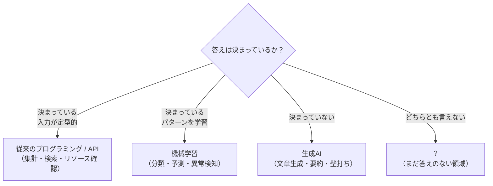

# SC運営×AI実装
## キックオフセミナー

生成AIの深掘りと最新技術へのキャッチアップ

<div class="pt-12 text-sm opacity-70">
講師：早崎 知弥（宝来エンジニアリング）
</div>

---

# 自己紹介

<div class="grid grid-cols-2 gap-8 items-center mt-4">

<div>


<div class="text-xs opacity-50 mt-2">前職：プラント・製造現場でのエンジニア経験</div>

</div>

<div>

**早崎 知弥**（はやさき ともや）
宝来エンジニアリング

- 現在：AWSを主軸としたクラウドインフラエンジニア（フリーランス）、TerraformなどIaCにも知見あり
- 前職：製造・プラント現場でのエンジニア
- SC経営士会 外部講師 / 年間サポートメンバー

</div>

</div>

<v-click>

**「現場」を知っているからこそ、机上の空論にならないAI活用をお話しします**

</v-click>


---
layout: default
---

# 本セミナーの全体像

<div class="text-xs opacity-60 mt-4">前半で「知り」、後半で「使う・考える」。最後は、ご自身の業務で試すところまでを目指します。</div>

<div class="flex flex-col gap-4 mt-5">

<div class="flex items-baseline gap-3">
<span class="font-bold whitespace-nowrap" style="color:#0b2f64; min-width:82px">第0章</span>
<span class="text-base">はじめに ─ 論点整理</span>
</div>

<div class="flex items-baseline gap-3">
<span class="font-bold whitespace-nowrap" style="color:#0b2f64; min-width:82px">第1章</span>
<span class="text-base">AIとは何か ─ 定義と歴史</span>
</div>

<div class="flex items-baseline gap-3">
<span class="font-bold whitespace-nowrap" style="color:#0b2f64; min-width:82px">第2章</span>
<span class="text-base">生成AIとは何か ─ 仕組みを知る</span>
</div>

<div class="flex items-baseline gap-3">
<span class="font-bold whitespace-nowrap" style="color:#0b2f64; min-width:82px">第3章</span>
<span class="text-base">AI活用の5段階レベル ─ 使い方の地図</span>
</div>

</div>


<div class="flex flex-col gap-4 mt-5">

<div class="flex items-baseline gap-3">
<span class="font-bold whitespace-nowrap" style="color:#0b2f64; min-width:82px">第4章</span>
<span class="text-base">Loop / Harness Engineering ─ 深く理解する</span>
</div>

<div class="flex items-baseline gap-3">
<span class="font-bold whitespace-nowrap" style="color:#0b2f64; min-width:82px">第5章</span>
<span class="text-base">Work Slop ─ 心構えと注意点</span>
</div>

<div class="flex items-baseline gap-3">
<span class="font-bold whitespace-nowrap" style="color:#0b2f64; min-width:82px">第6章</span>
<span class="text-base">アイデアソンへ向けて ─ 自分でやってみる</span>
</div>

<div class="flex items-baseline gap-3">
<span class="font-bold whitespace-nowrap" style="color:#993C1D; min-width:82px">Appendix</span>
<span class="text-base">もっと知りたい人へ</span>
</div>

</div>


---
layout: default
title: 論点整理
---

最初に、このセミナーで問う論点をお伝えします。

<br>

<div class="text-center center">

<v-click>

<h2>① なぜ私たちはAIを学ぶの？</h2>

</v-click>

<br>

<v-click>

<h3>→ みんな使ってるし確かに便利だけど、いまいち流されてる気がする</h3>

</v-click>

***

<br>

<v-click>

<h2>② どうAIと向き合っていけばいいの？</h2>

</v-click>

<br>

<v-click>

<h3>→ 毎月新しいニュースが出てるし、正直追いつけない</h3>

</v-click>

***

<br>

<v-click>

<h2>③ 今日聞いてたら何が嬉しいの？</h2>

</v-click>

<br>

<v-click>

<h3>→ 具体的に明日から使えるワザとかないでしょ</h3>

</v-click>

***

</div>

---
layout: section
title: 達成条件
---

この論点の問い、セミナー受講後には

<v-click>

<h3>出ます。</h3>

</v-click>

<br>

<v-click>

<h2>出します。</h2>

</v-click>

<br>

<v-click>

<h1>出させます。</h1>

</v-click>

<v-click>


</v-click>

---
layout: section
---


# 第1章
## AIとは何か_定義と歴史
<br>

### ~まずは成り立ちから~

---
layout: default
class: bg-white
---

# 1-1. 「AI・ML・DL」という言葉の整理

<!-- AI ⊃ ML ⊃ DL の包含関係を図解（インラインSVG）。ラベルはリング帯の中央高さに十分な間隔で配置。注釈は見切れ防止のためSVG外に配置 -->

<div class="flex flex-col items-center">

<svg viewBox="0 0 760 620" xmlns="http://www.w3.org/2000/svg" role="img" class="h-95 w-auto">
<title>AIと生成AIの関係を示す入れ子図</title>
<desc>AIという大きな概念の中に機械学習があり、その中に深層学習、さらにその中に生成AIが位置づけられることを示す4層の同心円図</desc>

<circle cx="380" cy="340" r="300" fill="#E6F1FB" stroke="#185FA5" stroke-width="2"/>
<circle cx="380" cy="340" r="222" fill="#B5D4F4" stroke="#185FA5" stroke-width="2"/>
<circle cx="380" cy="340" r="148" fill="#85B7EB" stroke="#185FA5" stroke-width="2"/>
<circle cx="380" cy="340" r="72" fill="#D85A30" stroke="#993C1D" stroke-width="2"/>

<v-click>
<text x="380" y="90" text-anchor="middle" font-size="20" font-weight="700" fill="#042C53" font-family="'Hiragino Kaku Gothic ProN','Yu Gothic','Noto Sans JP',sans-serif">AI(人工知能)</text>
</v-click>

<v-click>
<text x="380" y="186" text-anchor="middle" font-size="17" font-weight="700" fill="#042C53" font-family="'Hiragino Kaku Gothic ProN','Yu Gothic','Noto Sans JP',sans-serif">ML(機械学習)</text>
</v-click>

<v-click>
<text x="380" y="272" text-anchor="middle" font-size="15" font-weight="700" fill="#0C447C" font-family="'Hiragino Kaku Gothic ProN','Yu Gothic','Noto Sans JP',sans-serif">DL(深層学習)</text>
</v-click>

<v-click>
<text x="380" y="370" text-anchor="middle" font-size="15" font-weight="700" fill="#FFFFFF" font-family="'Hiragino Kaku Gothic ProN','Yu Gothic','Noto Sans JP',sans-serif">生成AI</text>
</v-click>
</svg>

<v-click>
<div class="text-xs opacity-60 mt-2">※生成AIの調整（RLHF）にも強化学習を一部使うが、土台は深層学習</div>
</v-click>

</div>

<!--
発表者ノート:
- 生成AIはAIという大きな概念の中の、深層学習を土台にした一部分であることを伝える
- 「深層強化学習」という言葉は生成AIの主要な分類ではない点に注意（RLHFという調整技術の一部で強化学習の考え方を使っているだけ）
-->

---
layout: default
class: bg-white
---

# 従来の課題解決との違いは？

<!-- 従来のプログラミングと機械学習の違いを示すフロー図（インラインSVG）。角丸なし、注釈はSVG外に配置 -->

<div class="flex flex-col items-center w-full">

<svg viewBox="0 0 940 560" xmlns="http://www.w3.org/2000/svg" role="img" class="w-full" style="max-height: 400px;" font-family="'Hiragino Kaku Gothic ProN','Yu Gothic','Noto Sans JP',sans-serif">
<title>伝統的なプログラミングと機械学習の違いを示すフロー図</title>
<desc>従来のプログラミングはデータと規則から出力を得るのに対し、機械学習は学習フェーズでデータとアルゴリズムからモデルを作り、推論フェーズで新しいデータをモデルに通して出力を得ることを示す図</desc>

<defs>
<marker id="arrow" viewBox="0 0 10 10" refX="8" refY="5" markerWidth="8" markerHeight="8" orient="auto-start-reverse">
<path d="M0,0 L10,5 L0,10 z" fill="#5F5E5A"/>
</marker>
</defs>

<g v-click>
<text x="30" y="28" font-size="8" font-weight="700" fill="#2C2C2A">①従来のプログラミング</text>

<rect x="30" y="46" width="170" height="52" fill="#E6F1FB" stroke="#185FA5" stroke-width="1.5"/>
<text x="115" y="79" text-anchor="middle" font-size="6" fill="#0C447C">データ</text>

<rect x="30" y="112" width="170" height="52" fill="#E6F1FB" stroke="#185FA5" stroke-width="1.5"/>
<text x="115" y="145" text-anchor="middle" font-size="6" fill="#0C447C">規則（プログラム）</text>

<rect x="400" y="79" width="170" height="52" fill="#F1EFE8" stroke="#5F5E5A" stroke-width="1.5"/>
<text x="485" y="112" text-anchor="middle" font-size="6" fill="#2C2C2A">コンピュータ</text>

<rect x="760" y="79" width="150" height="52" fill="#F1EFE8" stroke="#5F5E5A" stroke-width="1.5"/>
<text x="835" y="112" text-anchor="middle" font-size="6" fill="#2C2C2A">出力</text>

<path d="M200,72 L400,95" fill="none" stroke="#5F5E5A" stroke-width="1.5" marker-end="url(#arrow)"/>
<path d="M200,138 L400,115" fill="none" stroke="#5F5E5A" stroke-width="1.5" marker-end="url(#arrow)"/>
<path d="M570,105 L760,105" fill="none" stroke="#5F5E5A" stroke-width="1.5" marker-end="url(#arrow)"/>
</g>

<line x1="30" y1="200" x2="910" y2="200" stroke="#D3D1C7" stroke-width="1"/>

<g v-click>
<text x="30" y="238" font-size="8" font-weight="700" fill="#2C2C2A">②機械学習（学習フェーズ）</text>

<rect x="30" y="256" width="170" height="52" fill="#E6F1FB" stroke="#185FA5" stroke-width="1.5"/>
<text x="115" y="289" text-anchor="middle" font-size="6" fill="#0C447C">データ</text>

<rect x="30" y="322" width="170" height="52" fill="#E6F1FB" stroke="#185FA5" stroke-width="1.5"/>
<text x="115" y="355" text-anchor="middle" font-size="6" fill="#0C447C">アルゴリズム</text>

<rect x="400" y="289" width="170" height="52" fill="#F1EFE8" stroke="#5F5E5A" stroke-width="1.5"/>
<text x="485" y="322" text-anchor="middle" font-size="6" fill="#2C2C2A">コンピュータ</text>

<rect x="760" y="289" width="150" height="52" fill="#F0997B" stroke="#993C1D" stroke-width="1.5"/>
<text x="835" y="322" text-anchor="middle" font-size="6" fill="#4A1B0C">モデル</text>

<path d="M200,282 L400,305" fill="none" stroke="#5F5E5A" stroke-width="1.5" marker-end="url(#arrow)"/>
<path d="M200,348 L400,325" fill="none" stroke="#5F5E5A" stroke-width="1.5" marker-end="url(#arrow)"/>
<path d="M570,315 L760,315" fill="none" stroke="#5F5E5A" stroke-width="1.5" marker-end="url(#arrow)"/>
</g>

<line x1="30" y1="410" x2="910" y2="410" stroke="#D3D1C7" stroke-width="1"/>

<g v-click>
<text x="30" y="448" font-size="8" font-weight="700" fill="#2C2C2A">③機械学習（推論フェーズ）</text>

<rect x="30" y="466" width="190" height="52" fill="#E6F1FB" stroke="#185FA5" stroke-width="1.5"/>
<text x="125" y="499" text-anchor="middle" font-size="6" fill="#0C447C">新しいデータ</text>

<rect x="400" y="466" width="190" height="52" fill="#F0997B" stroke="#993C1D" stroke-width="1.5"/>
<text x="495" y="499" text-anchor="middle" font-size="6" fill="#4A1B0C">学習済みモデル</text>

<rect x="760" y="466" width="150" height="52" fill="#F1EFE8" stroke="#5F5E5A" stroke-width="1.5"/>
<text x="835" y="499" text-anchor="middle" font-size="6" fill="#2C2C2A">出力</text>

<path d="M220,492 L400,492" fill="none" stroke="#5F5E5A" stroke-width="1.5" marker-end="url(#arrow)"/>
<path d="M590,492 L760,492" fill="none" stroke="#5F5E5A" stroke-width="1.5" marker-end="url(#arrow)"/>
</g>
</svg>

<div class="text-xs opacity-60 mt-2">規則を人が書く代わりに、データから規則（＝モデル）を学習させます</div>

</div>

<!--
発表者ノート:
- 「ルールを人間が書く」から「データからルール（モデル）を学ばせる」への発想転換がポイント
- SC業務に例えるなら、過去の対応履歴データから対応パターンをモデルに学ばせるイメージ
-->

---
layout: default
class: bg-white
---

# 機械学習の定義とは

<!-- 機械学習の定義と3手法のVenn図（インラインSVG）。定義文・注釈はSVG外に配置 -->

<div class="flex flex-col items-center">

<div class="text-center mt-1 max-w-4xl">
機械学習とは、明示的な指示（ルール）を人が書く代わりに、<strong>データからパターンを学習</strong>し、新しいデータに対して予測・推論を行うAIの一分野です
<div class="text-xs opacity-50 mt-1">出典: AWS「機械学習とは何ですか?」／ IBM「機械学習とは」</div>
</div>

<svg viewBox="0 0 720 560" xmlns="http://www.w3.org/2000/svg" role="img" class="w-auto mt-2" style="max-height: 330px;" font-family="'Hiragino Kaku Gothic ProN','Yu Gothic','Noto Sans JP',sans-serif">
<title>機械学習の3つの学習パラダイムを示すVenn図</title>
<desc>教師あり学習・教師なし学習・強化学習の3つが重なり合う関係を示す図</desc>

<circle cx="280" cy="250" r="150" fill="#B5D4F4" fill-opacity="0.7" stroke="#185FA5" stroke-width="2"/>
<circle cx="440" cy="250" r="150" fill="#85B7EB" fill-opacity="0.7" stroke="#185FA5" stroke-width="2"/>
<circle cx="360" cy="380" r="150" fill="#F0997B" fill-opacity="0.7" stroke="#993C1D" stroke-width="2"/>

<text x="160" y="230" text-anchor="middle" font-size="9" font-weight="700" fill="#042C53">教師なし学習</text>
<text x="560" y="230" text-anchor="middle" font-size="9" font-weight="700" fill="#042C53">教師あり学習</text>
<text x="360" y="500" text-anchor="middle" font-size="9" font-weight="700" fill="#4A1B0C">強化学習</text>
<text x="360" y="95" text-anchor="middle" font-size="7" font-weight="700" fill="#042C53">半教師あり学習</text>
</svg>

<div class="text-xs opacity-60 mt-1">※3つは独立した手法ではなく、学習の目的やデータに応じた分類の切り口（実際は組み合わせて使う）</div>

</div>

<!--
発表者ノート:
- 機械学習の中にもいくつかのアプローチがあることだけ伝われば十分。各手法の詳細説明は不要
- 教師あり学習が実務では最も触れる機会が多い（分類・予測タスク）
-->

---

# 1-2. 機械学習の成り立ちと発展（時系列）

<!-- AIの3つのブームと、2000年代以降に各分野へ分岐して発展した様子を示す簡易時系列図（オリジナル作図）。文科省/JST俯瞰図を参考に要素を絞って独自作成 -->

<div class="flex flex-col items-center w-full">

<svg viewBox="0 0 960 480" xmlns="http://www.w3.org/2000/svg" role="img" class="w-full" style="max-height: 380px;" font-family="'Hiragino Kaku Gothic ProN','Yu Gothic','Noto Sans JP',sans-serif">
<title>AIの3つのブームと各分野への発展を示す時系列図</title>
<desc>1950年代のダートマス会議から始まり、第1次・第2次・第3次のブームを経て、2000年代以降に理論・応用・社会の各方面へ分岐して発展したことを示す図</desc>

<defs>
<marker id="tarrow" viewBox="0 0 10 10" refX="8" refY="5" markerWidth="7" markerHeight="7" orient="auto-start-reverse">
<path d="M0,0 L10,5 L0,10 z" fill="#185FA5"/>
</marker>
</defs>

<line x1="60" y1="460" x2="900" y2="460" stroke="#5F5E5A" stroke-width="1.5"/>
<text x="95" y="450" text-anchor="middle" font-size="9" fill="#5F5E5A">1956</text>
<text x="330" y="450" text-anchor="middle" font-size="9" fill="#5F5E5A">1980年代</text>
<text x="600" y="450" text-anchor="middle" font-size="9" fill="#5F5E5A">2010年代</text>
<text x="870" y="450" text-anchor="middle" font-size="9" fill="#5F5E5A">現在</text>

<circle cx="95" cy="380" r="6" fill="#B5D4F4" stroke="#185FA5" stroke-width="1.5"/>
<text x="95" y="360" text-anchor="middle" font-size="11" font-weight="700" fill="#042C53">第1次</text>
<text x="95" y="306" text-anchor="middle" font-size="6" fill="#0C447C">ダートマス会議</text>

<circle cx="330" cy="315" r="6" fill="#85B7EB" stroke="#185FA5" stroke-width="1.5"/>
<text x="330" y="295" text-anchor="middle" font-size="11" font-weight="700" fill="#042C53">第2次</text>
<text x="330" y="231" text-anchor="middle" font-size="6" fill="#0C447C">エキスパートシステム</text>

<circle cx="580" cy="230" r="8" fill="#D85A30" stroke="#993C1D" stroke-width="1.5"/>
<text x="580" y="168" text-anchor="middle" font-size="13" font-weight="700" fill="#4A1B0C">第3次ブーム</text>
<text x="580" y="102" text-anchor="middle" font-size="6" fill="#712B13">深層学習の登場</text>

<path d="M101,374 Q210,360 324,320" fill="none" stroke="#185FA5" stroke-width="1.5"/>
<path d="M336,310 Q450,275 572,235" fill="none" stroke="#185FA5" stroke-width="1.5"/>

<g v-click>
<path d="M588,225 Q720,160 860,110" fill="none" stroke="#185FA5" stroke-width="1.5" marker-end="url(#tarrow)"/>
<text x="900" y="108" text-anchor="end" font-size="11" font-weight="700" fill="#042C53">理論の革新</text>
</g>

<g v-click>
<path d="M589,231 Q720,225 860,220" fill="none" stroke="#185FA5" stroke-width="1.5" marker-end="url(#tarrow)"/>
<text x="900" y="218" text-anchor="end" font-size="11" font-weight="700" fill="#042C53">応用の拡大</text>
</g>

<g v-click>
<path d="M587,238 Q720,290 860,330" fill="none" stroke="#185FA5" stroke-width="1.5" marker-end="url(#tarrow)"/>
<text x="900" y="338" text-anchor="end" font-size="11" font-weight="700" fill="#042C53">社会との関係</text>
</g>
</svg>

<div class="text-xs opacity-60 mt-2">AIは1950年代から研究されてきました<br>第3次ブーム以降、理論・応用・社会の各方面へ広がっています（文科省「科学技術白書」/ JST研究開発戦略センターの俯瞰図を参考に作図）</div>

</div>

---

# 1-3. 機械学習は、こんなに広い領域で成果を出している

<div class="grid grid-cols-2 gap-8 mt-2">

<div>

**成功しているタスクの例**

<div class="text-sm">

- 迷惑メール（スパム）の判定
- ターゲティング広告の顧客セグメント化
- 天気予報・長期的な気候変動の予測
- クレジットカードの不正取引の検知
- 自然災害の被害額予測（保険数理）
- 自動運転・ドローンの制御
- エネルギー利用の最適化
- 遺伝子配列の解析（疫病）
- 防犯カメラの物体検出

</div>

</div>

<div>

**ビジネスへの応用（目的別）**

<div class="text-sm">

- **売上向上**：配車予測、来客分析、需要予測（小売・農業）
- **コスト削減**：コールセンター自動化、点検の自動化
- **信頼性担保**：がん診断支援、原油備蓄量の分析
- **監視・管理**：電力需給予測、ドライバーの安全管理
- **人員不足解消**：配達ルート最適化、レジの商品自動識別

</div>

</div>

</div>

<div class="text-xs opacity-60 mt-3">前ページの「各方面への発展」が、実際のビジネス領域ではこれだけの用途になっています</div>

---
layout: section
---

## ここで機械学習を用いたデモアプリをご紹介します。

---
layout: section
---

内部向け：デモ実演中：このスライドは後で削除いたします。


---
layout: default
class: bg-white
---

# ここまでのまとめ

<div class="text-lg leading-relaxed mt-6">

<div v-click>

<h3>1. AIという大きな概念の中に機械学習があり、その中に深層学習、さらに生成AIが位置づけられます。</h3>

</div>

<div v-click class="mt-6">

<h3>2. 機械学習は、人がルールを書く従来のプログラミングと違い、<strong>データからルール（モデル）を学習</strong>し、分類・予測・分析を行います。</h3>

</div>

<div v-click class="mt-6">

<h3>3. AIの研究は約70年前に始まり、ブームと冬の時代を繰り返しながら、いまや各方面へ発展しています。</h3>

</div>
</div>

<!--
発表者ノート:
- 1行目は同心円図（1-1）の入れ子構造を回収。「並列」ではなく「入れ子」であることを口頭でも補足
- 2行目はコード比較（if vs fit）とフロー図を回収
- 3行目は俯瞰図（1-2）を回収。この直後のパンチラインへつなぐ
-->

---
layout: section
---

# 第2章

## 生成AIとは何か

---
layout: center
class: bg-white
---

# 生成AIは、ざっくり2ステップで動く

<div class="grid grid-cols-[1fr_auto_1fr_auto_1fr] gap-3 items-center mt-10 text-center">

<div class="border-2 border-[#0b2f64] p-5">

**プロンプト**<br>
人間が入力する文章

</div>

<div class="text-3xl text-[#0b2f64]">▶</div>

<div class="border-2 border-[#0b2f64] p-5">

**トークンに変換**<br>
文章を細かい単位に分解

</div>

<div class="text-3xl text-[#0b2f64]">▶</div>

<div class="border-2 border-[#0b2f64] p-5">

**膨大パラメータで確率計算**<br>
次に来やすい単語を予測

</div>

</div>

<div v-click class="text-center mt-10 text-xl">

<h2>つまり生成AIは、<strong>「次の単語」を確率で選び続けている</strong>だけなのです</h2>

</div>

<!--
発表者ノート:
- 前のtiktokenizerデモが「トークンに変換」、次のbbycroftデモが「膨大なパラメータで確率計算」に対応
- 難しい仕組みは見せるが教えない。この2ステップだけ持ち帰ってもらう
-->

---

<!-- bbycroft可視化 https://bbycroft.net/llm を画面共有 / iframeで見せる。WOWモーメント。見せるが教えない -->

<iframe src="https://tiktokenizer.vercel.app/?model=cl100k_base" class="w-full h-100 border-0" />


---

<iframe src="https://bbycroft.net/llm" class="w-full h-100 border-0" />


---
layout: default
class: bg-white
---

### 2-1. 生成AIの仕組み

#### 生成AIも、実は機械学習と同じ仕組み

<!-- 第1章の「機械学習」の図と同じ箱・矢印を踏襲し、学習/推論フェーズが共通であることを示す。角丸なし、注釈はSVG外 -->
<br>
<div class="flex flex-col items-center w-full">

<svg viewBox="0 0 900 470" xmlns="http://www.w3.org/2000/svg" role="img" class="w-full" style="max-height: 380px;" font-family="'Hiragino Kaku Gothic ProN','Yu Gothic','Noto Sans JP',sans-serif">
<title>機械学習と生成AIが同じ学習・推論構造を持つことを示す図</title>
<desc>機械学習の学習フェーズ・推論フェーズと、生成AIの同じ構造（テキストデータ・Transformer・LLMによる学習、プロンプト・LLM・出力による推論）を比較する図</desc>

<defs>
<marker id="arrow2" viewBox="0 0 10 10" refX="8" refY="5" markerWidth="7" markerHeight="7" orient="auto-start-reverse">
<path d="M0,0 L10,5 L0,10 z" fill="#5F5E5A"/>
</marker>
</defs>

<text x="40" y="28" font-size="7.5" font-weight="700" fill="#2C2C2A">機械学習（一般化した構造）</text>

<rect x="40" y="42" width="180" height="46" fill="#E6F1FB" stroke="#185FA5" stroke-width="1.5"/>
<text x="130" y="70" text-anchor="middle" font-size="5" fill="#0C447C">訓練データ</text>
<rect x="290" y="42" width="180" height="46" fill="#E6F1FB" stroke="#185FA5" stroke-width="1.5"/>
<text x="380" y="70" text-anchor="middle" font-size="5" fill="#0C447C">アルゴリズム</text>
<rect x="540" y="42" width="200" height="46" fill="#F0997B" stroke="#993C1D" stroke-width="1.5"/>
<text x="640" y="70" text-anchor="middle" font-size="5" fill="#4A1B0C">モデル（学習済み）</text>
<path d="M220,65 L290,65" fill="none" stroke="#5F5E5A" stroke-width="1.5" marker-end="url(#arrow2)"/>
<path d="M470,65 L540,65" fill="none" stroke="#5F5E5A" stroke-width="1.5" marker-end="url(#arrow2)"/>

<rect x="40" y="106" width="180" height="46" fill="#E6F1FB" stroke="#185FA5" stroke-width="1.5"/>
<text x="130" y="134" text-anchor="middle" font-size="5" fill="#0C447C">新しい入力</text>
<rect x="290" y="106" width="180" height="46" fill="#F0997B" stroke="#993C1D" stroke-width="1.5"/>
<text x="380" y="134" text-anchor="middle" font-size="5" fill="#4A1B0C">モデル</text>
<rect x="540" y="106" width="200" height="46" fill="#F1EFE8" stroke="#5F5E5A" stroke-width="1.5"/>
<text x="640" y="134" text-anchor="middle" font-size="5" fill="#2C2C2A">出力</text>
<path d="M220,129 L290,129" fill="none" stroke="#5F5E5A" stroke-width="1.5" marker-end="url(#arrow2)"/>
<path d="M470,129 L540,129" fill="none" stroke="#5F5E5A" stroke-width="1.5" marker-end="url(#arrow2)"/>

<line x1="40" y1="182" x2="740" y2="182" stroke="#D3D1C7" stroke-width="1"/>

<text x="40" y="212" font-size="7.5" font-weight="700" fill="#2C2C2A">生成AI（同じ構造に当てはめると）</text>
<rect x="40" y="226" width="180" height="46" fill="#E6F1FB" stroke="#185FA5" stroke-width="1.5"/>
<text x="130" y="260" text-anchor="middle" font-size="5" fill="#0C447C">テキストデータ</text>
<rect x="290" y="226" width="180" height="46" fill="#E6F1FB" stroke="#185FA5" stroke-width="1.5"/>
<text x="380" y="254" text-anchor="middle" font-size="5" fill="#0C447C">Transformer</text>
<rect x="540" y="226" width="200" height="46" fill="#F0997B" stroke="#993C1D" stroke-width="1.5"/>
<text x="643" y="255" text-anchor="middle" font-size="4.5" fill="#4A1B0C">LLM（事前学習済み）</text>
<path d="M220,249 L290,249" fill="none" stroke="#5F5E5A" stroke-width="1.5" marker-end="url(#arrow2)"/>
<path d="M470,249 L540,249" fill="none" stroke="#5F5E5A" stroke-width="1.5" marker-end="url(#arrow2)"/>

<rect x="40" y="290" width="180" height="46" fill="#E6F1FB" stroke="#185FA5" stroke-width="1.5"/>
<text x="130" y="318" text-anchor="middle" font-size="5" fill="#0C447C">プロンプト</text>
<rect x="290" y="290" width="180" height="46" fill="#F0997B" stroke="#993C1D" stroke-width="1.5"/>
<text x="380" y="318" text-anchor="middle" font-size="5" fill="#4A1B0C">LLM</text>
<rect x="540" y="290" width="200" height="46" fill="#F1EFE8" stroke="#5F5E5A" stroke-width="1.5"/>
<text x="640" y="318" text-anchor="middle" font-size="5" fill="#2C2C2A">出力テキスト</text>
<path d="M220,313 L290,313" fill="none" stroke="#5F5E5A" stroke-width="1.5" marker-end="url(#arrow2)"/>
<path d="M470,313 L540,313" fill="none" stroke="#5F5E5A" stroke-width="1.5" marker-end="url(#arrow2)"/>

<text x="390" y="380" text-anchor="middle" font-size="7.5" font-weight="700" fill="#042C53">学習フェーズ・推論フェーズという骨格は共通</text>
</svg>

<div class="text-sm text-center mt-2">生成AIは「言葉」を大量に学習した<strong>機械学習モデルの一種</strong>です</div>

</div>

<!--
発表者ノート:
- 第1章の「従来のプログラミング vs 機械学習」の図と同じ箱・矢印を意図的に踏襲
- 「前に見た型に、もう1つ当てはまった」で理解の負荷を下げる
- ベクターストア/RAGは注釈で軽く触れる程度。「生成AIは常に検索している」という誤解を避ける
-->

---

# 2-2. なぜ「次の単語」を高精度で予測できるのか

<!-- 同じ「次単語予測」を、文脈をどこまで見て解くかの進化（n-gram / RNN・LSTM / Transformer）で比較。角丸なし、締めの注釈はSVG外、フォントは5〜6 -->

<div class="flex flex-col items-center w-full">

<svg viewBox="0 0 680 580" xmlns="http://www.w3.org/2000/svg" role="img" class="w-full" style="max-height: 400px;" font-family="'Hiragino Kaku Gothic ProN','Yu Gothic','Noto Sans JP',sans-serif">
<title>n-gram・RNN/LSTM・Transformerが次の単語を予測する際に、どこまで文脈を見ているかを比較する図</title>
<desc>同じ文「先月の来館者数は大きく＿＿」を例に、n-gramは直前の数語だけ、RNN/LSTMは全体を見るが古い情報ほど薄れる、Transformerは全単語を均等に直接参照することを示す3段の比較図</desc>

<defs>
<marker id="a1" viewBox="0 0 10 10" refX="9" refY="5" markerWidth="6" markerHeight="6" orient="auto-start-reverse">
<path d="M0,0 L10,5 L0,10 z" fill="#5F5E5A"/>
</marker>
</defs>

<text x="40" y="30" font-size="6" font-weight="700" fill="#2C2C2A">① n-gram（統計的手法）：直前の数語しか見ていない</text>

<rect x="40" y="52" width="80" height="38" fill="#F1EFE8" stroke="#D3D1C7" stroke-width="1.5"/>
<text x="80" y="75" text-anchor="middle" font-size="5" fill="#888780">先月</text>
<rect x="130" y="52" width="80" height="38" fill="#F1EFE8" stroke="#D3D1C7" stroke-width="1.5"/>
<text x="170" y="75" text-anchor="middle" font-size="5" fill="#888780">の</text>
<rect x="220" y="52" width="80" height="38" fill="#F1EFE8" stroke="#D3D1C7" stroke-width="1.5"/>
<text x="260" y="75" text-anchor="middle" font-size="5" fill="#888780">来館者数</text>
<rect x="310" y="52" width="80" height="38" fill="#E6F1FB" stroke="#185FA5" stroke-width="1.5"/>
<text x="350" y="75" text-anchor="middle" font-size="5" fill="#0C447C">は</text>
<rect x="400" y="52" width="80" height="38" fill="#E6F1FB" stroke="#185FA5" stroke-width="1.5"/>
<text x="440" y="75" text-anchor="middle" font-size="5" fill="#0C447C">大きく</text>
<rect x="490" y="52" width="70" height="38" fill="#F0997B" stroke="#993C1D" stroke-width="1.5"/>
<text x="525" y="76" text-anchor="middle" font-size="8" fill="#4A1B0C">？</text>
<path d="M390,71 L488,71" fill="none" stroke="#185FA5" stroke-width="1.5" marker-end="url(#a1)"/>
<path d="M300,71 L308,71" fill="none" stroke="#D3D1C7" stroke-width="1.5" stroke-dasharray="3,3"/>
<text x="170" y="116" text-anchor="middle" font-size="5.5" fill="#888780">この範囲は見ていない</text>

<line x1="40" y1="150" x2="640" y2="150" stroke="#D3D1C7" stroke-width="1"/>

<text x="40" y="188" font-size="6" font-weight="700" fill="#2C2C2A">② RNN・LSTM：全体を見るが、古い情報ほど記憶が薄れる</text>

<rect x="40" y="210" width="80" height="38" fill="#E6F1FB" fill-opacity="0.25" stroke="#185FA5" stroke-opacity="0.4" stroke-width="1.5"/>
<text x="80" y="233" text-anchor="middle" font-size="5" fill="#185FA5" fill-opacity="0.6">先月</text>
<rect x="130" y="210" width="80" height="38" fill="#E6F1FB" fill-opacity="0.4" stroke="#185FA5" stroke-opacity="0.55" stroke-width="1.5"/>
<text x="170" y="233" text-anchor="middle" font-size="5" fill="#185FA5" fill-opacity="0.75">の</text>
<rect x="220" y="210" width="80" height="38" fill="#E6F1FB" fill-opacity="0.6" stroke="#185FA5" stroke-opacity="0.7" stroke-width="1.5"/>
<text x="260" y="233" text-anchor="middle" font-size="5" fill="#0C447C">来館者数</text>
<rect x="310" y="210" width="80" height="38" fill="#E6F1FB" fill-opacity="0.8" stroke="#185FA5" stroke-width="1.5"/>
<text x="350" y="233" text-anchor="middle" font-size="5" fill="#0C447C">は</text>
<rect x="400" y="210" width="80" height="38" fill="#E6F1FB" stroke="#185FA5" stroke-width="1.5"/>
<text x="440" y="233" text-anchor="middle" font-size="5" fill="#0C447C">大きく</text>
<rect x="490" y="210" width="70" height="38" fill="#F0997B" stroke="#993C1D" stroke-width="1.5"/>
<text x="525" y="234" text-anchor="middle" font-size="8" fill="#4A1B0C">？</text>
<path d="M120,229 L128,229" fill="none" stroke="#185FA5" stroke-opacity="0.3" stroke-width="1.5" marker-end="url(#a1)"/>
<path d="M210,229 L218,229" fill="none" stroke="#185FA5" stroke-opacity="0.45" stroke-width="1.5" marker-end="url(#a1)"/>
<path d="M300,229 L308,229" fill="none" stroke="#185FA5" stroke-opacity="0.6" stroke-width="1.5" marker-end="url(#a1)"/>
<path d="M390,229 L398,229" fill="none" stroke="#185FA5" stroke-opacity="0.8" stroke-width="1.5" marker-end="url(#a1)"/>
<path d="M480,229 L488,229" fill="none" stroke="#185FA5" stroke-width="1.5" marker-end="url(#a1)"/>
<text x="180" y="274" text-anchor="middle" font-size="5.5" fill="#888780">1語ずつ順番に読み、古い記憶ほど薄くなる</text>

<line x1="40" y1="308" x2="640" y2="308" stroke="#D3D1C7" stroke-width="1"/>

<text x="40" y="346" font-size="6" font-weight="700" fill="#2C2C2A">③ Transformer（Attention）：全単語を均等に、直接見る</text>

<rect x="40" y="368" width="80" height="38" fill="#E6F1FB" stroke="#185FA5" stroke-width="1.5"/>
<text x="80" y="391" text-anchor="middle" font-size="5" fill="#0C447C">先月</text>
<rect x="130" y="368" width="80" height="38" fill="#E6F1FB" stroke="#185FA5" stroke-width="1.5"/>
<text x="170" y="391" text-anchor="middle" font-size="5" fill="#0C447C">の</text>
<rect x="220" y="368" width="80" height="38" fill="#E6F1FB" stroke="#185FA5" stroke-width="1.5"/>
<text x="260" y="391" text-anchor="middle" font-size="5" fill="#0C447C">来館者数</text>
<rect x="310" y="368" width="80" height="38" fill="#E6F1FB" stroke="#185FA5" stroke-width="1.5"/>
<text x="350" y="391" text-anchor="middle" font-size="5" fill="#0C447C">は</text>
<rect x="400" y="368" width="80" height="38" fill="#E6F1FB" stroke="#185FA5" stroke-width="1.5"/>
<text x="440" y="391" text-anchor="middle" font-size="5" fill="#0C447C">大きく</text>
<rect x="490" y="368" width="70" height="38" fill="#F0997B" stroke="#993C1D" stroke-width="1.5"/>
<text x="525" y="392" text-anchor="middle" font-size="8" fill="#4A1B0C">？</text>
<path d="M80,406 C80,445 500,455 515,408" fill="none" stroke="#185FA5" stroke-width="1.3" stroke-opacity="0.75" marker-end="url(#a1)"/>
<path d="M170,406 C170,440 500,450 518,408" fill="none" stroke="#185FA5" stroke-width="1.3" stroke-opacity="0.75" marker-end="url(#a1)"/>
<path d="M260,406 C260,430 490,440 522,408" fill="none" stroke="#185FA5" stroke-width="1.3" stroke-opacity="0.75" marker-end="url(#a1)"/>
<path d="M350,406 L470,408" fill="none" stroke="#185FA5" stroke-width="1.3" stroke-opacity="0.75" marker-end="url(#a1)"/>
<path d="M440,406 L488,407" fill="none" stroke="#185FA5" stroke-width="1.3" stroke-opacity="0.75" marker-end="url(#a1)"/>
</svg>

<div class="text-xs opacity-70 mt-2 text-center">「先月」も「大きく」も、距離に関係なく同じ強さで直接つながっている（＝Attention）。文脈が深く読めるようになり、予測精度が上がった</div>

</div>

<!--
発表者ノート:
- 「次の単語を当てる」タスク自体は3つとも共通。変わったのは文脈をどこまで見て解くか
- ① n-gram: 直前の数語のみ（浅い文脈）
- ② RNN/LSTM: 全体を順番に読むが古い情報ほど薄れる。1語ずつしか処理できず学習も遅い
- ③ Transformer: 全単語を同時・距離に関係なく直接参照（深い文脈）。並列処理で大規模データを高速学習
- 因果は「文脈が読めるようになったから精度が上がった」
-->

---

# 2-3. 結局、どれを使えばいいの？（代表的なツール）

<div class="text-sm opacity-70 mb-4">難しい話が続きましたので、ここは少し肩の力を抜いて。名前だけ知っておいていただければ十分です</div>

<div class="text-base leading-relaxed">

- **ChatGPT / Claude / Gemini** ＝ いわゆる<strong>御三家</strong>。まず触るならこの3つ。日常の文章・要約・相談はどれでも十分です
- **Claude Code** ＝ <strong>エージェントのはしり</strong>。指示すると、自分で調べて手を動かしてくれます
- **AWS Bedrock** ＝ 自社システムに<strong>LLMを組み込みたい</strong>ときに使う、クラウドの土台です
- **Harness（ハーネス）** ＝ <strong>？</strong>

</div>

<div v-click class="mt-8 text-center text-xl">

<h1>この「<strong>？</strong>」が、後半の主役です</h1>

</div>

<!--
発表者ノート:
- ここは受講生に近い立場で、くだけて話す。「全部覚えなくていい、名前だけ」
- 御三家は日常用途ならどれでもOK、と安心させる
- Claude Codeで「エージェント」という言葉に触れておく（後半L3〜の伏線）
- Harnessをあえて「？」のままにして、第3章／後半のLoop・Harness Engineeringへ引き込む
-->

---
layout: section
---

# 第3章
## AI活用の5段階レベル

---
layout: center
class: text-center
---

<!-- 第3章の導入パンチライン（タイトルなし／ワンメッセージ）。5段階レベルへの動機づけ -->

# **あなたは、AIを<br>「うまく」使えていますか？**

<div v-click class="mt-10 text-2xl">

その「<strong>うまく</strong>」を、<br>言葉で説明できますか？

</div>

---
layout: center
class: text-center
---

<div class="text-xl leading-relaxed">

「なんとなく便利」で止まっていると、<br>
そこから先へは進めません。

<div v-click class="mt-8">

だからこそ、<strong>使い方に"ものさし"を持つ</strong>。<br>
それが、これからご紹介する<strong>5段階レベル</strong>です。

</div>

</div>

<!--
発表者ノート:
- 「うまく使えていますか？」は多くの人がYesと答える。だが「うまくを言語化して」で詰まる
- 言語化できない＝改善の方向が見えない、という気づきを与える
- そのものさしとしてL1〜L5を提示する、と自然につなぐ
- レベルが上＝偉い、ではない点は後のスライドで補足（手法の違いであって優劣ではない）
-->

---
layout: center
---

# その前に：「エージェント」とは？

<div class="text-sm opacity-70 mb-4">この後よく出てくる言葉なので、ここで一度だけ整理します</div>

<div class="text-base leading-relaxed">

<div v-click>

**チャット型AI**（ChatGPT等）＝ 質問に<strong>言葉で答える</strong>。答えたら終わりです。

</div>

<div v-click class="mt-5">

**エージェント型AI**（Claude Code等）＝ 目的を渡すと、<strong>自分で調べ・道具を使い・手を動かします</strong>。ファイルを読む、プログラムを動かす、検索する、を<strong>繰り返して</strong>ゴールに近づいていきます。

</div>

</div>

<div v-click class="text-center mt-6 text-lg">

ひとことで言えば、<strong>エージェント＝「道具を使いながら、繰り返し働くAI」</strong>です

</div>

<div class="text-xs opacity-50 mt-4">参考: Mitchell Hashimoto「エージェントとは、ループの中でツールを呼べるLLM」</div>

<!--
発表者ノート:
- L3以降が「エージェント構築」なので、その前に用語を一度だけ押さえる
- 「答えて終わり」か「動いて働く」か、の対比で直感的に
- この「繰り返し働く」がのちのループの話につながる伏線
-->

---
layout: section
---

## 言うは易し、横山はやすし。
<br>

### エージェントのデモをご覧ください。

---
layout: section
---

内部向け：デモ実演中：このスライドは後で削除いたします。

---
layout: default
class: bg-white
---

# 使い分けの目安：まず「答えは決まっているか？」

<div class="flex justify-center mt-2">



</div>

<div class="text-xs opacity-60 mt-2 text-center">「生成AIか従来か」ではなく、作業の性質から選びます。判断に迷う「？」の領域こそ、後半で一緒に考えていきましょう</div>

<!--
発表者ノート:
- パンチラインの問い「答えは決まっているか？」を、そのまま判断の入口に置いた
- 「？（まだ答えのない領域）」が後半「生成AIをどう使いこなすか」への入り口になる
- 断定ではなく、判断の目安として提示する
-->


---

<!-- 3-1〜3-3: AI活用の5段階レベル。ピラミッドで該当レベルをハイライトしながら1枚ずつ説明（L1→L5） -->

# 3-1. AI活用の5段階レベル ── L1

<div class="grid grid-cols-2 gap-6 items-center">

<div class="flex justify-center">
<svg viewBox="0 0 760 440" xmlns="http://www.w3.org/2000/svg" role="img" class="h-90 w-auto" font-family="'Hiragino Kaku Gothic ProN','Yu Gothic','Noto Sans JP',sans-serif">
<title>AI活用5段階のピラミッド。L1をハイライト</title>
<polygon points="380,70 428,134 332,134" fill="#B5D4F4" opacity="0.25" stroke="#185FA5" stroke-width="1.5"/>
<polygon points="332,134 428,134 476,198 284,198" fill="#B5D4F4" opacity="0.25" stroke="#185FA5" stroke-width="1.5"/>
<polygon points="284,198 476,198 524,262 236,262" fill="#B5D4F4" opacity="0.25" stroke="#185FA5" stroke-width="1.5"/>
<polygon points="236,262 524,262 572,326 188,326" fill="#B5D4F4" opacity="0.25" stroke="#185FA5" stroke-width="1.5"/>
<polygon points="188,326 572,326 620,390 140,390" fill="#D85A30" stroke="#993C1D" stroke-width="2"/>
<text x="380" y="112" text-anchor="middle" font-size="13" font-weight="700" fill="#042C53" opacity="0.4">L5</text>
<text x="380" y="176" text-anchor="middle" font-size="13" font-weight="700" fill="#042C53" opacity="0.4">L4</text>
<text x="380" y="240" text-anchor="middle" font-size="13" font-weight="700" fill="#042C53" opacity="0.4">L3</text>
<text x="380" y="304" text-anchor="middle" font-size="13" font-weight="700" fill="#042C53" opacity="0.4">L2</text>
<text x="380" y="366" text-anchor="middle" font-size="18" font-weight="700" fill="#b30a0a">L1</text>
</svg>
</div>

<div>

## L1：チャット

<div class="text-sm mt-3 leading-relaxed">

- **やること**：AIに話しかけて、その場で答えをもらう
- **代表ツール**：ChatGPT / Claude / Gemini / Copilot
- **SC業務での使い方**：議事録・文案・報告書の下書き

</div>

<div class="text-sm mt-4 pl-3" style="border-left:3px solid #993C1D">
<strong>見分け方</strong>：毎回その場で質問して、返ってきた答えを人が使う。手順やデータの設定はしていない。
</div>

<div class="text-xs opacity-60 mt-3">まずはここから。誰でも今日から始められる入口です</div>

</div>

</div>

---

# 3-1. AI活用の5段階レベル ── L2

<div class="grid grid-cols-2 gap-6 items-center">

<div class="flex justify-center">
<svg viewBox="0 0 760 440" xmlns="http://www.w3.org/2000/svg" role="img" class="h-90 w-auto" font-family="'Hiragino Kaku Gothic ProN','Yu Gothic','Noto Sans JP',sans-serif">
<title>AI活用5段階のピラミッド。L2をハイライト</title>
<polygon points="380,70 428,134 332,134" fill="#B5D4F4" opacity="0.25" stroke="#185FA5" stroke-width="1.5"/>
<polygon points="332,134 428,134 476,198 284,198" fill="#B5D4F4" opacity="0.25" stroke="#185FA5" stroke-width="1.5"/>
<polygon points="284,198 476,198 524,262 236,262" fill="#B5D4F4" opacity="0.25" stroke="#185FA5" stroke-width="1.5"/>
<polygon points="236,262 524,262 572,326 188,326" fill="#D85A30" stroke="#993C1D" stroke-width="2"/>
<polygon points="188,326 572,326 620,390 140,390" fill="#B5D4F4" opacity="0.25" stroke="#185FA5" stroke-width="1.5"/>
<text x="380" y="112" text-anchor="middle" font-size="13" font-weight="700" fill="#042C53" opacity="0.4">L5</text>
<text x="380" y="176" text-anchor="middle" font-size="13" font-weight="700" fill="#042C53" opacity="0.4">L4</text>
<text x="380" y="240" text-anchor="middle" font-size="13" font-weight="700" fill="#042C53" opacity="0.4">L3</text>
<text x="380" y="302" text-anchor="middle" font-size="18" font-weight="700" fill="#b30a0a">L2</text>
<text x="380" y="366" text-anchor="middle" font-size="13" font-weight="700" fill="#042C53" opacity="0.4">L1</text>
</svg>
</div>

<div>

## L2：プロンプトエンジニアリング

<div class="text-sm mt-3 leading-relaxed">

- **やること**：指示や前提を作り込み、AIの出力を安定させる
- **代表ツール**：Claude Projects / Custom GPTs / Notion AI
- **SC業務での使い方**：SC特化FAQ、定型分析レポートの自動生成

</div>

<div class="text-sm mt-4 pl-3" style="border-left:3px solid #993C1D">
<strong>見分け方</strong>：あらかじめ指示文や資料を仕込んで、毎回同じ品質で答えさせている。でも実行するのは人。
</div>

<div class="text-xs opacity-60 mt-3">「毎回同じ質の答え」を引き出せるようにする段階です</div>

</div>

</div>

---

# 3-1. AI活用の5段階レベル ── L3

<div class="grid grid-cols-2 gap-6 items-center">

<div class="flex justify-center">
<svg viewBox="0 0 760 440" xmlns="http://www.w3.org/2000/svg" role="img" class="h-90 w-auto" font-family="'Hiragino Kaku Gothic ProN','Yu Gothic','Noto Sans JP',sans-serif">
<title>AI活用5段階のピラミッド。L3をハイライト</title>
<polygon points="380,70 428,134 332,134" fill="#B5D4F4" opacity="0.25" stroke="#185FA5" stroke-width="1.5"/>
<polygon points="332,134 428,134 476,198 284,198" fill="#B5D4F4" opacity="0.25" stroke="#185FA5" stroke-width="1.5"/>
<polygon points="284,198 476,198 524,262 236,262" fill="#D85A30" stroke="#993C1D" stroke-width="2"/>
<polygon points="236,262 524,262 572,326 188,326" fill="#B5D4F4" opacity="0.25" stroke="#185FA5" stroke-width="1.5"/>
<polygon points="188,326 572,326 620,390 140,390" fill="#B5D4F4" opacity="0.25" stroke="#185FA5" stroke-width="1.5"/>
<text x="380" y="112" text-anchor="middle" font-size="13" font-weight="700" fill="#042C53" opacity="0.4">L5</text>
<text x="380" y="176" text-anchor="middle" font-size="13" font-weight="700" fill="#042C53" opacity="0.4">L4</text>
<text x="380" y="238" text-anchor="middle" font-size="18" font-weight="700" fill="#b30a0a">L3</text>
<text x="380" y="304" text-anchor="middle" font-size="13" font-weight="700" fill="#042C53" opacity="0.4">L2</text>
<text x="380" y="366" text-anchor="middle" font-size="13" font-weight="700" fill="#042C53" opacity="0.4">L1</text>
</svg>
</div>

<div>

## L3：エージェント構築

<div class="text-sm mt-3 leading-relaxed">

- **やること**：AIに道具を持たせ、一連の作業を自分で実行させる
- **代表ツール**：Claude Code / Devin / Make.com / Zapier AI
- **SC業務での使い方**：売上データ取得 → 分析 → レポート送信を自動実行

</div>

<div class="text-sm mt-4 pl-3" style="border-left:3px solid #993C1D">
<strong>見分け方</strong>：AIが外部のツールやデータを操作し、複数の手順を自分でつないで最後までやり切る。
</div>

<div class="text-xs opacity-60 mt-3">「相談相手」から「作業してくれる相手」へ変わる段階です</div>

</div>

</div>

---

# 3-1. AI活用の5段階レベル ── L4

<div class="grid grid-cols-2 gap-6 items-center">

<div class="flex justify-center">
<svg viewBox="0 0 760 440" xmlns="http://www.w3.org/2000/svg" role="img" class="h-90 w-auto" font-family="'Hiragino Kaku Gothic ProN','Yu Gothic','Noto Sans JP',sans-serif">
<title>AI活用5段階のピラミッド。L4をハイライト</title>
<polygon points="380,70 428,134 332,134" fill="#B5D4F4" opacity="0.25" stroke="#185FA5" stroke-width="1.5"/>
<polygon points="332,134 428,134 476,198 284,198" fill="#D85A30" stroke="#993C1D" stroke-width="2"/>
<polygon points="284,198 476,198 524,262 236,262" fill="#B5D4F4" opacity="0.25" stroke="#185FA5" stroke-width="1.5"/>
<polygon points="236,262 524,262 572,326 188,326" fill="#B5D4F4" opacity="0.25" stroke="#185FA5" stroke-width="1.5"/>
<polygon points="188,326 572,326 620,390 140,390" fill="#B5D4F4" opacity="0.25" stroke="#185FA5" stroke-width="1.5"/>
<text x="380" y="112" text-anchor="middle" font-size="13" font-weight="700" fill="#042C53" opacity="0.4">L5</text>
<text x="380" y="174" text-anchor="middle" font-size="18" font-weight="700" fill="#b30a0a">L4</text>
<text x="380" y="240" text-anchor="middle" font-size="13" font-weight="700" fill="#042C53" opacity="0.4">L3</text>
<text x="380" y="304" text-anchor="middle" font-size="13" font-weight="700" fill="#042C53" opacity="0.4">L2</text>
<text x="380" y="366" text-anchor="middle" font-size="13" font-weight="700" fill="#042C53" opacity="0.4">L1</text>
</svg>
</div>

<div>

## L4：マルチエージェント連携

<div class="text-sm mt-3 leading-relaxed">

- **やること**：役割の違う複数のAIを連携させ、横断的に処理する
- **代表ツール**：AWS Bedrock Agents / LangGraph / CrewAI
- **SC業務での使い方**：営業・施設管理・販促を横断して自動化

</div>

<div class="text-sm mt-4 pl-3" style="border-left:3px solid #993C1D">
<strong>見分け方</strong>：役割の違うAIが複数動き、互いの結果を渡し合う。1体の作業自動化には収まらない。
</div>

<div class="text-xs opacity-60 mt-3">1体では手に負えない、複数部門をまたぐ業務の段階です</div>

</div>

</div>

---

# 3-1. AI活用の5段階レベル ── L5

<div class="grid grid-cols-2 gap-6 items-center">

<div class="flex justify-center">
<svg viewBox="0 0 760 440" xmlns="http://www.w3.org/2000/svg" role="img" class="h-90 w-auto" font-family="'Hiragino Kaku Gothic ProN','Yu Gothic','Noto Sans JP',sans-serif">
<title>AI活用5段階のピラミッド。L5をハイライト</title>
<polygon points="380,70 428,134 332,134" fill="#D85A30" stroke="#993C1D" stroke-width="2"/>
<polygon points="332,134 428,134 476,198 284,198" fill="#B5D4F4" opacity="0.25" stroke="#185FA5" stroke-width="1.5"/>
<polygon points="284,198 476,198 524,262 236,262" fill="#B5D4F4" opacity="0.25" stroke="#185FA5" stroke-width="1.5"/>
<polygon points="236,262 524,262 572,326 188,326" fill="#B5D4F4" opacity="0.25" stroke="#185FA5" stroke-width="1.5"/>
<polygon points="188,326 572,326 620,390 140,390" fill="#B5D4F4" opacity="0.25" stroke="#185FA5" stroke-width="1.5"/>
<text x="380" y="116" text-anchor="middle" font-size="15" font-weight="700" fill="#b30a0a">L5</text>
<text x="380" y="176" text-anchor="middle" font-size="13" font-weight="700" fill="#042C53" opacity="0.4">L4</text>
<text x="380" y="240" text-anchor="middle" font-size="13" font-weight="700" fill="#042C53" opacity="0.4">L3</text>
<text x="380" y="304" text-anchor="middle" font-size="13" font-weight="700" fill="#042C53" opacity="0.4">L2</text>
<text x="380" y="366" text-anchor="middle" font-size="13" font-weight="700" fill="#042C53" opacity="0.4">L1</text>
</svg>
</div>

<div>

## L5：Harness / Loop Engineering

<div class="text-sm mt-3 leading-relaxed">

- **やること**：AIが安全に自律動作する“足場”を設計し、改善が回り続ける仕組みを作る
- **代表ツール**：カスタム開発が中心（既製品では届かない領域）
- **SC業務での使い方**：SC全体のAI基盤・自律改善システム

</div>

<div class="text-sm mt-4 pl-3" style="border-left:3px solid #993C1D">
<strong>見分け方</strong>：人が毎回起動しなくても、仕組みが回り続けて勝手に改善していく。単体のツールというより「基盤」。
</div>

<div class="text-xs opacity-60 mt-3">前半で「？」にしたHarnessは、ここです。後半で詳しく扱います</div>

</div>

</div>

---
layout: default
class: bg-white
---

# ただし、レベルは「優劣」ではない

<div class="text-lg leading-relaxed mt-6">

<div v-click>

**1.** レベルが高い＝偉い、ではありません。<strong>どのレベルも、目的に合えば効果的</strong>です。

</div>

<div v-click class="mt-6">

**2.** L1で十分な仕事に、わざわざL4を持ち出す必要はありません。<strong>作業に合ったレベルを選ぶ</strong>のが本質です。

</div>

<div v-click class="mt-8 text-center text-xl">

その上で、私たちが最終的に目指したいのは<br>
<h2><strong>L5＝Harness and Loop <br> 自律的に改善が回り続ける仕組み</strong></h2>

</div>

</div>

<!--
発表者ノート:
- まず「上が偉いわけではない」と明言し、レベル表を序列と誤解させない
- ただし到達点として目指す価値があるのはL5（Harness）だ、と方向性は示す
- この“優劣ではないが目指す先はある”という締めが、次のシステム構築（ウォーターフォール/アジャイル）とHarnessの話への橋渡しになる
-->

---
layout: section
---

## それでは、ここでワークショップに入りたいと思います。

---
layout: section
---

# 第4章
## Loop / Harness Engineering ── より深く理解する

---
layout: default
class: bg-white
---

# はじめに：ここから先は「発展的な話」です


<br>
<div class="bordered-box mt-6">

これから話す<strong>ループ / ハーネスエンジニアリング</strong>は、まだ一般に確立された理論ではありません。

各種文献を、<strong>一開発者として</strong>総合的に整理・解釈した内容です。「こうした考え方の資産がある」という視点でお聞きいただければと思います。

</div>

<div v-click class="mt-6 text-base">

そして、ループは<strong>諸刃の剣</strong>です。<br>
深く理解して使えば加速し、考えずに使えば品質は落ちます。道具は違いを知りません。<strong>決めるのは、使う私たちです。</strong>


</div>

<div class="text-xs opacity-50 mt-6">
参考: Anthropic「Getting started with loops」／ Addy Osmani「Loop Engineering」／ Mitchell Hashimoto「My AI Adoption Journey」
</div>

<!--
発表者ノート:
- 確立された整理（第3章のL1〜L5）と、発展的な私の解釈（この第4章）を明確に切り分ける
- 原著者たち（Osmani/Cherny等）自身も「まだ早期・懐疑的・トークンコスト注意」と言っている。その誠実さを踏襲
- 「諸刃の剣」はOsmani/Mitchell共通の警告。怖がらせず、判断は人間、と着地
-->

---


# 4-1. 使い方の進化：<br>Prompt → Context → Harness → Loop

| 用語 | 定義 | 補足 |
|---|---|---|
| Prompt | 人間がAIに渡すテキストを作成する | |
| Context | 人間がAIに見せる情報を選択する | |
| Harenss | AIが安全に動くための環境・足場（ツール・メモリ・権限・検証の仕組み）を人間が用意する | 「制約を課す」だけでなく「能力を与える」側面もある |
| loop | 調査→実施→検証→繰り返しの反復サイクルを設計し、人間の関与ポイントを決める | |

<div class="text-xs opacity-50 mt-6">出典: Addy Osmani "Own the Outer Loop"（2026/7）</div>

---
layout: section
---

<div class="bordered-box mt-6">

<v-click>

## Q. ちょっと待って、なんでそこまで「ループ」にこだわるの？

</v-click>

<br>

<v-click>

## **A. 将来、人間の手作業がボトルネックになるからです。**
AIが速く生産するほど、1つずつ承認する人間が追いつかなくなります。<br>だからこそ「回り続ける仕組み」を先に設計しておきます。

</v-click>

</div>


---

# 4-2. なぜ「ループ」へ向かうのか

<div class="text-base leading-relaxed mt-4">

<br>
<div v-click>

<h3>これまで：人間がAIに指示 → 確認 → また指示。<br><strong>1手ずつのキャッチボールです。</strong></h3>

</div>
<br>
<div v-click class="mt-5">

<h3>問題：AIが速く動けるほど、<strong>1件ずつ確認する人間が渋滞の原因</strong>になります。</h3>

</div>
<br>
<div v-click class="mt-5">

<h2>だからこそ：人間はキャッチボールをやめ、<strong>AIが動くためのルール（＝ループ）を設計する側</strong>へ移ります。</h2>

</div>

</div>

<div v-click class="text-center mt-6 text-lg">

この「人間の立ち位置の移動」を、次のHITL → HOTLで整理します

</div>

<!--
発表者ノート:
- Boris Cherny（Anthropic）:「私はもうClaudeにプロンプトしない。プロンプトするループを走らせている。私の仕事はループを書くこと」
- 人間がボトルネックになる、という3-2末尾のQ&Aをここで正式な転換点として展開
-->

---

# 4-3. 人間の役割の変化：HITLからHOTLへ

| 用語 | 定義 |
|---|---|
| HITL（Human in the Loop） | 一連の作業の中に人間が介在し、実行前に承認が必要 |
| HOTL（Human on the Loop） | 人間は外から監視し、方針・制約を管理する。実行自体は自律 |

<v-click>

> "Engineers own the outer loop." —— Addy Osmani

人間はinner loop（実行そのもの）にいる必要はありません。**constraints / sampling / audit / ownership** という4つの外側のループに関与します。

</v-click>

<div class="text-xs opacity-50 mt-6">
出典: Addy Osmani "Own the Outer Loop"（"HOTL"という語自体は原文では未使用。解釈的まとめ）<br>
補足: Anthropic「2026 Agentic Coding Trends Report」では、AI委任タスクの80〜100%で能動的な監視が継続。関与の「量」ではなく「位置」が変化している
</div>

---

# 4-4. ループの3層構造

<div class="text-sm opacity-70 mb-2">速いループが内側で回り、その外側を人間が、さらに外側を外部評価が包む ── 入れ子の3層です</div>

<div class="flex justify-center w-full">

<svg viewBox="0 0 900 470" xmlns="http://www.w3.org/2000/svg" role="img" class="w-full" style="max-height: 400px;" font-family="'Hiragino Kaku Gothic ProN','Yu Gothic','Noto Sans JP',sans-serif">
<title>ループの3層構造（入れ子）</title>
<desc>内側の速いコーディングループを、開発者のフィードバックループが囲み、さらに外部フィードバックループが囲む入れ子構造。外へいくほどサイクルが長くなる</desc>

<!-- 第三層（外側・外部フィードバック） -->
<rect x="30" y="30" width="700" height="410" fill="#F4F7FB" stroke="#185FA5" stroke-width="1.5"/>
<text x="50" y="58" style="font-size:15px" font-weight="700" fill="#042C53">第三層 ── 外部フィードバックループ</text>
<text x="50" y="80" style="font-size:12px" fill="#0C447C">ユーザー・テスター等の外部評価が仕様に反映される</text>

<!-- 第二層（中間・開発者フィードバック） -->
<rect x="70" y="100" width="620" height="300" fill="#FBEFE9" stroke="#993C1D" stroke-width="1.5"/>
<text x="90" y="128" style="font-size:15px" font-weight="700" fill="#993C1D">第二層 ── 開発者フィードバックループ</text>
<text x="90" y="150" style="font-size:12px" fill="#7A3117">人間が成果物を見て方向づけ。人間の判断が最も効く層</text>

<!-- 第一層（内側・エージェント） -->
<rect x="110" y="170" width="540" height="200" fill="#F1EFE8" stroke="#5F5E5A" stroke-width="1.5"/>
<text x="130" y="200" style="font-size:15px" font-weight="700" fill="#2C2C2A">第一層 ── エージェント型コーディングループ</text>
<text x="130" y="224" style="font-size:12px" fill="#4A4945">AIが実装〜自己テストを反復。人間は基本不在</text>

<!-- 内側の反復矢印 -->
<g>
<path d="M300,300 A70,55 0 1 1 440,300" fill="none" stroke="#5F5E5A" stroke-width="1.5" marker-end="url(#l3)"/>
<text x="370" y="352" text-anchor="middle" style="font-size:12px" fill="#5F5E5A">実装 → 自己テスト を高速で反復</text>
</g>

<defs>
<marker id="l3" viewBox="0 0 10 10" refX="8" refY="5" markerWidth="7" markerHeight="7" orient="auto-start-reverse">
<path d="M0,0 L10,5 L0,10 z" fill="#5F5E5A"/>
</marker>
<marker id="l3b" viewBox="0 0 10 10" refX="8" refY="5" markerWidth="7" markerHeight="7" orient="auto-start-reverse">
<path d="M0,0 L10,5 L0,10 z" fill="#185FA5"/>
</marker>
</defs>

<!-- サイクル時間の軸（右側） -->
<text x="820" y="55" text-anchor="middle" style="font-size:12px" font-weight="700" fill="#185FA5">サイクル</text>
<line x1="820" y1="75" x2="820" y2="415" stroke="#185FA5" stroke-width="1.5" marker-end="url(#l3b)"/>
<text x="820" y="200" text-anchor="middle" style="font-size:12px" fill="#2C2C2A">n分</text>
<text x="820" y="220" text-anchor="middle" style="font-size:12px" fill="#2C2C2A">〜1時間</text>
<text x="820" y="290" text-anchor="middle" style="font-size:12px" fill="#993C1D">n時間</text>
<text x="820" y="380" text-anchor="middle" style="font-size:12px" fill="#042C53">n日〜週</text>
<text x="855" y="245" text-anchor="middle" style="font-size:11px" fill="#5F5E5A" transform="rotate(90 855 245)">外へいくほど長い</text>
</svg>

</div>

<div class="text-xs opacity-50 mt-2">出典: Andrew Ng "3 Loops for 0-to-1 AI Products"（Osmaniとは別出典）</div>

---

# 4-5. ループの設計とは

- 全てAIに任せるのではない
- 全て人間がやるのでもない
- 3層構造のうち、**どこに人間のインプットを置くのか**を決める

<v-click>

<div class="text-sm opacity-70 mt-4 mb-2">「人間が手を動かすのは第二層だけ」と見えます。でも、人間の関わり方は層ごとに違います</div>

<div class="grid grid-cols-3 gap-4 text-sm">

<div class="bordered-box">

**第一層｜事前に枠を決める**
トリガー・任せる範囲・完了指標を、動かす前に設計しておく<span class="text-xs opacity-60"></span>

</div>

<div class="bordered-box">

**第二層｜走行中に方向づける**
成果物を見て舵を切る。リアルタイムで手を動かす操縦席

</div>

<div class="bordered-box">

**第三層｜評価を回収する仕組みを作る**
外部の声は自然には集まらない。誰の評価をどう仕様へ戻すか、その回路を設計する

</div>

</div>

</v-click>

<v-click>

<div class="text-sm mt-3">操作するのは第二層。でも<strong>設計するのは3層すべて</strong>。ここに人間の価値が残ります</div>

</v-click>

<v-click>

これが「ループ設計」＝L5（Harness / Loop Engineering）の本質です

</v-click>

<v-click>

**段階的にシステムを構築する。その先に、ループがあります。**

</v-click>

---

# 4-6. ループを支える4つの部品

<div class="text-sm opacity-70 mb-3">エージェントを「賢く・安全に」動かすには、道具立てが要る（技術用語は覚えなくてOK）</div>

<div class="grid grid-cols-2 gap-5 text-sm">

<div class="bordered-box">

**スキル**（専門マニュアル）
「この作業はこの手順で」を書いて覚えさせます。間違えるたびに書き足すと、AIが同じ失敗をしなくなります。

</div>

<div class="bordered-box">

**サブエージェント**（担当を分ける）
調査係・作成係・チェック係に分業します。<strong>作る人と検証する人を分ける</strong>のがコツです。

</div>

<div class="bordered-box">

**フック**（自動トリガー）
「保存したら自動でチェック」など、条件で自動的に処理を発火させます。

</div>

<div class="bordered-box">

**記憶**（外部メモ）
やったこと・次にやることを会話の外（ファイル等）に残します。AIは会話をまたぐと忘れてしまうためです。

</div>

</div>

<div class="text-xs opacity-50 mt-3">参考: Addy Osmani「Loop Engineering」の5要素を要約（Automations / Skills / Sub-agents / Connectors / State）</div>

<!--
発表者ノート:
- 今日のこの資料自体、スキル（Slidevの注意点）とルール（デザインシステム）で作られている、と実例で語れる
- 「作る人と検証する人を分ける」はOsmani/Claude公式が最重要と強調する構造
- 記憶＝markdown等。AIは会話をまたぐと忘れる、という長時間エージェントの基本
-->

---

# 4-7. 部品を組み合わせると、こう回る

<div class="text-sm opacity-70 mb-1">例：自動で見つけて、作って、チェックして、人は「採用するか」だけ決める（クラウドで動き続ける）</div>

<!-- プロアクティブループの円環図（インラインSVG）。ボックスを大きく取り、矢印はボックスの外側を通してテキストと重ねない -->

<div class="flex justify-center w-full">

<svg viewBox="0 0 960 380" xmlns="http://www.w3.org/2000/svg" role="img" class="w-full" style="max-height: 320px;" font-family="'Hiragino Kaku Gothic ProN','Yu Gothic','Noto Sans JP',sans-serif">
<title>プロアクティブループの循環図</title>
<desc>トリガーで起動し、メインエージェントが作成、第2のエージェントがレビュー、人間は採用可否を決める、という循環を示す図</desc>

<defs>
<marker id="lp" viewBox="0 0 10 10" refX="8" refY="5" markerWidth="7" markerHeight="7" orient="auto-start-reverse">
<path d="M0,0 L10,5 L0,10 z" fill="#5F5E5A"/>
</marker>
</defs>

<rect x="20" y="150" width="210" height="86" fill="#F1EFE8" stroke="#5F5E5A" stroke-width="1.5"/>
<text x="125" y="182" text-anchor="middle" style="font-size:15px" font-weight="700" fill="#993C1D">① トリガー</text>
<text x="125" y="204" text-anchor="middle" style="font-size:11px" fill="#2C2C2A">決めた時刻に</text>
<text x="125" y="220" text-anchor="middle" style="font-size:11px" fill="#2C2C2A">自動で起動</text>

<rect x="270" y="150" width="210" height="86" fill="#D85A30" stroke="#993C1D" stroke-width="1.5"/>
<text x="375" y="182" text-anchor="middle" style="font-size:14px" font-weight="700" fill="#FFFFFF">② メインエージェント</text>
<text x="375" y="204" text-anchor="middle" style="font-size:11px" fill="#FCE3D8">完了指標を満たすまで</text>
<text x="375" y="220" text-anchor="middle" style="font-size:11px" fill="#FCE3D8">作業を繰り返す</text>

<rect x="520" y="150" width="210" height="86" fill="#E6F1FB" stroke="#185FA5" stroke-width="1.5"/>
<text x="625" y="182" text-anchor="middle" style="font-size:15px" font-weight="700" fill="#042C53">③ レビュー</text>
<text x="625" y="204" text-anchor="middle" style="font-size:11px" fill="#0C447C">別のエージェントが点検し</text>
<text x="625" y="220" text-anchor="middle" style="font-size:11px" fill="#0C447C">人に知らせる</text>

<rect x="770" y="150" width="170" height="86" fill="#F1EFE8" stroke="#5F5E5A" stroke-width="1.5"/>
<text x="855" y="182" text-anchor="middle" style="font-size:15px" font-weight="700" fill="#2C2C2A">あなた（人間）</text>
<text x="855" y="204" text-anchor="middle" style="font-size:11px" fill="#2C2C2A">「採用するか」を</text>
<text x="855" y="220" text-anchor="middle" style="font-size:11px" fill="#2C2C2A">決める</text>

<path d="M230,193 L268,193" fill="none" stroke="#5F5E5A" stroke-width="1.5" marker-end="url(#lp)"/>
<path d="M480,193 L518,193" fill="none" stroke="#5F5E5A" stroke-width="1.5" marker-end="url(#lp)"/>
<path d="M730,193 L768,193" fill="none" stroke="#5F5E5A" stroke-width="1.5" marker-end="url(#lp)"/>

<path d="M375,236 L375,320 L125,320 L125,238" fill="none" stroke="#185FA5" stroke-width="1.5" marker-end="url(#lp)"/>
<text x="250" y="338" text-anchor="middle" style="font-size:11px" fill="#185FA5">完了するまで、この区間を繰り返す</text>

<path d="M855,150 L855,60 L125,60 L125,148" fill="none" stroke="#5F5E5A" stroke-width="1.5" marker-end="url(#lp)"/>
<text x="490" y="50" text-anchor="middle" style="font-size:11px" fill="#5F5E5A">要判断のものだけ人へ。あとは自動で次のループへ</text>
</svg>

</div>

<div class="text-xs opacity-50 mt-1">参考: Anthropic「Getting started with loops」（proactive loop）／ Addy Osmani「Loop Engineering」</div>

<!--
発表者ノート:
- 4-6の部品（トリガー=フック、メイン/レビュー=サブエージェント、完了指標=goal）が、組み合わさるとこう回る、という統合図
- 人間は輪の外にいて「採用するか」だけ決める＝HOTL（4-3）の具体像
- 全自動に見えるが、レビュー係と完了指標があるから任せられる、と強調
-->

---
layout: section
---

## それでは、一旦ご自身の状況を振り返りましょう。

---

# 4-13. 「あなたは今どこにいるか」自己診断

<div class="text-sm opacity-70 mb-4">当てはまる一番上のレベルが、いまのあなたの立ち位置です</div>

<div class="flex flex-col gap-2 text-sm">

<div class="flex items-baseline gap-3 pl-3" style="border-left:3px solid #7C8290">
<span class="font-bold" style="color:#0b2f64; min-width:150px">L1：チャット</span>
<span>AIに質問して、答えをそのまま使っている</span>
</div>
<br>
<div class="flex items-baseline gap-3 pl-3" style="border-left:3px solid #5B6BA6">
<span class="font-bold" style="color:#0b2f64; min-width:150px">L2：プロンプト</span>
<span>よく使う指示を「型」として用意し、安定した答えを引き出せる</span>
</div>
<br>
<div class="flex items-baseline gap-3 pl-3" style="border-left:3px solid #3F7A9E">
<span class="font-bold" style="color:#0b2f64; min-width:150px">L3：エージェント</span>
<span>AIに複数の作業を任せ、一連の流れを自動で実行させたことがある</span>
</div>
<br>
<div class="flex items-baseline gap-3 pl-3" style="border-left:3px solid #4E8A6B">
<span class="font-bold" style="color:#0b2f64; min-width:150px">L4：マルチエージェント</span>
<span>複数のAIや業務を横断してつなげた経験がある</span>
</div>
<br>
<div class="flex items-baseline gap-3 pl-3" style="border-left:3px solid #C8922B">
<span class="font-bold" style="color:#0b2f64; min-width:150px">L5：ループ／ハーネス</span>
<span>AIが自律的に回り続ける仕組みを設計している</span>
</div>

</div>

<div v-click class="text-center mt-6 text-lg">

大事なのは「今どこか」よりも、<strong>「次のレベルに何が足りないか」</strong>が見えることです

</div>

---
layout: default
---

# 4-14. アイデアソン参加者の到達目標レベル

<br>
<br>
<br>
<br>
<br>
<div class=center>
<v-click>

<h2> -> L3を「理解している」状態で、アイデアソンに臨みましょう</h2>

</v-click>
</div>

---

# 第5章
## AIと向き合う心構えと実装の注意点

---
layout: center
class: text-center
---

<!-- 第5章の入り。共感を呼ぶワンスライド -->

# **AIは便利。<br>でも、信じすぎるのも<br>ちょっと怖い。**

<div v-click class="mt-10 text-xl">

——そう感じている方も、<br>いらっしゃるのではないでしょうか。

</div>

<!--
発表者ノート:
- ここは説明ではなく共感。聴衆の本音（便利だけど不安）を代弁して、5章の注意点パートに自然に入る
- 賛同を得てから「その不安は正しい。だから心構えが要る」と続ける
-->

---

# 5-1. ワークスロップへの対応

<br>
AIが生成した、体裁は整っているが中身の薄い成果物のことを「ワークスロップ（workslop）」と呼びます

<br>
<br>

<v-click>

- 一見もっともらしいが、実質的な価値を欠いている
- 受け取った側が、内容の確認・修正という余計な負担を強いられる
- 結果として、チームの信頼関係まで損なってしまう

</v-click>

<div class="text-xs opacity-50 mt-6">出典: BetterUp Labs / Harvard Business Review（2025）</div>

---
layout: section
---

## せめて自分は生み出さないようにしたい。

---

# 5-2. ワークスロップを防ぐ2つの方向

<div class="text-sm opacity-70 mb-3">AIの「入口（入力）」と「出口（出力）」の両方を締める</div>

<div class="grid grid-cols-2 gap-6">

<div class="bordered-box">

**① 仕組みで防ぐ（組織）**

AIの<strong>出力に枠をはめます</strong>。ステアリングやスキルを組織で貯め、AIが生成する場合も「枠組みに沿った形」で出させます。

<div class="text-xs opacity-70 mt-3">＝ AIが安全に動く足場を育てる。これは第4章のHarness（L5）そのものです</div>

</div>

<div class="bordered-box">

**② 定義で防ぐ（個人）**

AIへの<strong>入力から曖昧さを消します</strong>。指示を具体的にし、いつ・誰が・何を、まで言葉にします。

<div class="text-xs opacity-70 mt-3">＝ 従来のプログラミングが厳密だったのと同じ責任を、人間が持ちます</div>

</div>

</div>

<div v-click class="text-center mt-6 text-lg">

出口（枠）と入口（定義）、<strong>両方を締めるほど、ワークスロップは減っていきます</strong>

</div>

<!--
発表者ノート:
- 今日皆さんが見たこの資料自体、①の仕組み（デザインルール＝ステアリング、Slidevの注意点＝スキル）で作られている、と実例で語る
- ①はワークスロップ対策であると同時にL5=Harnessの実践。後半の伏線を回収する
- ②はif vs fitの話とつながる（生成AIは曖昧な指示も受け取ってしまうから、人間が絞る）
-->

---

# 5-3. 【個人編】曖昧な指示を、具体的な指示に

<div class="text-sm opacity-70 mb-4">「何をしてほしいか」だけでなく「いつ・誰と・どこまで」を言葉にする</div>

<div class="grid grid-cols-2 gap-6 text-sm">

<div>

**曖昧な指示（ワークスロップを生む）**

<div class="mt-2 leading-relaxed">

- 「移行方針について認識を合わせる」
- 「現在の課題を検証する」

</div>

</div>

<div>

**具体的な指示（成果につながる）**

<div class="mt-2 leading-relaxed">

- 「<strong>◯月◯日まで</strong>に<strong>担当部署</strong>と移行方針の認識を合わせる」
- 「<strong>来週まで</strong>に現在の課題をリスト化し、<strong>優先順位をつけてExcelに記載</strong>する」

</div>

</div>

</div>

<div v-click class="text-center mt-6 text-lg">

曖昧さを消すほど、AIも人も<strong>同じゴールを向けます</strong>

</div>

---

# 5-4. 便利さの裏にある「危険」も知っておく

<div class="text-sm opacity-70 mb-3">自律的に動くほど、事故も自律的に起きる。だから設計する</div>

<div class="text-sm">

| 起こりうる事故 | 対策（このセミナーで見た概念） |
|---|---|
| **破壊的操作**：本番DBの削除、重要ファイルの消去を実行してしまう | 実行前に人間が承認する層を残す（**HITL**）／権限を絞る（**Harness**） |
| **プロンプトインジェクション**：Webページや資料に埋め込まれた"命令"にAIが従う | 外部データを鵜呑みにさせない／機密情報から隔離する |
| **暴走**：自律ループが誤った方向に走り続ける | **完了指標**と停止条件を先に決める（"5回で止める"等） |

</div>

<div v-click class="text-center mt-5 text-lg">

怖いから使わない、ではない。<strong>危険を知った上で「枠」を設計する</strong>

</div>

<div class="text-xs opacity-50 mt-3">参考: Anthropic「Computer Use」注意喚起／ Osmani「無人で走るループは、無人でミスするループ」</div>

<!--
発表者ノート:
- Xなどで報告される「AIが本番DBを消した」等の実例に触れる
- 怖がらせて終わりにしない。リスクは全部、前半で見たHarness/HITL/完了指標で防げる、と回収する
- リスクの存在が、なぜHarnessやHITLが要るのかを裏側から証明する
-->

---

# 5-5. AIに任せるほど、"自分の判断力"が失われる

<div class="text-base leading-relaxed mt-3">

<div v-click>

AIが日々の対応を肩代わりするほど、人が<strong>経験を積む機会</strong>が減っていきます。

</div>

<div v-click class="mt-5">

ふだんの仕事こそが、いざという時の<strong>直感を養う場</strong>でした。<br>
AIが解けない、前例のない事態が来たとき——経験の浅いまま、人が対応することになります。

</div>

<div v-click class="mt-5">

これは「<strong>自動化の皮肉</strong>」。自動化が進むほど、人はより高い実力を求められる。<br>
システムの実態と、人の理解の差が広がっていく（＝<strong>理解の負債</strong>）。

</div>

</div>

<div class="text-xs opacity-50 mt-4">参考: Sylvain Kalache「AI handles incidents, engineers lose touch with their systems」／ L. Bainbridge「The Ironies of Automation」(1983)</div>

<!--
発表者ノート:
- 記事の核：AIがインシデント対応をこなすほど、エンジニアがシステムへの直感を失う
- 航空業界の比喩：自動操縦が飛行の大半を担うが、緊急時はパイロットが対応。だから定期的にシミュレータで訓練する
- 「観察や説明では代替できない。テニスは見るだけでは学べない、コートに立つしかない」
- 5-6（評価は自分のドメイン知識だけ）と一本の線でつながる
-->

---
layout: center
class: text-center
---

<!-- 強メッセージ。中央太字 -->

# **自己鍛錬、創意工夫を怠らない。**

<div v-click class="mt-10 text-xl">

使えるものは、すべて使いましょう。

</div>

<!--
発表者ノート:
- 対策：生成AIも使う、自分（人の力）も使う。そして何より、自分を高める作業を怠らない
- 航空業界のように「訓練を続ける」ことが、AI時代にこそ重要になる
-->

---

# 5-7. AIの出力をどう評価するか

- 生成AIは「それらしい答え」を出しますが、正しいとは限りません
- 出力を検証できるのは、**自分自身のドメイン知識だけ**です
- SC経営士としての現場知見こそが、AIを武器にする唯一の土台です

<div v-click class="mt-10 text-xl">

AIの生成はあくまで『参考』に。判断は人間が行う。
<br>
*AI生成のデータで意思決定する場合は、組織のガバナンスを定義する。

</div>

---

# 5-8. AIに頼る前に揃えるべきもの

- 定量的なデータの蓄積（来館者数・売上・稼働率など）
- 業務プロセスの言語化・標準化
- AIは「データと言語」がなければ動きません

<div v-click class="mt-10 text-xl">

自身や組織が持つデータを『見える化』『共通化』する。

</div>

---

# 5-9. PoC実装のバッドプラクティス

<br>
<br>

- **作って終わり**：使う人を想定せずに作ったシステムは使われない
- **ユーザー視点の欠如**：技術が優れていても現場に馴染まなければ意味がない
- **発注丸投げ**：発注側がドメイン知識を持たないと要件がズレる
- **過剰な期待**：AIは万能ではない
- **逆も然り**：過小評価してAIを使わないままでいることも、同じくらい機会損失になる

<br>

<v-click>

> 「AIを使えるエンジニア」が増えるほど、ユーザー視点を持たないシステムも増える。
> そのシステムが使われなければ、エンジニアの存在意義も失われる

</v-click>

---

# 5-10. 投入データの安全性をどう確保するか？

<div class="text-base leading-relaxed mt-6">

近年、AIをめぐる脅威の一つとして、<strong>投入したデータがどこへ行くのか</strong>が問われるようになりました。

<div class="mt-4 pl-3" style="border-left:3px solid #993C1D">
モデルやサービスによっては、入力したデータが<strong>そのまま学習に使われたり、Web上に公開されたり</strong>することもあります。
</div>

</div>

<div v-click class="text-xl font-bold mt-10">
では、どう対策すればいいのか？
</div>

<div v-click class="text-lg mt-4">
現状、大きく<strong>3つの対策</strong>があると考えます。<span class="text-sm opacity-60">（次ページ）</span>
</div>


---
layout: default
class: bg-white
---

# データの安全性 ── 3段階で守りを固める

<div class="text-sm opacity-70 mb-4">下にいくほど守りは固くなります。まず①から始め、扱うデータの機微さに応じて②③へ引き上げます</div>

<div class="grid grid-cols-1 gap-3 text-sm">

<div v-click>
<div class="bordered-box">

#### **フェーズ1：手元でデータを隠してから渡す**
氏名・住所・売上などの重要な部分を、AIに渡す前に伏せ字や仮の値へ置き換えます。<br>
<span class="text-xs opacity-60">誰でも今日から始められる第一歩。ただし「隠し忘れ」が残るため、これだけに頼りきらないのが前提です。</span>

</div>
</div>

<div v-click>
<div class="bordered-box">

#### **フェーズ2：安全なツールを選ぶ**
「入力を学習に使わない」と明言された法人向けプラン・契約のサービスを使います。<br>
<span class="text-xs opacity-60">設定と契約の確認だけで効果が大きく、実務ではここが本命。多くの業務はこの段階で十分守れます。</span>

</div>
</div>

<div v-click>
<div class="bordered-box">

#### **フェーズ3：ローカルLLMで外に出さない**
自社の手元環境でAIを動かし、データを一切インターネットに出しません。<br>
<span class="text-xs opacity-60">最も守りは固い一方、環境構築や性能の制約もあります。特に機微なデータを扱う場合の選択肢です。</span>

</div>
</div>

</div>

<div v-click class="text-sm mt-4">
大切なのは「全部ローカルにすれば安心」ではなく、<strong>扱うデータの重要度に、守りの強さを合わせる</strong>ことです。
</div>

---


# 5-11. AI関連業務の評価指標について

<div class="text-base leading-relaxed mt-2">

<div v-click>

今回取り組むのは、AIを使った<strong>業務改善の一環</strong>です。<br>
改善である以上、<strong>「何がどう良くなったか」を測る指標</strong>を持つことが肝心です。

</div>

</div>

<div v-click class="mt-5">

<div class="text-sm opacity-70 mb-2">測定指標は、対象業務によって大きく2つに分かれます。</div>

| 対象 | 主な測定指標 |
|---|---|
| **既存業務の改善** | 工数削減率・コスト削減額・処理速度の向上 |
| **新規業務の立ち上げ** | 学習データの蓄積量・知見のドキュメント化・現場採用率 |

</div>

<div v-click class="mt-4 text-sm">

新規業務では、即時のROIを求めない傾向にあると考えます。<strong>蓄積されること自体が成果</strong>です。<br>
<br>
ただし「蓄積されているが使われていない」状態は、成功とは言えません。

</div>

<!--
発表者ノート:
- 冒頭から移設。いきなり判断軸ではなく「業務改善だから指標が要る」という文脈を与えてから2分類を出す
- この指標の話が、次の6-2（具体的言語化）と6-7ワークシートの「完了指標」に直結する
-->

---
layout: section
---

# 第6章
## アイデアソンへ向けて

---
layout: section
---

## 皆さんが『明日から』できることは**3つ**です。

---

# 6-1. 明日からできること① ─ AIへの指示を具体的にする

<div class="text-sm opacity-70 mb-4">曖昧な言葉を、数字・期日・対象まで落としましょう。</div>

<div v-click class="text-sm">

| 曖昧な言葉 | 具体化した指示 |
|---|---|
| 迅速化する | この作業の所要時間を、◯月までに ◯時間 → ◯時間 に短縮する |
| 効率化する | ◯◯の作業を機械化し、対応人数を ◯人 削減する |
| 共有化する | サービス運用を従業員・協力業者に理解させ、◯月までに全員が施策を実行できる状態にする |

</div>

<div v-click class="text-center mt-6 text-lg">

この「具体化」が、そのまま<strong>AIループの「完了指標」</strong>になります

</div>

---

# 6-2. 明日からできること② ─ チャットを"卒業"する

<br>

<div class="text-base leading-relaxed mt-2">

<div v-click>

**今**：Gemini / Microsoft Copilot に<strong>チャットで質問</strong>している段階（L1）。便利ですが、ここで止まりがちです。

</div>

<div v-click class="mt-5">

**次の一歩**：<strong>エージェント型</strong>の使い方を試してみましょう。<br>
Claude Code だけでなく、<strong>Gemini（Spark）</strong>も <strong>Microsoft Copilot</strong> も、いま使っているツールのまま一段深く踏み込めます。

</div>

<div v-click class="mt-5">

**チャットとの違い**：目標を渡すと、AIが自分で手順を組んで実行まで進めます。<strong>「質問して答えをもらう」から「任せて仕上げてもらう」へ</strong>変わります。

</div>

</div>

<div v-click class="text-center mt-6 text-lg">

作るものは何でも構いません。大切なのは<strong>「一段組み込んだ使い方」にご自身で触れてみる</strong>ことです<br>
<span class="text-sm opacity-60">具体的な始め方は、次ページにまとめました</span>

</div>

<!--
発表者ノート:
- Mitchell Hashimoto Step1「意味ある仕事をチャットボットでやるのをやめろ。価値を出すにはエージェントを使え」
- チャットは過去の学習に賭けて、間違いを人間が何度も訂正する非効率、という論拠
- L1→L3への移動そのもの。2-3・3-1の回収
-->

---
layout: default
class: bg-white
---

# 6-2'. エージェント型の始め方 ── 3つのツール

<div class="text-sm opacity-70 mb-3">選ぶツールは違っても、<strong>使い方の流れは3つとも同じ</strong>です。始めるための前提だけ、下に整理しました</div>

<div class="grid grid-cols-3 gap-4 text-sm">

<div class="bordered-box">

**Gemini**<span class="text-xs opacity-60"> ／ Google</span>

<div class="text-xs leading-relaxed mt-1">
<strong>使う場所</strong>：Webブラウザ<br>
<strong>必要なもの</strong>：有料プラン（要確認）<br>
<strong>ログインID</strong>：Google アカウント
</div>

<div class="text-xs mt-2" style="color:#993C1D">Google Workspace 中心の方に</div>

</div>

<div class="bordered-box">

**Microsoft Copilot**<span class="text-xs opacity-60"> ／ Microsoft</span>

<div class="text-xs leading-relaxed mt-1">
<strong>使う場所</strong>：Webブラウザ／各Officeアプリ<br>
<strong>必要なもの</strong>：有料プラン（要確認）<br>
<strong>ログインID</strong>：Microsoft アカウント
</div>

<div class="text-xs mt-2" style="color:#993C1D">Microsoft 365 導入企業に</div>

</div>

<div class="bordered-box">

**Claude Code**<span class="text-xs opacity-60"> ／ Anthropic</span>

<div class="text-xs leading-relaxed mt-1">
<strong>使う場所</strong>：専用ツール（PCにインストール）<br>
<strong>必要なもの</strong>：有料プラン（要確認）<br>
<strong>ログインID</strong>：Anthropic アカウント
</div>

<div class="text-xs mt-2" style="color:#993C1D">手元で大量のファイルを扱う方に</div>

</div>

</div>

<div v-click class="mt-5">

<div class="text-sm font-bold mb-2" style="color:#0b2f64">使い方は、3つとも同じ流れです</div>

<div class="text-sm pl-3" style="border-left:3px solid #993C1D">
① やってほしいゴールを、日本語で伝える<br>
② AIが実行の計画・提案を出す<br>
③ 人がその内容を確認して、承認する<br>
④ 承認された作業をAIが進める
</div>

</div>

<div v-click class="text-xs opacity-60 mt-3">
※ 必要なプランや対応機能は変わることがあります。導入前に各サービスの公式情報でご確認ください
</div>

<!--
発表者ノート:
- 「どれか一つが正解」ではなく、自社の主戦場（Google/Microsoft/ローカル）で選ぶ、と伝える
- 個別の操作手順はあえて載せていない。UIやプランが頻繁に変わるため、当日の断定は避ける
  - 「必要なプランは各社の公式で要確認」と口頭でも念押しする
- ここで強調したいのは「3つとも、ゴールを伝える→計画を確認→承認→実行、という同じ流れ」であること
- プラン等の詳細は公式情報へ誘導（ハンドアウトやリンク集で補う想定）
- 3-1のL3（エージェント構築）を、具体的な製品名で「明日から」に落とすスライド
-->

---
layout: default
class: bg-white
---

# 6-3. 明日からできること③ ─ まず作ってみる。

#### そして、最初から完璧を目指さない

<div class="text-lg leading-relaxed mt-6">

<div v-click>

多くの方は「最初から使えるもの・完璧なもの」を作ろうとします。<br>
ですが、<strong>失敗する前提</strong>で臨んでいただきたいのです。

</div>

<div v-click class="mt-6">

なぜなら、ループは<strong>間違いを潰すたびに、スキルが資産として積み上がる</strong>から。<br>
＝ その<strong>間違いこそが、次の資産</strong>になります。

</div>

<div v-click class="mt-8 text-center text-xl">

そして、その資産（ドメインの型）は<br>
<strong>その業界を知る、あなたにしか作れません</strong>

</div>

</div>

---
layout: default
---

## まとめ

<br>

# 1. AIへの指示を具体的にする
<br>

# 2. チャットを"卒業"する
<br>

# 3. まず作ってみる
<br>

---
layout: center
title: 論点への回答①
---

## 論点の振り返り

<div class="text-sm opacity-70 mt-2 mb-4 text-center">冒頭で、こんな問いと本音をお伝えしました。覚えていらっしゃいますか</div>

<div class="text-center center">

<h3>① なぜ私たちはAIを学ぶの？</h3>
<div class="text-base opacity-60">→ みんな使ってるし確かに便利だけど、いまいち流されてる気がする</div>

<br>

<h3>② どうAIと向き合っていけばいいの？</h3>
<div class="text-base opacity-60">→ 毎月新しいニュースが出てるし、正直追いつけない</div>

<br>

<h3>③ 今日聞いてたら何が嬉しいの？</h3>
<div class="text-base opacity-60">→ 具体的に明日から使えるワザとかないでしょ</div>

</div>

<div class="text-center mt-5 text-lg">では、いまなら何と答えられるでしょうか。</div>

---
layout: center
title: 論点への回答②
---

<div class="text-center center">


<h3>① なぜ私たちはAIを学ぶの？</h3>


<br>

<v-click>

<h2>→ 豊かになり、これからも選ばれ続けるため</h2>

</v-click>

<br>


<h3>② どうAIと向き合っていけばいいの？</h3>

<br>

<v-click>

<h2>→ ツールに惑わされず、本質を抑える努力を続ける</h2>

</v-click>

<br>


<h3>③ 今日聞いてたら何が嬉しいの？</h3>

<br>

<v-click>

<h2>→ 明日から磨ける、3つのスキルが持ち帰れます</h2>

</v-click>

</div>

---
layout: default
class: bg-white
---

# 最後に ── これから磨きたい3つのスキル

<br>

<div class="text-base leading-relaxed mt-4">

<div v-click>

## **1. 問題を整理・分解する力（ビジネススキル）**
課題を分け、解決までの道筋を自分の中で描けること。<span class="text-xs opacity-60">← 今日のワークセッション</span>

</div>

<div v-click class="mt-5">

## **2. AIを使いこなす力**
次々出てくるAIやツールを、仕組みごと理解して選び・使えること。<span class="text-xs opacity-60">← 5段階レベル（第3章）</span>

</div>

<div v-click class="mt-5">

## **3. AIを"束ねる"力（ループを設計する力）**
複数のAIを並列で動かし、どこに人間を置くかを設計すること。<span class="text-xs opacity-60">← Loop / Harness（第4章）</span>

</div>

</div>

<div v-click class="text-center mt-6 text-lg">

どれも、<strong>今日が出発点</strong>です

</div>

<!--
発表者ノート:
- 3つのスキルが、それぞれ本セミナーの章に対応している（ワーク／第3章／第4章）
- 3つ目は「量」ではなく「設計・オーケストレーション」。第4章のループ設計の回収
- この後の締め（問いはいくつ増えた）へつなぐ
-->


---
layout: center
class: text-center
---

<!-- 締めのディスカッション。冒頭ゴール「問いを持ち帰る」を回収 -->

# **今日、AIへの「問い」、や「やりたいこと』は<br>いくつ増えましたか？**

<div v-click class="mt-10 text-xl">

増えた問いの数だけ、<br>次の一歩があります。

</div>

---
layout: center
class: text-center
---

# ご清聴ありがとうございました

<div class="text-sm opacity-70 mt-6">
その問いを、これから半年間のアイデアソンで一緒に深めていきましょう
</div>

---
layout: default
class: bg-white
title: Appendix
---

# Appendix ── もっと知りたい人へ

<div class="text-sm opacity-70 mb-4">本編で触れきれなかった補足資料です。3つのテーマに分けています</div>

<div class="text-base leading-relaxed">

**A. プログラミングと機械学習の違い**<span class="text-xs opacity-60"> ── コードで見る「1か所」の差</span>

**B. どのツール・手法を使うか**<span class="text-xs opacity-60"> ── 生成AIか従来か、主要エージェントの特性</span>

**C. AIと協働した実例**<span class="text-xs opacity-60"> ── 新規事業をAIと構造化したプロセス</span>

</div>

---
layout: section
class: bg-white
title: Appendix A｜プログラミングと機械学習の違い
---

## A. プログラミングと機械学習の違い

<div class="text-sm opacity-70 mt-3">「ルールを人が書くか、データから学ぶか」── その差をコードで見ます</div>

---
layout: default
class: bg-white
title: Appendix
---

# コードで見ると、違いは「1か所」だけ

<div class="text-sm opacity-70 mb-3">同じ「クレジットカード承認」を、2つのやり方で書いてみます（コードの中身は読めなくて大丈夫です）</div>

<div class="grid grid-cols-2 gap-6">

<div>

**従来のプログラミング**

```python {all}{lines:true}
def approve(income, score, debt):
    # 人がルールを書く
    if (income >= 5_000_000
        and score >= 650
        and debt < income * 0.3):
        return "承認"
    else:
        return "却下"
```

<div v-click="1" class="text-xs text-red-700 mt-2">↑ 判定ルールを<strong>人が丸ごと書く</strong></div>

</div>

<div>

**機械学習**

```python {all}{lines:true}
model = DecisionTreeClassifier()

# データから自動で学習する
model.fit(X_train, y_train)

def approve(income, score, debt):
    return model.predict(
        [[income, score, debt]])
```

<div v-click="2" class="text-xs text-red-700 mt-2">↑ ルールは書かない。<strong>fit() でデータから学ぶ</strong></div>

</div>

</div>

<div v-click="3" class="text-center mt-5 text-lg">
違うのは「<strong>ルールを人が書くか / データから学ぶか</strong>」——この一点だけです
</div>

<!--
発表者ノート:
- コードの詳細は読ませない。左右で「if文の塊」と「fit()の1行」を対比させるのが狙い
- クリック①：従来はif文＝人がルールを書く。クリック②：機械学習はfit()＝データから学ぶ。クリック③：結論
- 判定基準（年収・スコア・借入）は両者で同じにしてあるので、違いはルールの作り方だけ、と言い切れる
-->

---
layout: section
class: bg-white
title: Appendix B｜どのツール・手法を使うか
---

## B. どのツール・手法を使うか

<div class="text-sm opacity-70 mt-3">生成AIか従来か。そして、主要なAIエージェントはそれぞれ何が得意なのか</div>

---
layout: center
class: text-center
---

<!-- 話の転換点・パンチライン（タイトルなし／ワンメッセージ）。機械学習の説明の締め -->

# **生成AIと機械学習、従来のプログラミング<br>なにを使えばいいの？**

---
layout: default
class: bg-white
title: ツールとの向き合い方について
---

# 私もまだ、答えを持っていません

<div class="mt-4">

いま、ほとんどの案件で生成AIを使って業務を進めています。

</div>

<div v-click class="mt-6">

ただ——クラウドのリソース確認のように、<strong>答えが決まっている作業</strong>にまで生成AIを使うのは、正直、少し違うと考えています。

</div>

<div v-click class="mt-6">

確実な答えがあるものを、わざわざ「それっぽく答える道具」に置き換える必要はありません。

</div>

<div v-click class="mt-8 text-center text-xl">

問うべきは「生成AIか、従来か」ではなく<br>
<strong>「その作業の答えは、決まっているか？」</strong>

</div>

<!--
発表者ノート:
- ここは断言せず「まだ答えは出ていない」という正直なスタンスで話す
- 答えが決まっている作業（リソース確認・集計・検索・ルール判定）→ API/スクリプト/従来手法で十分
- 答えが決まっていない作業（文章生成・要約・方針の壁打ち・あいまいな入力の解釈）→ 生成AIの出番
- 構造化データの数値予測・分類・異常検知 → 従来の機械学習が速くて安い
- このセミナーのゴール（問いを持ち帰る）に合わせ、聴衆に問いを渡す形で締める
-->

---
layout: default
class: bg-white
title: 主要AIエージェントの特性
---

# 主要AIエージェントの特性 ── 得意分野で選ぶ

<div class="text-sm opacity-70 mb-3">同じ「エージェント型」でも、出自が違えば得意分野も違います。自社の主戦場で選ぶのがコツです</div>

<div class="text-center mb-3">

</div>

<div class="grid grid-cols-3 gap-4 text-sm">

<div class="bordered-box">

**Google Gemini**<span class="text-xs opacity-60"> ／ 調査・構想の相棒</span><br>
Webブラウザベースで動くため、<strong>最新の情報にキャッチアップしやすい</strong>。広い知識を集めて調べ、まとめる作業に強い。

</div>

<div class="bordered-box">

**MS Copilot**<span class="text-xs opacity-60"> ／ 業務ワークフロー自動化</span><br>
Microsoft製品との連携が強力。<strong>Entra（IT基盤）と結びつき、端末ごと管理できる</strong>。社内データを安全に扱う業務に向く。

</div>

<div class="bordered-box">

**Claude Code**<span class="text-xs opacity-60"> ／ 生産に特化</span><br>
ファイルを直接操作し、<strong>コードや成果物を「作る」ことに特化</strong>。手元で何かを生産・自動修正していく用途に強い。

</div>

</div>

<!--
発表者ノート:
- 出典画像: memo由来の俯瞰図（Gemini / Copilot / Claude Code の役割と特性）
- Gemini: Webブラウザベース → 最新技術・情報へのキャッチアップが速い（調査・構想）
- Copilot: MS製品に強い＋Entra連携で端末ごとIT管理できる（社内ワークフロー自動化）
- Claude Code: コード生成・ファイル生産に特化（手元での生産）
- 6-2「3つのツール」を、より深く特性面から補足するAppendix。優劣ではなく主戦場で選ぶ、と伝える
-->

---

# システム構築の基礎（一枚絵）

<div class="text-sm opacity-70 mb-2">開発の進め方には大きく2つの型がある（詳細用語は覚えなくてOK）</div>

<!-- ウォーターフォール（直線）とアジャイル（反復ループ）の対比図。角丸なし、横長viewBox+w-full、フォント小さめ -->

<div class="flex flex-col items-center w-full">

<svg viewBox="0 0 900 300" xmlns="http://www.w3.org/2000/svg" role="img" class="w-full" style="max-height: 250px;" font-family="'Hiragino Kaku Gothic ProN','Yu Gothic','Noto Sans JP',sans-serif">
<title>ウォーターフォールとアジャイルの開発モデル対比図</title>
<desc>ウォーターフォールは企画から運用まで一方向に進む。アジャイルは設計・開発・テストを短く反復する</desc>

<defs>
<marker id="wf" viewBox="0 0 10 10" refX="8" refY="5" markerWidth="7" markerHeight="7" orient="auto-start-reverse">
<path d="M0,0 L10,5 L0,10 z" fill="#5F5E5A"/>
</marker>
</defs>

<text x="30" y="28" style="font-size:15px" font-weight="700" fill="#2C2C2A">ウォーターフォール：一方向に順番に進む</text>

<rect x="30" y="46" width="118" height="46" fill="#E6F1FB" stroke="#185FA5" stroke-width="1.5"/>
<text x="89" y="75" text-anchor="middle" style="font-size:13px" fill="#0C447C">企画</text>
<rect x="178" y="46" width="118" height="46" fill="#E6F1FB" stroke="#185FA5" stroke-width="1.5"/>
<text x="237" y="75" text-anchor="middle" style="font-size:13px" fill="#0C447C">設計</text>
<rect x="326" y="46" width="118" height="46" fill="#D85A30" stroke="#993C1D" stroke-width="1.5"/>
<text x="385" y="75" text-anchor="middle" style="font-size:13px" fill="#FFFFFF">開発</text>
<rect x="474" y="46" width="118" height="46" fill="#E6F1FB" stroke="#185FA5" stroke-width="1.5"/>
<text x="533" y="75" text-anchor="middle" style="font-size:13px" fill="#0C447C">テスト</text>
<rect x="622" y="46" width="118" height="46" fill="#E6F1FB" stroke="#185FA5" stroke-width="1.5"/>
<text x="681" y="75" text-anchor="middle" style="font-size:13px" fill="#0C447C">リリース</text>
<rect x="770" y="46" width="118" height="46" fill="#E6F1FB" stroke="#185FA5" stroke-width="1.5"/>
<text x="829" y="75" text-anchor="middle" style="font-size:13px" fill="#0C447C">運用</text>
<path d="M148,69 L176,69" fill="none" stroke="#5F5E5A" stroke-width="1.5" marker-end="url(#wf)"/>
<path d="M296,69 L324,69" fill="none" stroke="#5F5E5A" stroke-width="1.5" marker-end="url(#wf)"/>
<path d="M444,69 L472,69" fill="none" stroke="#5F5E5A" stroke-width="1.5" marker-end="url(#wf)"/>
<path d="M592,69 L620,69" fill="none" stroke="#5F5E5A" stroke-width="1.5" marker-end="url(#wf)"/>
<path d="M740,69 L768,69" fill="none" stroke="#5F5E5A" stroke-width="1.5" marker-end="url(#wf)"/>

<line x1="30" y1="120" x2="888" y2="120" stroke="#D3D1C7" stroke-width="1"/>

<text x="30" y="150" style="font-size:15px" font-weight="700" fill="#2C2C2A">アジャイル：短く作って試すを繰り返す</text>

<rect x="300" y="172" width="118" height="46" fill="#E6F1FB" stroke="#185FA5" stroke-width="1.5"/>
<text x="359" y="201" text-anchor="middle" style="font-size:13px" fill="#0C447C">設計</text>
<rect x="448" y="172" width="118" height="46" fill="#D85A30" stroke="#993C1D" stroke-width="1.5"/>
<text x="507" y="201" text-anchor="middle" style="font-size:13px" fill="#FFFFFF">開発</text>
<rect x="596" y="172" width="118" height="46" fill="#E6F1FB" stroke="#185FA5" stroke-width="1.5"/>
<text x="655" y="201" text-anchor="middle" style="font-size:13px" fill="#0C447C">テスト</text>
<path d="M418,195 L446,195" fill="none" stroke="#5F5E5A" stroke-width="1.5" marker-end="url(#wf)"/>
<path d="M566,195 L594,195" fill="none" stroke="#5F5E5A" stroke-width="1.5" marker-end="url(#wf)"/>
<path d="M655,218 Q655,258 507,258 Q359,258 359,220" fill="none" stroke="#185FA5" stroke-width="1.5" stroke-dasharray="5,3" marker-end="url(#wf)"/>
<text x="507" y="278" text-anchor="middle" style="font-size:12px" fill="#185FA5">短いサイクルで繰り返す</text>
</svg>

</div>

<v-click>

<div class="text-center text-lg mt-2"><strong>AIエージェントは、現時点では「開発」フェーズに最も貢献する</strong></div>

</v-click>

<!--
発表者ノート:
- SDLCの詳細用語は出さない。2つの型があること、どちらも「開発」の工程を含むことだけ伝える
- 開発フェーズ（オレンジ）を両モデルで強調 → AIエージェントが最も効くのはここ、につなぐ
-->

<!-- グループC扉 -->

---
layout: section
class: bg-white
title: Appendix C｜AIと協働した実例
---

## C. AIと協働した実例

<div class="text-sm opacity-70 mt-3">新規事業の検討を、AIと対話しながら構造化していったプロセスの記録です</div>

---

# 実例：ビジネスアイデアをAIと一緒に構造化する

<div class="grid grid-cols-2 gap-8 items-center mt-2">

<div>

自身が新規事業を検討した際、Claudeと対話しながら思考を進めた実例

<v-click>

現状、スマートデバイスとAIを用いた効率化を目指している
<br>
https://www.guide-series.com/products/guide01/

</v-click>

<v-click>

ポイントは「AIに答えを出させた」のではなく、
「思考を構造化し、論点を可視化しながら、最終判断は自分で行った」こと

</v-click>

</div>

<div class="text-center">


</div>

</div>

---

#  検討の変遷

<h3>1. 最初のアイデアを思いつく</h3>
<br>
<h3>2. AIが前提を事実確認する（すでに世の中にある技術と重複していないか）</h3>
<br>
<h3>3. AIが価値提案の弱点を率直に指摘する → 方向を修正</h3>
<br>
<h3>4. AIが検討を進めるための考え方の型（フレームワーク）を提示する</h3>
<br>
<h3>5. 自分の現場知識・専門性を投入した瞬間、話の質が変わる → 方針転換</h3>

---

#  対話の中の役割分担

| 役割 | 内容 |
|---|---|
| **AIが担ったこと** | 前提の事実確認／価値提案の弱点の指摘／考え方の型（フレームワーク）の提示／論点の整理 |
| **自分が担ったこと** | 現場知見の投入／最終判断／方向転換の意思決定 |

<v-click>

これがまさに、先ほど見た「ループ設計」＝**どこに人間を置くか**の実例です

</v-click>

---

# ここから見える「実装への一歩」

このプロセスを実際に動くしくみにするなら、次のように設計を進めます

| 項目 | 考え方 |
|---|---|
| ①業務のどの部分か | 型が決まっている定型作業（現場の判断が必要な部分は残す） |
| ②AIエージェントの役割 | 条件をもとにたたき台（下書き・データ）を作る |
| ③人間の役割 | 最終的に「これは使えるか」を判断する |
| ④実装するなら何を使うか | 条件を入力するフォーム＋生成AIの組み合わせ（L2〜L3） |

<div class="text-xs opacity-50 mt-4">この4項目が、第6章で使う「ループ設計ワークシート」の型になります</div>